<!-- OPENSPEC:START -->
# OpenSpec Instructions

These instructions are for AI assistants working in this project.

Always open `@/openspec/AGENTS.md` when the request:
- Mentions planning or proposals (words like proposal, spec, change, plan)
- Introduces new capabilities, breaking changes, architecture shifts, or big performance/security work
- Sounds ambiguous and you need the authoritative spec before coding

Use `@/openspec/AGENTS.md` to learn:
- How to create and apply change proposals
- Spec format and conventions
- Project structure and guidelines

Keep this managed block so 'openspec update' can refresh the instructions.

<!-- OPENSPEC:END -->

# ApexBridge - 家庭AI系统中枢

> **项目愿景**: 一个现代化的桥接应用项目，构建家庭AI系统中枢，集成多LLM支持、高级RAG搜索、人格引擎、情感引擎和节点管理功能。

## 🏗️ 架构总览

```mermaid
graph TD
    A["ApexBridge 主系统"] --> B["核心引擎"];
    B --> C["Protocol引擎<br/>ABP协议处理"];
    B --> D["LLM客户端"];
    B --> E["人格引擎"];
    B --> F["情感引擎"];
    B --> G["节点管理器"];

    A --> H["服务层"];
    H --> I["聊天服务"];
    H --> J["RAG记忆服务"];
    H --> K["配置服务"];
    H --> L["节点服务"];

    A --> M["API接口"];
    M --> N["聊天控制器"];
    M --> O["节点控制器"];
    M --> P["人格控制器"];

    A --> Q["Skills 能力体系"];
    Q --> R["指令与元数据（SKILL.md）"];
    Q --> S["执行脚本（scripts/execute.ts）"];
    Q --> T["资源（references/assets）"];

    A --> U["管理后台"];
    U --> V["React前端"];
    U --> W["设置向导"];
    U --> X["仪表板"];

    click C "./apex-bridge/src/core/ProtocolEngine.ts" "查看Protocol引擎实现"
    click D "./apex-bridge/src/core/LLMClient.ts" "查看LLM客户端实现"
    click E "./apex-bridge/src/core/PersonalityEngine.ts" "查看人格引擎实现"
    click V "./apex-bridge/admin/CLAUDE.md" "查看管理后台文档"
```



## 📦 模块索引

| 模块 | 路径 | 职责 | 技术栈 | 状态 |
|------|------|------|--------|------|
| **ApexBridge主系统** | `apex-bridge/` | 家庭AI系统中枢，核心引擎和API | TypeScript + Node.js | ✅ [详细文档](./apex-bridge/CLAUDE.md) |
| **管理后台** | `apex-bridge/admin/` | Web管理界面，配置和监控 | React 18 + TypeScript + Vite | ✅ [详细文档](./apex-bridge/admin/CLAUDE.md) |
| **ABP RAG SDK** | `vcp-intellicore-rag/` | 高性能RAG向量检索服务 | TypeScript + hnswlib-node | ✅ [详细文档](./vcp-intellicore-rag/CLAUDE.md) |

## 🚀 运行与开发

### 📋 环境要求
- **Node.js** ≥ 16.0.0
- **npm** ≥ 8.0.0 或 **yarn** ≥ 1.22.0
- **Git** （版本控制）

### ⚡ 快速开始
```bash
# 1. 克隆项目
git clone https://github.com/your-username/apex-bridge.git
cd apex-bridge

# 2. 更新徽章配置（替换为你的GitHub用户名）
./scripts/update-badges.sh your-username

# 3. 安装所有模块依赖
npm run install:all

# 4. 配置环境变量
cp apex-bridge/env.template .env
# 编辑 .env 文件配置LLM提供商API密钥

# 5. 开发模式
npm run dev

# 6. 管理后台开发
cd apex-bridge/admin && npm run dev  # 运行在 http://localhost:3000/admin
```

### 📦 依赖管理
```bash
# 安装所有模块依赖
npm run install:all

# 更新所有模块依赖
npm run update:all

# 检查依赖安全
npm run audit:all
```

## 🔧 项目管理体系

ApexBridge 采用**企业级项目管理标准**，提供完整的开发、测试、发布和维护流程。

### 📚 项目管理规范

#### 📋 文档体系
- **README模板规范** ([docs/README_TEMPLATE.md](./docs/README_TEMPLATE.md)) - 统一的文档格式标准
- **文档维护指南** ([docs/README_MAINTENANCE_GUIDE.md](./docs/README_MAINTENANCE_GUIDE.md)) - README文件维护流程
- **徽章配置指南** ([docs/BADGE_CONFIGURATION.md](docs/BADGE_CONFIGURATION.md)) - 徽章配置和修复指南

#### 📝 提交信息规范
- **Conventional Commits** ([docs/CONVENTIONAL_COMMITS.md](./docs/CONVENTION_COMMITS.md)) - 标准化提交信息格式
- **提交类型**: `feat`、`fix`、`docs`、`style`、`refactor`、`test`、`chore`
- **提交格式**: `type(scope): description`

#### 📊 变更日志
- **变更日志** ([CHANGELOG.md](./CHANGELOG.md)) - 完整的项目变更记录
- **自动化生成**: 基于 Conventional Commits 自动生成

### 🔧 代码质量保障

#### 🛡️ 代码检查工具
- **ESLint配置** (`.eslintrc.js`) - 严格的代码质量检查
- **Prettier配置** (`.prettierrc.js`) - 统一的代码格式化
- **TypeScript严格模式** - 类型安全保障

#### 🤖 自动化检查脚本
```bash
# 代码质量检查
npm run lint

# 代码格式检查
npm run format:check

# 徽章显示检查
npm run docs:check-badges

# 发布前全面检查
npm run release:check
```

### 🏗️ CI/CD 自动化

#### 🔍 CI 流水线 ([.github/workflows/ci.yml](./.github/workflows/ci.yml))
- **代码质量检查** - ESLint + Prettier
- **自动化测试** - 单元测试 + 集成测试
- **构建验证** - 多模块构建检查
- **安全扫描** - 依赖漏洞扫描

#### 🛡️ 安全测试 ([.github/workflows/security-tests.yml](./.github/workflows/security-tests.yml))
- **API速率限制测试**
- **输入验证测试**
- **竞态条件测试**
- **安全审计日志**

#### 🚀 自动发布 ([.github/workflows/release.yml](./github/workflows/release.yml))
- **npm包自动发布**
- **Docker镜像构建**
- **GitHub Release创建**
- **文档站点更新**

### 📋 项目配置
- **Git忽略规则** (`.gitignore`) - 完整的项目忽略配置
- **TypeScript配置** (`tsconfig.json`) - 类型检查配置
- **Jest测试配置** (`jest.config.js`) - 测试框架配置
- **包管理配置** (`package.json`) - 依赖和脚本管理

## 🤝 社区治理

### 📖 贡献指南
- **贡献者指南** ([CONTRIBUTING.md](./CONTRIBUTING.md)) - 完整的贡献流程
- **开发环境设置** - 详细的环境配置指南
- **代码规范** - 编码标准和最佳实践
- **Pull Request流程** - 代码审查和合并流程

### 🏛️ 社区准则
- **行为准则** ([CODE_OF_CONDUCT.md](./CODE_OF_CONDUCT.md)) - 社区行为规范
- **友好包容** - 欢迎所有背景的贡献者
- **尊重和专业** - 建设积极的协作环境

### 📋 Issue 和 PR 模板
- **Bug报告模板** ([.github/ISSUE_TEMPLATE/bug_report.md](./github/ISSUE_TEMPLATE/bug_report.md))
- **功能请求模板** ([.github/ISSUE_TEMPLATE/feature_request.md](./github/ISSUE_TEMPLATE/feature_request.md))
- **文档问题模板** ([.github/ISSUE_TEMPLATE/documentation.md](./github/ISSUE_TEMPLATE/documentation.md))
- **Pull Request模板** ([.github/PULL_REQUEST_TEMPLATE.md](.github/PULL_REQUEST_TEMPLATE.md))

## 🧪 测试策略

### 测试层级
1. **单元测试** - 核心引擎和服务层（Jest）
2. **集成测试** - API接口和WebSocket
3. **端到端测试** - 完整用户场景

### 运行测试
```bash
# 在主目录运行所有测试
cd apex-bridge
npm test

# 覆盖率报告
npm run test:coverage

# 特定测试
npm test -- PersonalityEngine.test.ts
```

### 测试覆盖重点
- 人格引擎配置加载和缓存机制
- ABP协议变量解析与 Skills 执行
- 多LLM提供商适配和切换
- WebSocket连接和消息处理
- Skills 体系的安全性与隔离

## 📋 编码规范

### TypeScript规范
- 严格模式启用 (`strict: true`)
- 明确的类型定义和接口设计
- 函数式编程优先，类用于明确抽象
- 错误处理和日志记录标准化

### 项目结构规范
```
apex-bridge/
├── src/
│   ├── core/           # 核心引擎（Protocol、LLM、人格、情感等）
│   ├── services/       # 业务逻辑服务
│   ├── api/            # API接口和控制器
│   ├── types/          # 类型定义
│   ├── utils/          # 工具函数
│   └── config/         # 配置管理
├── admin/              # 管理后台（独立React应用）
├── skills/             # Skills 能力（取代插件）
├── tests/              # 测试套件
├── config/             # 配置文件
└── docs/               # 文档
```

### 命名约定
- **类名**: PascalCase (如: `ProtocolEngine`, `PersonalityEngine`)
- **函数和变量**: camelCase (如: `loadPersonality`, `systemPrompt`)
- **常量**: UPPER_SNAKE_CASE (如: `DEFAULT_TIMEOUT`, `MAX_RETRIES`)
- **文件和目录**: kebab-case (如: `personality-engine.ts`, `chat-controller.ts`)

## 🤖 AI 使用指引

### 核心引擎理解路径
1. **Protocol引擎** (`src/core/ProtocolEngine.ts`)
   - 独立实现，不再依赖VCP SDK
   - 处理ABP协议解析和工具调用（经 Skills 映射执行）
   - 处理变量解析与三段渐进式工具描述
   - 集成RAG搜索和时间感知功能

2. **LLM客户端** (`src/core/LLMClient.ts`)
   - 多提供商适配器模式
   - 支持OpenAI、DeepSeek、智谱、Ollama
   - 流式聊天和重试机制

3. **人格引擎** (`src/core/PersonalityEngine.ts`)
   - 动态加载人格配置
   - 构建系统提示词
   - 支持JSON和TXT格式

4. **情感引擎** (`src/core/EmotionEngine.ts`)
   - 处理情感状态管理
   - 情感反应生成
   - 与人格系统集成

### Skills 开发指南
1. **目录结构**
   - `SKILL.md`：前言区含 ABP 配置（tools/kind/parameters），正文提供执行指令与注意事项
   - `scripts/execute.ts`：技能执行入口（默认导出）
   - `references/`、`assets/`：参考资料与资源
2. **三段渐进式披露**
   - Metadata（名称/描述/工具签名）→ Brief（参数/约束）→ Full（完整指令与资源）
   - 覆盖逻辑：若存在偏好 `toolsDisclosure=metadata|brief|full`，则固定该阶段；否则基于置信度回退
3. **偏好驱动的参数默认值**
   - 当工具参数缺省时，按“显式参数 > schema 默认 > 偏好”的顺序补全
   - 相关实现：`SkillsToToolMapper.convertToolCallToExecutionRequestWithDefaults`、`ChatService.setPreferenceService`
3. **迁移脚本**
   - 使用 `scripts/migrate-skills-to-claude-package.ts` 将旧技能规范化

### API扩展模式
```typescript
// 1. 创建控制器
// src/api/controllers/NewController.ts
export class NewController {
  // 实现处理逻辑
}

// 2. 注册路由
// src/server.ts
app.use('/api/new', newController.getRouter());

// 3. 添加测试
// tests/api/NewController.test.ts
```

## 📊 变更记录 (Changelog)

### 2025-11-15 - VCP协议移除与 Skills-only 架构
- ✅ 移除插件运行时（PluginRuntime）与加载器（PluginLoader）
- ✅ 移除vcp-intellicore-sdk依赖，实现完全独立
- ✅ 完成WebSocket路径迁移（支持新旧路径向后兼容）
- ✅ Skills 体系接管工具执行与描述披露；更新文档反映新架构

### 2025-11-12 - 完整项目初始化
- ✅ 完成VCP IntelliCore RAG依赖包分析和文档化（已迁移为ABP RAG SDK）
- ✅ 建立完整的模块文档体系
- ✅ 识别RAG向量检索架构

### 2025-11-12 - 初始化架构
- ✅ 完成项目结构识别和分析
- ✅ 建立根级CLAUDE.md文档
- ✅ 创建模块级CLAUDE.md文档（主系统和管理后台）
- ✅ 生成架构图和模块索引
- ✅ 分析核心依赖和技术栈
- ✅ 识别测试策略和开发规范

### 扫描覆盖率
- **总文件数**: 117个 (主系统) + 28个 (RAG) + 45个 (SDK) = 190个
- **已扫描**: 23个文件 (主系统) + 28个文件 (RAG) + 45个文件 (SDK) = 96个文件 (50.5%)
- **主要模块**: 4个核心模块已完整文档化
- **下一步**: 深度分析核心引擎实现细节

## 🎯 下一步建议

### 高优先级任务
1. **核心引擎深度分析** - 详细分析VCP引擎、LLM客户端、人格引擎的实现细节
2. **插件系统研究** - 深入理解插件架构、安全机制和扩展能力
3. **测试覆盖率提升** - 分析当前测试覆盖缺口，添加关键测试

### 中等优先级任务
4. **部署配置完善** - 研究Docker化方案和部署最佳实践
5. **性能优化分析** - 识别性能瓶颈和优化机会
6. **安全审计** - 审查认证授权机制和安全配置

### 建议扫描重点
- `src/core/ProtocolEngine.ts` - ABP协议核心实现
- `src/core/LLMClient.ts` - 多LLM适配器模式
- `src/core/PersonalityEngine.ts` - 人格系统实现
- `src/core/PluginLoader.ts` - 插件加载机制
- `plugins/` - 插件示例和架构模式
- `tests/core/` - 核心功能测试覆盖

**预计深度分析时间**: 3-4个工作日
**推荐续扫目录**:
- `apex-bridge/src/core/` - 核心引擎实现
- `apex-bridge/src/services/` - 业务服务层
- `apex-bridge/plugins/` - 插件系统架构
- `vcp-intellicore-rag/src/RAGService.ts` - RAG服务核心
- `src/core/protocol/` - ABP协议实现
- `src/core/plugin/` - 独立插件运行时实现