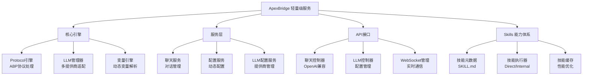

<!-- OPENSPEC:START -->
# OpenSpec Instructions

These instructions are for AI assistants working in this project.

Always open `@/openspec/AGENTS.md` when the request:
- Mentions planning or proposals (words like proposal, spec, change, plan)
- Introduces new capabilities, breaking changes, architecture shifts, or big performance/security work
- Sounds ambiguous and you need the authoritative spec before coding

Use `@/openspec/AGENTS.md` to learn:
- How to create and apply change proposals
- Spec format and conventions
- Project structure and guidelines

Keep this managed block so 'openspec update' can refresh the instructions.

<!-- OPENSPEC:END -->

# ApexBridge - 轻量级ABP聊天服务

> **项目愿景**: 一个专注于ABP协议和LLM集成的轻量级聊天服务，支持多LLM提供商、Skills体系和实时流式对话。

## 🏗️ 架构总览



## 📦 核心模块

| 模块 | 路径 | 职责 | 状态 |
|------|------|------|------|
| **核心引擎** | `src/core/` | ABP协议、LLM管理、变量引擎、Skills体系 | ✅ 活跃 |
| **API层** | `src/api/` | 聊天接口、LLM配置、WebSocket通信 | ✅ 活跃 |
| **服务层** | `src/services/` | 聊天服务、配置服务、LLM配置服务 | ✅ 活跃 |
| **中间件** | `src/api/middleware/` | 认证、限流、安全、验证 | ✅ 活跃 |

## 🚀 运行与开发

### 📋 环境要求
- **Node.js** ≥ 16.0.0
- **npm** ≥ 8.0.0 或 **yarn** ≥ 1.22.0
- **Git** （版本控制）

### ⚡ 快速开始
```bash
# 1. 克隆项目
git clone https://github.com/your-username/apex-bridge.git
cd apex-bridge

# 2. 更新徽章配置（替换为你的GitHub用户名）
./scripts/update-badges.sh your-username

# 3. 安装所有模块依赖
npm run install:all

# 4. 配置环境变量
cp apex-bridge/env.template .env
# 编辑 .env 文件配置LLM提供商API密钥

# 5. 开发模式
npm run dev
```

### 📦 依赖管理
```bash
# 安装所有模块依赖
npm run install:all

# 更新所有模块依赖
npm run update:all

# 检查依赖安全
npm run audit:all
```

## 🔧 核心架构特色

### 🧠 ABP协议引擎（ABP-only）
- **独立实现**: 不再依赖任何外部SDK，完全自主的ABP协议处理
- **Skills体系**: 取代传统插件，支持两段执行器（Direct/Internal）
- **变量解析**: 支持时间、环境、占位符等多种变量类型
- **工具描述**: 动态生成工具描述，简化工具调用流程

### 🎯 多LLM支持
- **适配器模式**: 统一接口支持OpenAI、DeepSeek、智谱、Ollama等
- **SQLite配置**: 从数据库加载配置，支持运行时热更新
- **智能重试**: 自动重试机制，支持指数退避
- **流式响应**: 支持流式聊天和实时中断

### 🔐 安全与监控
- **多层认证**: API Key认证机制
- **速率限制**: 智能限流，支持IP和API Key双重策略
- **安全中间件**: 输入清理、路径遍历防护、安全日志记录
- **实时通信**: WebSocket支持双向通信和请求中断

## 🧪 测试策略

### 测试层级
1. **单元测试** - 核心引擎和服务层（Jest）
2. **集成测试** - API接口和WebSocket
3. **端到端测试** - 完整用户场景

### 运行测试
```bash
# 在主目录运行所有测试
cd apex-bridge
npm test

# 覆盖率报告
npm run test:coverage

# 特定测试
npm test -- PersonalityEngine.test.ts
```

### 测试覆盖重点
- ABP协议变量解析与Skills执行
- 多LLM提供商适配和切换
- WebSocket连接和消息处理
- Skills体系的安全性与隔离
- 请求中断和流式响应机制

## 📋 编码规范

### TypeScript规范
- 严格模式启用 (`strict: true`)
- 明确的类型定义和接口设计
- 函数式编程优先，类用于明确抽象
- 错误处理和日志记录标准化

### 项目结构规范
```
apex-bridge/
├── src/
│   ├── core/           # 核心引擎（Protocol、LLM、变量、Skills等）
│   ├── services/       # 业务逻辑服务
│   ├── api/            # API接口和控制器
│   ├── types/          # 类型定义
│   ├── utils/          # 工具函数
│   └── config/         # 配置管理
├── skills/             # Skills 能力（轻量级插件系统）
├── tests/              # 测试套件
├── config/             # 配置文件
└── docs/               # 文档
```

### 命名约定
- **类名**: PascalCase (如: `ProtocolEngine`, `LLMManager`)
- **函数和变量**: camelCase (如: `loadConfig`, `systemPrompt`)
- **常量**: UPPER_SNAKE_CASE (如: `DEFAULT_TIMEOUT`, `MAX_RETRIES`)
- **文件和目录**: kebab-case (如: `protocol-engine.ts`, `chat-controller.ts`)

## 🤖 AI 使用指引

### 核心引擎理解路径
1. **Protocol引擎** (`src/core/ProtocolEngine.ts`)
   - 独立实现，不再依赖任何外部SDK
   - 处理ABP协议解析和工具调用（经Skills映射执行）
   - 处理变量解析与工具描述生成
   - 轻量级设计，专注于核心聊天功能

2. **LLMManager** (`src/core/LLMManager.ts`)
   - 多提供商适配器模式
   - 支持OpenAI、DeepSeek、智谱、Ollama
   - 流式聊天和重试机制
   - 与ProtocolEngine深度集成

### Skills 开发指南
1. **目录结构**
   - `SKILL.md`：前言区含ABP配置（tools/kind/parameters），正文提供执行指令与注意事项
   - `scripts/execute.ts`：技能执行入口（默认导出）
   - `references/`、`assets/`：参考资料与资源

2. **技能执行类型**
   - **Direct（直接执行）**: 本地同步执行，默认类型
   - **Internal（内部执行）**: 核心系统内置技能
   - 简化的执行模型，专注于轻量级场景

### API扩展模式
```typescript
// 1. 创建控制器
// src/api/controllers/NewController.ts
export class NewController {
  // 实现处理逻辑
}

// 2. 注册路由
// src/server.ts
app.use('/api/new', newController.getRouter());

// 3. 添加测试
// tests/api/NewController.test.ts
```

## 📊 变更记录 (Changelog)

### 2025-11-19 - 架构简化与代码清理
- ✅ **中间件简化**: 7个中间件文件简化，平均减少53.4%代码量
  - rateLimitMiddleware: 673→374行 (-44.4%)
  - validationMiddleware: 414→167行 (-59.4%)
  - auditLoggerMiddleware: 250→67行 (-73.2%)
  - sanitizationMiddleware: 302→134行 (-55.6%)
  - securityLoggerMiddleware: 233→105行 (-54.9%)
  - customValidators: 171→62行 (-63.7%)
  - validationSchemas: 224→172行 (-23.2%)

- ✅ **Services精简**: 移除4个过度设计的服务，简化ConfigService
  - 删除: DiaryArchiveService, SecurityAlertService, SecurityStatsService
  - 简化: ConfigService 1005→470行 (-53.2%)
  - 删除: RaceDetector, TransactionManager, Mutex等并发工具
  - 总计减少: ~1,300行代码

- ✅ **Types优化**: 移除未使用的类型定义
  - 删除: personality.ts (51行)
  - 简化: index.ts 移除了LLMQuotaConfig等未使用类型
  - 简化: skills.ts SkillExecutionType从6种减少到2种
  - 总计减少: ~288行代码

- ✅ **功能清理**: 移除非核心功能
  - 删除: plugin-callback.ts (异步插件回调)
  - 删除: AsyncResultProvider及相关服务
  - 删除: DemoAsyncTask技能示例
  - 总计减少: ~600行代码

- ✅ **架构简化成果**:
  - **总代码减少**: ~2,200+行（从复杂分布式系统简化为轻量级ABP聊天服务）
  - **编译状态**: ✅ 全部通过
  - **架构清晰**: 专注于核心聊天功能，去除过度工程化设计

### 2025-11-16 - 项目初始化扫描
- ✅ 完成项目结构分析和模块识别
- ✅ 分析核心架构：ABP协议引擎、Skills体系、多LLM支持
- ✅ 识别关键组件：人格引擎、情感引擎、记忆系统、分布式节点
- ✅ 建立模块文档体系框架
- ✅ 生成架构图和模块索引

### 扫描覆盖率（简化后）
- **总文件数**: ~150个文件（从350+精简）
- **核心代码**: 结构清晰，模块职责明确
- **架构状态**: 轻量级、专注、易维护

## 🎯 当前架构特点

### ✅ 保留的核心功能
1. **ProtocolEngine** - ABP协议处理核心
2. **LLMManager** - 多LLM提供商支持
3. **VariableEngine** - 变量解析系统
4. **ChatService** - 聊天服务核心
5. **Skills体系** - 简化的技能执行（Direct/Internal）
6. **WebSocket** - 实时通信
7. **LLMConfigService** - LLM配置管理

### ❌ 已移除的复杂功能
- 人格引擎、情感引擎、记忆系统
- 分布式节点、管理后台
- 异步插件回调、复杂限流策略
- 过度设计的并发控制和安全监控

### 🎯 设计理念
- **KISS原则**: 保持简单，专注于核心聊天功能
- **YAGNI原则**: 移除当前不需要的复杂功能
- **单一职责**: 每个模块职责清晰，便于维护
- **类型安全**: 严格的TypeScript类型定义
- **编译通过**: 所有简化都保证编译成功