<!-- OPENSPEC:START -->
# OpenSpec Instructions

These instructions are for AI assistants working in this project.

Always open `@/openspec/AGENTS.md` when the request:
- Mentions planning or proposals (words like proposal, spec, change, plan)
- Introduces new capabilities, breaking changes, architecture shifts, or big performance/security work
- Sounds ambiguous and you need the authoritative spec before coding

Use `@/openspec/AGENTS.md` to learn:
- How to create and apply change proposals
- Spec format and conventions
- Project structure and guidelines

Keep this managed block so 'openspec update' can refresh the instructions.

<!-- OPENSPEC:END -->

# ApexBridge - 家庭AI系统中枢

> **项目愿景**: 一个现代化的桥接应用项目，构建家庭AI系统中枢，集成多LLM支持、高级RAG搜索、人格引擎、情感引擎和节点管理功能。采用ABP协议，Skills体系，React管理后台。

## 🏗️ 架构总览

```mermaid
graph TD
    A["ApexBridge 主系统"] --> B["核心引擎"];
    B --> C["Protocol引擎<br/>ABP协议处理"];
    B --> D["LLM客户端<br/>多提供商适配"];
    B --> E["人格引擎<br/>动态人格配置"];
    B --> F["情感引擎<br/>情感状态管理"];
    B --> G["节点管理器<br/>分布式节点"];

    A --> H["服务层"];
    H --> I["聊天服务<br/>会话管理"];
    H --> J["RAG记忆服务<br/>向量检索"];
    H --> K["配置服务<br/>动态配置"];
    H --> L["节点服务<br/>节点生命周期"];
    H --> M["偏好服务<br/>个性化设置"];
    H --> N["主动性调度<br/>场景触发"];

    A --> O["API接口"];
    O --> P["聊天控制器<br/>OpenAI兼容"];
    O --> Q["节点控制器<br/>节点管理"];
    O --> R["人格控制器<br/>人格配置"];
    O --> S["偏好控制器<br/>偏好管理"];
    O --> T["时间线控制器<br/>记忆时间线"];
    O --> U["关系控制器<br/>关系管理"];

    A --> V["Skills 能力体系"];
    V --> W["指令与元数据<br/>SKILL.md"];
    V --> X["执行脚本<br/>scripts/execute.ts"];
    V --> Y["资源与引用<br/>references/"];

    A --> Z["管理后台"];
    Z --> AA["React前端<br/>Vite + TypeScript"];
    Z --> AB["设置向导<br/>初始化配置"];
    Z --> AC["仪表板<br/>系统监控"];

    A --> AD["节点代理"];
    AD --> AE["Worker节点<br/>任务执行"];
    AD --> AF["Companion节点<br/>陪伴助手"];

    click C "./src/core/ProtocolEngine.ts" "查看Protocol引擎实现"
    click D "./src/core/LLMClient.ts" "查看LLM客户端实现"
    click E "./src/core/PersonalityEngine.ts" "查看人格引擎实现"
    click Z "./admin/CLAUDE.md" "查看管理后台文档"
```



## 📦 模块索引

| 模块 | 路径 | 职责 | 技术栈 | 状态 |
|------|------|------|--------|------|
| **ApexBridge主系统** | `apex-bridge/` | 家庭AI系统中枢，核心引擎和API | TypeScript + Node.js | ✅ [详细文档](./apex-bridge/CLAUDE.md) |
| **管理后台** | `apex-bridge/admin/` | Web管理界面，配置和监控 | React 18 + TypeScript + Vite | ✅ [详细文档](./apex-bridge/admin/CLAUDE.md) |
| **节点代理** | `apex-bridge/packages/node-agent/` | 分布式节点运行时 | TypeScript + WebSocket | ✅ [详细文档](./apex-bridge/packages/node-agent/CLAUDE.md) |

## 🚀 运行与开发

### 📋 环境要求
- **Node.js** ≥ 16.0.0
- **npm** ≥ 8.0.0 或 **yarn** ≥ 1.22.0
- **Git** （版本控制）

### ⚡ 快速开始
```bash
# 1. 克隆项目
git clone https://github.com/your-username/apex-bridge.git
cd apex-bridge

# 2. 更新徽章配置（替换为你的GitHub用户名）
./scripts/update-badges.sh your-username

# 3. 安装所有模块依赖
npm run install:all

# 4. 配置环境变量
cp apex-bridge/env.template .env
# 编辑 .env 文件配置LLM提供商API密钥

# 5. 开发模式
npm run dev

# 6. 管理后台开发
cd apex-bridge/admin && npm run dev  # 运行在 http://localhost:3000/admin
```

### 📦 依赖管理
```bash
# 安装所有模块依赖
npm run install:all

# 更新所有模块依赖
npm run update:all

# 检查依赖安全
npm run audit:all
```

## 🔧 核心架构特色

### 🧠 协议引擎（ABP-only）
- **独立实现**: 不再依赖外部SDK，完全自主的ABP协议处理
- **Skills体系**: 取代传统插件，支持三段渐进式披露
- **变量解析**: 支持时间、环境、占位符、代理等多种变量类型
- **工具描述**: 动态生成工具描述，支持偏好驱动的参数默认值

### 🎯 多LLM支持
- **适配器模式**: 统一接口支持OpenAI、DeepSeek、智谱、Ollama等
- **智能重试**: 自动重试机制，支持指数退避
- **流式响应**: 支持流式聊天和实时中断
- **参数过滤**: 根据厂商特性自动过滤不支持的参数

### 🎭 人格与情感引擎
- **动态人格**: 支持JSON和TXT格式的人格配置
- **情感状态**: 情感识别、反应生成和状态管理
- **记忆集成**: 与记忆服务深度集成，支持情感记录

### 💾 记忆系统
- **双轨记忆**: 支持语义记忆（向量检索）和情景记忆（时间序列）
- **RAG集成**: 高性能向量检索，支持hnswlib-node
- **记忆桥接**: 情景-语义桥接，自动同步和关联

### 🌐 分布式节点
- **节点类型**: Hub、Worker、Companion三种节点类型
- **WebSocket通信**: 实时双向通信，支持节点状态同步
- **任务调度**: 分布式任务分配和执行
- **配额管理**: 细粒度的LLM配额控制

### 🔐 安全与监控
- **多层认证**: API Key、节点Key、管理后台独立认证
- **速率限制**: 智能限流，支持IP和API Key双重策略
- **安全中间件**: 输入清理、SQL注入防护、路径遍历防护
- **审计日志**: 完整的操作审计和安全事件记录

## 🧪 测试策略

### 测试层级
1. **单元测试** - 核心引擎和服务层（Jest）
2. **集成测试** - API接口和WebSocket
3. **端到端测试** - 完整用户场景

### 运行测试
```bash
# 在主目录运行所有测试
cd apex-bridge
npm test

# 覆盖率报告
npm run test:coverage

# 特定测试
npm test -- PersonalityEngine.test.ts
```

### 测试覆盖重点
- 人格引擎配置加载和缓存机制
- ABP协议变量解析与Skills执行
- 多LLM提供商适配和切换
- WebSocket连接和消息处理
- Skills体系的安全性与隔离

## 📋 编码规范

### TypeScript规范
- 严格模式启用 (`strict: true`)
- 明确的类型定义和接口设计
- 函数式编程优先，类用于明确抽象
- 错误处理和日志记录标准化

### 项目结构规范
```
apex-bridge/
├── src/
│   ├── core/           # 核心引擎（Protocol、LLM、人格、情感等）
│   ├── services/       # 业务逻辑服务
│   ├── api/            # API接口和控制器
│   ├── types/          # 类型定义
│   ├── utils/          # 工具函数
│   └── config/         # 配置管理
├── admin/              # 管理后台（独立React应用）
├── skills/             # Skills 能力（取代插件）
├── packages/node-agent/# 节点代理包
├── tests/              # 测试套件
├── config/             # 配置文件
└── docs/               # 文档
```

### 命名约定
- **类名**: PascalCase (如: `ProtocolEngine`, `PersonalityEngine`)
- **函数和变量**: camelCase (如: `loadPersonality`, `systemPrompt`)
- **常量**: UPPER_SNAKE_CASE (如: `DEFAULT_TIMEOUT`, `MAX_RETRIES`)
- **文件和目录**: kebab-case (如: `personality-engine.ts`, `chat-controller.ts`)

## 🤖 AI 使用指引

### 核心引擎理解路径
1. **Protocol引擎** (`src/core/ProtocolEngine.ts`)
   - 独立实现，不再依赖任何外部SDK
   - 处理ABP协议解析和工具调用（经Skills映射执行）
   - 处理变量解析与三段渐进式工具描述
   - 集成RAG搜索和时间感知功能

2. **LLM客户端** (`src/core/LLMClient.ts`)
   - 多提供商适配器模式
   - 支持OpenAI、DeepSeek、智谱、Ollama
   - 流式聊天和重试机制

3. **人格引擎** (`src/core/PersonalityEngine.ts`)
   - 动态加载人格配置
   - 构建系统提示词
   - 支持JSON和TXT格式

4. **情感引擎** (`src/core/EmotionEngine.ts`)
   - 处理情感状态管理
   - 情感反应生成
   - 与人格系统集成

### Skills 开发指南
1. **目录结构**
   - `SKILL.md`：前言区含ABP配置（tools/kind/parameters），正文提供执行指令与注意事项
   - `scripts/execute.ts`：技能执行入口（默认导出）
   - `references/`、`assets/`：参考资料与资源

2. **三段渐进式披露**
   - Metadata（名称/描述/工具签名）→ Brief（参数/约束）→ Full（完整指令与资源）
   - 覆盖逻辑：若存在偏好`toolsDisclosure=metadata|brief|full`，则固定该阶段；否则基于置信度回退

3. **偏好驱动的参数默认值**
   - 当工具参数缺省时，按"显式参数 > schema默认 > 偏好"的顺序补全
   - 相关实现：`SkillsToToolMapper.convertToolCallToExecutionRequestWithDefaults`、`ChatService.setPreferenceService`

4. **迁移脚本**
   - 使用`scripts/migrate-skills-to-claude-package.ts`将旧技能规范化

### API扩展模式
```typescript
// 1. 创建控制器
// src/api/controllers/NewController.ts
export class NewController {
  // 实现处理逻辑
}

// 2. 注册路由
// src/server.ts
app.use('/api/new', newController.getRouter());

// 3. 添加测试
// tests/api/NewController.test.ts
```

## 📊 变更记录 (Changelog)

### 2025-11-16 - 项目初始化扫描
- ✅ 完成项目结构分析和模块识别
- ✅ 分析核心架构：ABP协议引擎、Skills体系、多LLM支持
- ✅ 识别关键组件：人格引擎、情感引擎、记忆系统、分布式节点
- ✅ 建立模块文档体系框架
- ✅ 生成架构图和模块索引

### 扫描覆盖率
- **总文件数**: 约350+个文件
- **已扫描**: 23个核心文件
- **主要模块**: 3个核心模块已识别
- **下一步**: 深度分析各模块实现细节

## 🎯 下一步建议

### 高优先级任务
1. **核心引擎深度分析** - 详细分析ProtocolEngine、LLMClient、PersonalityEngine实现
2. **Skills体系研究** - 深入理解Skills架构、执行机制、描述生成
3. **记忆系统分析** - 研究RAG集成、双轨记忆、记忆桥接机制

### 中等优先级任务
4. **节点代理分析** - 研究分布式节点架构和通信机制
5. **管理后台分析** - 分析React前端架构和功能模块
6. **安全机制审计** - 审查认证授权、限流、安全中间件

### 建议扫描重点
- `src/core/ProtocolEngine.ts` - ABP协议核心实现
- `src/core/LLMClient.ts` - 多LLM适配器模式
- `src/core/PersonalityEngine.ts` - 人格系统实现
- `src/core/skills/` - Skills体系实现
- `src/services/memory/` - 记忆服务实现
- `src/api/websocket/` - WebSocket通信机制
- `admin/src/` - 管理后台前端实现
- `packages/node-agent/src/` - 节点代理实现

**预计深度分析时间**: 4-5个工作日
**推荐续扫目录**:
- `apex-bridge/src/core/` - 核心引擎实现
- `apex-bridge/src/services/` - 业务服务层
- `apex-bridge/src/core/skills/` - Skills体系
- `apex-bridge/src/services/memory/` - 记忆服务
- `apex-bridge/admin/src/` - 管理后台
- `apex-bridge/packages/node-agent/src/` - 节点代理