<div align="center">

# 🏠 ApexBridge - 轻量级ABP聊天服务

[](https://github.com/suntianc/apex-bridge)
[](https://github.com/suntianc/apex-bridge/releases)
[](LICENSE)
[](https://nodejs.org/)
[](https://www.typescriptlang.org/)
[](https://www.docker.com/)

**一款专注于ABP协议和LLM集成的轻量级聊天服务，支持多LLM提供商、Skills体系、RAG检索和实时流式对话**

`6.4K+ 行TypeScript代码 | 181+ 类/接口/类型 | 企业级架构`

[🚀 快速开始](#-快速开始) | [📖 完整文档](./docs/) | [🔧 API参考](./docs/API_REFERENCE.md)

</div>

## 🌟 项目特色

ApexBridge 是一个专为LLM应用设计的轻量级、高性能ABP协议聊天服务，采用简洁的TypeScript架构，专注于核心聊天功能。

### ✨ 核心亮点

- **🧠 企业级ABP协议引擎** - 完全自主实现的ABP协议栈，无外部依赖，支持协议解析、工具调用和VariableEngine
- **🎛️ 多LLM统一管理** - 适配器模式支持OpenAI、DeepSeek、智谱、Ollama、Claude等主流LLM提供商（SQLite动态配置）
- **🧩 Skills 能力体系** - 轻量级技能执行框架，支持Direct/Internal双模式执行
-  **🔍 原生RAG检索**  - 集成 `abp-rag-sdk` 向量搜索引擎，支持文档检索和知识库管理
- **🛡️ 全链路安全防护** - API Key认证、智能限流、输入清理、安全日志、审计追踪
- **⚡ 实时流式通信** - WebSocket双向通信，支持请求中断和实时响应
- **🔧 动态配置管理** - SQLite存储LLM配置，支持运行时热更新，无需重启
- **📊 会话管理增强** - 完善的对话历史、Token统计、活动请求追踪
- **🏗️ 架构清晰** - 6大核心层、8大服务模块、15+中间件，职责分离、易于扩展

## 🏗️ 系统架构

```mermaid
graph TD
    %% 主应用
    A["ApexBridge Server"] --> B["Core Engines"];
    A --> C["Service Layer"];
    A --> D["API Layer"];
    A --> E["Types & Utils"];

    %% 核心引擎
    B --> B1["ProtocolEngine<br/>ABP协议解析"];
    B --> B2["LLMManager<br/>多LLM适配"];
    B --> B3["VariableEngine<br/>动态变量解析"];
    B --> B4["TaskEvaluator<br/>任务评估"];
    B --> B5["EventBus<br/>事件总线"];

    %% 服务层
    C --> C1["ChatService<br/>聊天核心"];
    C --> C2["LLMConfigService<br/>SQLite配置"];
    C --> C3["AceService<br/>ACE引擎"];
    C --> C4["ConfigService<br/>配置管理"];
    C --> C5["ConversationHistoryService<br/>对话历史"];
    C --> C6["ModelRegistry<br/>模型注册表"];
    C --> C7["PathService<br/>路径管理"];
    C --> C8["RedisService<br/>Redis缓存"];

    %% API层
    D --> D1["ChatController<br/>/v1/chat/completions"];
    D --> D2["ProviderController<br/>LLM提供商"];
    D --> D3["ModelController<br/>模型管理"];
    D --> D4["WebSocketManager<br/>实时通信"];
    D --> D5["Middlewares<br/>15+中间件"];

    %% Skills体系
    F["Skills 能力体系"] --> F1["ABP协议映射"];
    F --> F2["Direct执行器"];
    F --> F3["Internal执行器"];

    B -.-> F;
    C -.-> F;

    %% 数据存储
    G["Data Storage"] --> G1["SQLite<br/>LLM配置"];
    G --> G2["File System<br/>日志/向量库"];
    G --> G3["Redis<br/>缓存/限流"];

    C -.-> G;

    style A fill:#4a90e2,stroke:#333,stroke-width:2px
    style B fill:#f39c12,stroke:#333,stroke-width:2px
    style C fill:#27ae60,stroke:#333,stroke-width:2px
    style D fill:#e74c3c,stroke:#333,stroke-width:2px
    style E fill:#9b59b6,stroke:#333,stroke-width:2px
    style F fill:#1abc9c,stroke:#333,stroke-width:2px
    style G fill:#34495e,stroke:#333,stroke-width:2px
```



## 📂 项目结构

```
apex-bridge/
├── 📁 src/                          # 源代码（6.4K+行）
│   ├── 📁 api/                      # API层
│   │   ├── 📁 controllers/          # RESTful控制器（Chat/Provider/Model）
│   │   ├── 📁 websocket/            # WebSocket通信
│   │   └── 📁 middleware/           # 15+中间件（安全/限流/验证）
│   ├── 📁 core/                     # 核心引擎层
│   │   ├── LLMManager.ts           # LLM管理器（适配器模式）
│   │   ├── ProtocolEngine.ts       # ABP协议引擎
│   │   ├── TaskEvaluator.ts        # 任务评估器
│   │   ├── EventBus.ts             # 事件总线
│   │   ├── 📁 llm/adapters/        # LLM适配器（6+提供商）
│   │   ├── 📁 variable/            # VariableEngine
│   │   └── 📁 protocol/            # ABP协议实现
│   ├── 📁 services/                 # 服务层
│   │   ├── ChatService.ts          # 聊天服务核心（46KB）
│   │   ├── LLMConfigService.ts     # LLM配置服务（SQLite）
│   │   ├── AceService.ts           # ACE引擎服务
│   │   ├── ConversationHistoryService.ts  # 对话历史
│   │   ├── ModelRegistry.ts        # 模型注册表
│   │   ├── ConfigService.ts        # 配置管理
│   │   ├── PathService.ts          # 路径管理
│   │   └── RedisService.ts         # Redis缓存
│   ├── 📁 types/                    # TypeScript类型定义
│   └── 📁 utils/                    # 工具函数（日志/重试/缓存）
├── 📁 config/                       # 配置文件
├── 📁 docs/                         # 完整文档
├── 📁 tests/                        # 测试套件
├── 📁 data/                         # 数据存储
├── 📁 vector_store/                 # 向量数据库
└── 📁 logs/                         # 运行日志
```

## 📦 技术栈

### 核心技术
- **Runtime**: Node.js ≥ 16.0.0
- **Language**: TypeScript 5.0+（严格模式）
- **Framework**: Express.js 4.18+（RESTful API）
- **Database**: Better-SQLite3 12.4+（LLM配置管理）
- **Cache**: Redis 4.6+（限流/缓存）

### 关键依赖
- **WebSocket**: ws 8.17+（实时通信）
- **RAG**: abp-rag-sdk 1.0+（向量检索）
- **Embedding**: ChromaDB 3.1+ + hnswlib-node 3.0+
- **Security**: helmet 7.1+, cors 2.8+
- **Logging**: winston 3.11+
- **Scheduling**: node-schedule 2.1+
- **Validation**: ajv 8.17+ + ajv-formats 3.0+

### 开发工具
- **Testing**: Jest 29.7+ + ts-jest + supertest
- **Linting**: ESLint 9.39+ + TypeScript ESLint
- **Formatting**: Prettier 3.6+
- **Dev Server**: nodemon + ts-node

## 🚀 快速开始

### 📋 环境要求

- **Node.js** ≥ 16.0.0（推荐 v18+）
- **npm** ≥ 8.0.0 或 **yarn** ≥ 1.22.0
- **Git**（代码版本控制）
- **SQLite**（内置，无需额外安装）

### ⚡ 一键启动

```bash
# 1. 克隆项目
git clone https://github.com/suntianc/apex-bridge.git
cd apex-bridge

# 2. 更新徽章配置（可选 - 替换为你的GitHub用户名）
./scripts/update-badges.sh your-username

# 3. 安装依赖
npm install

# 4. 配置LLM提供商（关键步骤！）
cp config/admin-config-template.json config/admin-config.json
# 编辑 config/admin-config.json，填入你的LLM API密钥

# 5. 启动开发服务器
npm run dev

# 🎉 访问服务
# API文档: http://localhost:8088/api/docs
# 健康检查: http://localhost:8088/health
# 聊天API: http://localhost:8088/v1/chat/completions
```

### 🔧 核心配置

编辑 `config/admin-config.json`：

```json
{
  "api": {
    "host": "0.0.0.0",
    "port": 8088
  },
  "auth": {
    "enabled": false,
    "apiKey": "your-api-key-here"
  },
  "llm": {
    "defaultProvider": "openai",
    "defaultModel": "gpt-4o",
    "timeout": 60000,
    "maxRetries": 3
  },
  "rag": {
    "enabled": true,
    "storagePath": "./vector_store"
  },
  "websocket": {
    "enabled": true,
    "path": "/chat"
  }
}
```

详细配置指南请查看：[LLM配置手册](./docs/LLM_CONFIG_MANUAL_SETUP.md)

### 🐳 Docker部署（可选）

```bash
# 构建镜像
docker build -t apex-bridge .

# 运行容器
docker run -d \
  --name apex-bridge \
  -p 8088:8088 \
  -v $(pwd)/config:/app/config \
  -v $(pwd)/data:/app/data \
  apex-bridge
```

## 💻 使用指南

### 💬 基础聊天 API

```bash
# 非流式请求
curl -X POST http://localhost:8088/v1/chat/completions \
  -H "Content-Type: application/json" \
  -d '{
    "messages": [
      {"role": "system", "content": "你是一个专业的AI助手"},
      {"role": "user", "content": "请介绍TypeScript的主要特性"}
    ],
    "stream": false
  }'

# 流式请求（推荐用于长文本）
curl -X POST http://localhost:8088/v1/chat/completions \
  -H "Content-Type: application/json" \
  -d '{
    "messages": [{"role": "user", "content": "写一篇关于人工智能的文章"}],
    "stream": true
  }'
```

### 🎛️ LLM配置管理 API

```bash
# 查看所有LLM提供商
curl http://localhost:8088/api/llm/providers

# 添加新的LLM提供商
curl -X POST http://localhost:8088/api/llm/providers \
  -H "Content-Type: application/json" \
  -d '{
    "provider": "deepseek",
    "name": "DeepSeek AI",
    "enabled": true,
    "baseConfig": {
      "apiKey": "your-api-key",
      "baseURL": "https://api.deepseek.com",
      "timeout": 60000,
      "maxRetries": 3
    }
  }'

# 为提供商添加模型
curl -X POST http://localhost:8088/api/llm/providers/deepseek/models \
  -H "Content-Type: application/json" \
  -d '{
    "modelKey": "deepseek-chat",
    "modelName": "DeepSeek Chat",
    "modelType": "nlp",
    "enabled": true,
    "isDefault": false
  }'

# 查看所有模型
curl http://localhost:8088/api/llm/models
```

### 🌐 WebSocket 实时通信

```javascript
// 客户端JavaScript示例
const ws = new WebSocket('ws://localhost:8088/chat');

// 连接建立
ws.onopen = () => {
  console.log('WebSocket connected');

  // 发送聊天请求
  ws.send(JSON.stringify({
    type: 'stream_chat',
    requestId: 'req_12345',
    payload: {
      messages: [{ role: 'user', content: '你好，介绍一下这个项目' }],
      options: {
        stream: true,
        provider: 'openai',
        model: 'gpt-4o'
      }
    }
  }));
};

// 接收流式响应
ws.onmessage = (event) => {
  const message = JSON.parse(event.data);

  switch (message.type) {
    case 'stream_chunk':
      // 流式数据块
      process.stdout.write(message.payload.delta?.content || '');
      break;

    case 'stream_end':
      // 流式结束
      console.log('\n\n✅ 响应完成');
      console.log('Token用量:', message.payload.usage);
      break;

    case 'stream_error':
      // 错误处理
      console.error('❌ 错误:', message.payload.error);
      break;
  }
};

// 主动中断请求
document.getElementById('stopBtn').onclick = () => {
  ws.send(JSON.stringify({
    type: 'interrupt',
    requestId: 'req_12345'
  }));
};
```

### 🔍 RAG检索示例

```bash
# 添加文档到向量库（通过Skills体系）
curl -X POST http://localhost:8088/v1/chat/completions \
  -H "Content-Type: application/json" \
  -d '{
    "messages": [{
      "role": "user",
      "content": "使用rag_search技能，搜索\"TypeScript最佳实践\""
    }],
    "stream": false
  }'

# Skills体系会自动调用RAG服务进行向量检索
# 查询最近添加的技术文档
curl -X POST http://localhost:8088/v1/chat/completions \
  -H "Content-Type: application/json" \
  -d '{
    "messages": [{
      "role": "user",
      "content": "基于知识库，解释SOLID原则在TypeScript中的应用"
    }],
    "stream": true
  }'
```

## 🧪 测试与验证

### 自动化测试

```bash
# 运行所有单元测试
npm test

# 生成覆盖率报告
npm run test:coverage

# 监视模式（开发用）
npm run test:watch
```

### 人工测试清单

1. **快速验证（5分钟）**
   ```bash
   # 健康检查
   curl http://localhost:8088/health

   # 基础聊天
   curl -X POST http://localhost:8088/v1/chat/completions \
     -H "Content-Type: application/json" \
     -d '{"messages": [{"role": "user", "content": "你好"}], "stream": false}'
   ```

2. **完整验证（30分钟）**
   - [ ] LLM配置管理API测试
   - [ ] 流式/非流式聊天测试
   - [ ] WebSocket实时通信测试
   - [ ] Skills体系调用测试
   - [ ] RAG检索功能测试
   - [ ] 请求中断功能测试
   - [ ] 安全配置和限流测试

详细测试指南：[MANUAL_TESTING_GUIDE](./docs/testing/MANUAL_TESTING_GUIDE.md)

## 📚 文档资源

### 📖 核心文档
- [🚀 API参考手册](./docs/API_REFERENCE.md) - 完整的RESTful API文档
- [🔧 LLM配置手册](./docs/LLM_CONFIG_MANUAL_SETUP.md) - LLM配置详细步骤
- [🧠 自思考API文档](./docs/self-thinking-api.md) - 自思考功能API说明

### 🧪 测试文档
- [📋 测试文档中心](./docs/testing/README.md) - 测试总览与架构
- [🔍 完整验证指南](./docs/testing/MANUAL_TESTING_GUIDE.md) - 人工测试流程
- [⚡ 快速验证清单](./docs/testing/guides/QUICK_VALIDATION_CHECKLIST.md) - 5分钟快速验证
- [✅ 完整验证清单](./docs/testing/guides/FULL_VALIDATION_CHECKLIST.md) - 30分钟完整验证

### 🧩 测试用例（详细）
- [ProtocolEngine测试](./docs/testing/cases/PROTOCOL_ENGINE_TEST_CASES.md)
- [VariableEngine测试](./docs/testing/cases/VARIABLE_ENGINE_TEST_CASES.md)
- [LLMManager测试](./docs/testing/cases/LLM_MANAGER_TEST_CASES.md)
- [LLMConfigService测试](./docs/testing/cases/LLM_CONFIG_SERVICE_TEST_CASES.md)
- [Provider/Model API测试](./docs/testing/cases/PROVIDER_MODEL_API_TEST_CASES.md)
- [Chat API测试](./docs/testing/cases/CHAT_API_TEST_CASES.md)
- [WebSocket测试](./docs/testing/cases/WEBSOCKET_TEST_CASES.md)
- [会话管理测试](./docs/testing/cases/SESSION_MANAGEMENT_TEST_CASES.md)

### 🔗 在线资源
- [🏠 项目主页](https://github.com/suntianc/apex-bridge)
- [🐛 问题反馈](https://github.com/suntianc/apex-bridge/issues)
- [💬 讨论区](https://github.com/suntianc/apex-bridge/discussions)
- [⭐ 给项目Star](https://github.com/suntianc/apex-bridge/stargazers)

## 🛣️ 发展路线图

### ✅ v1.0 - 已完成（当前版本）

**核心功能**
- ✅ 企业级ABP协议引擎（独立实现，无外部依赖）
- ✅ 多LLM统一管理平台（SQLite配置，热更新）
- ✅ OpenAI兼容API端点（/v1/chat/completions）
- ✅ Skills 能力体系（Direct/Internal双模式）
- ✅ 原生RAG检索（abp-rag-sdk集成）
- ✅ WebSocket实时通信（流式/中断）
- ✅ 全链路安全防护（认证/限流/验证/清理）
- ✅ 会话管理增强（Token统计/历史追踪）
- ✅ 动态配置管理（SQLite + 文件系统）

**开发体验**
- ✅ TypeScript严格模式（完整的类型系统）
- ✅ Express + 15+中间件体系
- ✅ Jest测试框架 + 覆盖率报告
- ✅ ESLint + Prettier代码规范
- ✅ 完整API文档和测试用例

### 🚧 v1.1 - 进行中

**性能优化**
- 🔄 智能缓存层（Redis多级缓存）
- 🔄 批量请求优化和连接池管理
- 🔄 内存使用优化（GC调优）
- 🔄 响应时间监控和慢查询优化

**功能增强**
- 🔄 更多LLM提供商（Gemini、Claude增强、开源模型）
- 🔄 Advanced RAG（混合检索、重排序）
- 🔄 高级Skills调试和性能分析
- 🔄 完整OpenAI API兼容性（Embeddings、Fine-tuning）

**运维体验**
- 🔄 高级监控和日志系统（Prometheus + Grafana）
- 🔄 分布式追踪（Jaeger/OpenTelemetry）
- 🔄 健康检查和自愈机制
- 🔄 Kubernetes部署模板和Helm Charts

### 🎯 v1.2 - 规划中

**企业级特性**
- 📋 多租户支持（Namespace隔离）
- 📋 高级RBAC权限控制
- 📋 使用配额和计费系统
- 📋 审计日志和合规报告

**AI工程化**
- 📋 Prompt版本管理和A/B测试
- 📋 模型性能对比和评估
- 📋 自动Prompt优化
- 📋 领域特定的Skills市场

**生态集成**
- 📋 LangChain/LlamaIndex兼容层
- 📋 MCP（Model Context Protocol）支持
- 📋 更多向量数据库（Pinecone、Weaviate、Qdrant）
- 📋 更多Embedding提供商集成

## 🤝 贡献指南

我们热烈欢迎所有形式的贡献！🎉 无论您是开发者、文档编写者、测试人员还是使用反馈者，您的贡献都将让ApexBridge变得更好。

### 🛠️ 如何开始贡献

1. **Fork 仓库**
   ```bash
   # 点击GitHub页面的Fork按钮
   # 然后克隆你的Fork
   git clone https://github.com/your-username/apex-bridge.git
   cd apex-bridge/apex-bridge
   ```

2. **创建特性分支**
   ```bash
   git checkout -b feature/your-amazing-feature
   # 或 bugfix/fix-some-bug
   # 或 docs/improve-documentation
   ```

3. **开发环境设置**
   ```bash
   # 安装依赖
   npm install

   # 启动开发服务器（热重载）
   npm run dev

   # 运行测试确保通过
   npm test

   # 代码格式化和检查
   npm run format
   npm run lint
   ```

4. **提交更改（遵循规范）**
   ```bash
   git add .
   git commit -m "feat: 添加新的LLM提供商支持

   - 支持Claude 3.5 Sonnet
   - 优化Token计算逻辑
   - 添加完整测试用例

   Closes #123"
   ```

5. **推送到分支**
   ```bash
   git push origin feature/your-amazing-feature
   ```

6. **提交 Pull Request**
   - 访问 GitHub 创建 PR
   - 填写清晰的标题和描述
   - 关联相关 Issue
   - 等待代码审查

### 📋 贡献规范

#### 代码规范
- **TypeScript**: 启用严格模式（`strict: true`）
- **代码风格**: 使用 ESLint + Prettier（提交前运行 `npm run format`）
- **命名约定**:
  - 类名: `PascalCase`（如: `ProtocolEngine`、`LLMManager`）
  - 函数和变量: `camelCase`（如: `loadConfig`、`systemPrompt`）
  - 常量: `UPPER_SNAKE_CASE`（如: `DEFAULT_TIMEOUT`）
  - 文件: `kebab-case`（如: `chat-controller.ts`）

#### 提交信息规范
遵循 [Conventional Commits](https://conventionalcommits.org/):

- `feat:` - 新功能（minor版本升级）
- `fix:` - Bug修复（patch版本升级）
- `docs:` - 文档更新
- `style:` - 代码格式（不影响逻辑）
- `refactor:` - 代码重构（不改变功能）
- `test:` - 测试相关
- `chore:` - 构建/辅助工具
- `perf:` - 性能优化
- `security:` - 安全修复

示例：
```
feat: add Claude 3.5 Sonnet adapter support

- Add new ClaudeAdapter with streaming support
- Implement token counting for Claude models
- Add comprehensive unit tests
- Update API documentation

Closes #234
BREAKING CHANGE: rename `claudeVersion` to `claudeModel`
```

#### 测试要求
- **新功能** 必须包含单元测试
- **测试覆盖率** 不低于 80%
- **集成测试** 覆盖关键业务流程
- **人工测试** 提交PR前完成快速验证清单

#### 文档更新
- **API变更** 必须更新 `docs/API_REFERENCE.md`
- **配置变更** 更新 `docs/LLM_CONFIG_MANUAL_SETUP.md`
- **新功能** 添加使用示例到 README.md
- **复杂功能** 编写专门的文档

### 🎯 贡献方向（需要帮助）

#### 高优先级
- [ ] 更多LLM提供商适配器（特别是开源模型）
- [ ] 高级RAG功能（混合检索、重排序）
- [ ] Prometheus + Grafana 监控面板
- [ ] Kubernetes 部署配置
- [ ] 性能基准测试和优化

#### 中优先级
- [ ] Skills 性能分析和优化
- [ ] Prompt版本管理系统
- [ ] 更多测试用例和场景覆盖
- [ ] 错误处理和边界情况完善
- [ ] 文档翻译（英文版）

#### 低优先级/Nice to have
- [ ] Admin UI 管理界面
- [ ] 交互式CLI工具
- [ ] 更多示例项目
- [ ] 视频教程
- [ ] 社区插件生态

### 🏆 贡献者荣誉

我们珍视每一位贡献者！所有贡献者将被：
- 列入 README.md 贡献者名单
- 获得项目 Member 权限（持续贡献者）
- 在 Release Notes 中被特别感谢
- 获得数字徽章和成就

## 📄 许可证

本项目采用 [Apache License 2.0](LICENSE) - 一个商业友好的开源许可证。

```
Copyright 2025 ApexBridge Team

Licensed under the Apache License, Version 2.0 (the "License");
you may not use this file except in compliance with the License.
You may obtain a copy of the License at

    http://www.apache.org/licenses/LICENSE-2.0

Unless required by applicable law or agreed to in writing, software
distributed under the License is distributed on an "AS IS" BASIS,
WITHOUT WARRANTIES OR CONDITIONS OF ANY KIND, either express or implied.
See the License for the specific language governing permissions and
limitations under the License.
```

**您可以：**
- ✅ 商业使用
- ✅ 修改和分发
- ✅ 专利授权
- ✅ 私用和部署

**限制：**
- ❌ 不得使用本项目商标
- ❌ 修改后的代码需要保留Apache协议头
- ❌ 不承担任何责任（免责声明）

## 📞 技术支持和联系

### 💬 社区支持
- **GitHub Issues**: [报告Bug/功能请求](https://github.com/suntianc/apex-bridge/issues)
- **GitHub Discussions**: [技术讨论/Q&A](https://github.com/suntianc/apex-bridge/discussions)
- **PR Review**: 提交Pull Request获得代码审查

### 📧 直接联系
- **项目维护者**: suntianc
- **邮箱**: suntianc@gmail.com
- **GitHub**: [@suntianc](https://github.com/suntianc)

### 🆘 紧急支持
如果遇到紧急问题：
1. 查看 [FAQ文档](./docs/faq.md)（如果存在）
2. 搜索 [GitHub Issues](https://github.com/suntianc/apex-bridge/issues) 是否有类似问题
3. 创建新的 Issue，标记为 `urgent`
4. 在 Discussion 中 @ 维护者

---

<div align="center">

**[⬆️ 回到顶部](#-apexbridge——轻量级abp聊天服务)**

---

### ❤️ 致谢

感谢以下项目和社区对 ApexBridge 的支持：

- [TypeScript](https://www.typescriptlang.org/) - 静态类型系统
- [Node.js](https://nodejs.org/) - 运行时环境
- [Express.js](https://expressjs.com/) - Web框架
- [Jest](https://jestjs.io/) - 测试框架
- [ESLint](https://eslint.org/) - 代码检查
- [Prettier](https://prettier.io/) - 代码格式化

---

### 📈 项目状态

- **当前版本**: v1.0.1
- **维护状态**: 🟢 活跃维护
- **发布频率**: 每月发布
- **最后更新**: 2025-11-24
- **代码质量**: ✅ 通过所有测试

---

**如果 ApexBridge 对您有帮助，请给我们一个 ⭐️ Star！**

[](https://star-history.com/#suntianc/apex-bridge&Date)

[🏠 返回主页](https://github.com/suntianc) | [📖 查看文档](./docs/) | [🐛 报告问题](https://github.com/suntianc/apex-bridge/issues) | [💡 功能建议](https://github.com/suntianc/apex-bridge/issues/new?template=feature_request.md)

</div>
