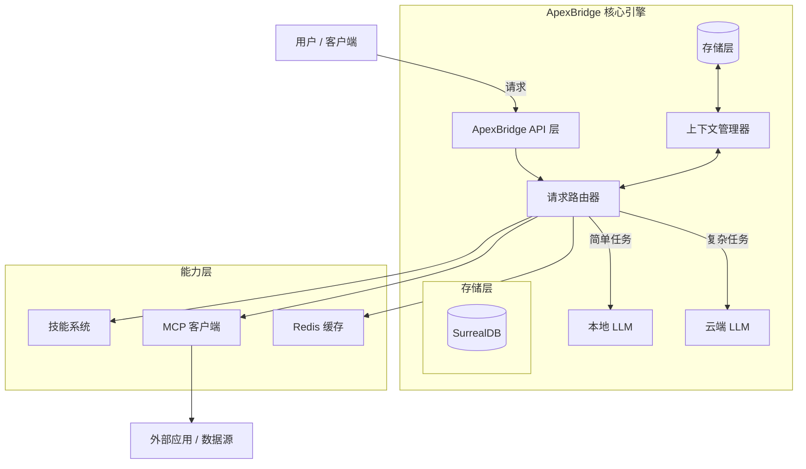

<div align="center">
  

# ApexBridge

**下一代轻量级 AI Agent 框架，MCP 协议集成专家**

连接智能的桥梁 · 轻量级架构 · 多模型编排 · 技能扩展

[](https://opensource.org/licenses/MIT)
[](https://www.typescriptlang.org/)
[](https://nodejs.org/)
[](https://github.com/model-context-protocol)
[](http://makeapullrequest.com)

[核心特性](#-核心特性) • [快速开始](#-快速开始) • [使用示例](#-使用示例) • [路线图](#-路线图) • [贡献指南](#-贡献指南)

</div>

---

## 📖 项目介绍

**ApexBridge** 是一个高性能的 AI Agent 框架，旨在构建孤立的大语言模型（LLM）与现实行动之间的桥梁。专为速度和灵活性而设计，是多智能体系统的连接纽带。

与笨重的传统框架不同，ApexBridge 专注于：

- **轻量级架构**：高效的内存管理，适合本地部署和边缘设备。
- **MCP 原生支持**：深度集成 **Model Context Protocol (MCP)**，标准化上下文共享和工具调用。
- **模型无关编排**：无缝切换 OpenAI、Claude、DeepSeek、Ollama 等多种 LLM。
- **智能上下文管理**：支持 4 层上下文压缩策略，长对话无忧。

> "连接智能与执行的桥梁，开启自主代理新时代。"

**项目信息**：

- **版本**: 1.0.1
- **最后更新**: 2026-01-21
- **提交**: 61f1442 (fix: 修复 CI/CD issues)
- **入口文件**: `src/server.ts` (非 `index.ts`)

---

## ✨ 核心特性

| 特性                  | 描述                                                                                                      |
| :-------------------- | :-------------------------------------------------------------------------------------------------------- |
| 🧠 **多模型支持**     | 统一接口支持 GPT-4、Claude 3.5、Llama 3、DeepSeek、Ollama、智谱等，根据任务复杂度动态切换模型。           |
| 🔌 **MCP 协议集成**   | 完全兼容 **Model Context Protocol**，实现代理间标准化上下文共享和工具使用。                               |
| 🛠️ **技能系统**       | 模块化技能注册，支持通过 YAML 定义工具并动态绑定到代理。                                                  |
| ⚡ **高性能执行**     | 核心逻辑针对低延迟进行优化，适合实时交互和边缘计算场景。                                                  |
| 🔄 **智能上下文压缩** | 4 层压缩策略（Truncate/Prune/Summary/Hybrid），100 条消息可压缩至 ~4000 tokens，节省高达 44% 上下文空间。 |
| 🌊 **流式响应**       | WebSocket 实时推送思考过程与结果，支持随时中断。                                                          |
| 📊 **监控指标**       | Prometheus 兼容的 `/metrics` 端点，支持性能监控和调试。                                                   |
| 📝 **API 文档**       | 自动生成的 Swagger/OpenAPI 文档，开发更高效。                                                             |

---

## 🏗️ 系统架构



### 核心组件

| 组件                          | 功能                                                              | 位置                                    |
| ----------------------------- | ----------------------------------------------------------------- | --------------------------------------- |
| **ChatService**               | 聊天协调器，处理消息流和压缩逻辑                                  | `src/services/ChatService.ts`           |
| **LLMManager**                | 多模型适配器管理，支持 OpenAI/Claude/DeepSeek/Ollama/Zhipu/Custom | `src/core/LLMManager.ts`                |
| **ContextCompressionService** | 4 层上下文压缩引擎（Truncate/Prune/Summary/Hybrid）               | `src/services/context-compression/`     |
| **ToolRetrievalService**      | 基于向量检索的工具匹配（SurrealDB 向量存储）                      | `src/services/tool-retrieval/`          |
| **SkillManager**              | 本地技能管理和索引                                                | `src/services/skill/SkillManager.ts`    |
| **MCPIntegrationService**     | MCP 协议客户端和服务端                                            | `src/services/MCPIntegrationService.ts` |
| **ProtocolEngine**            | ABP 协议解析和编排                                                | `src/core/ProtocolEngine.ts`            |
| **ReActStrategy**             | 多轮思考策略，支持工具调用                                        | `src/strategies/ReActStrategy.ts`       |

---

## 🚀 快速开始

### 环境要求

- **Node.js**: 18.0+ (推荐 20.x)
- **包管理器**: npm / yarn / pnpm
- **API Keys**: OpenAI / Anthropic / DeepSeek 等（根据使用的模型）

### 安装部署

```bash
# 克隆仓库
git clone https://github.com/suntianc/apex-bridge.git
cd apex-bridge

# 安装依赖
npm install

# 启动开发服务器（自动重启）
npm run dev

# 生产构建
npm run build
npm start
```

### 环境配置

在项目根目录创建 `.env` 文件：

```ini
# .env 配置示例
NODE_ENV=development
PORT=8088

# LLM API 配置
OPENAI_API_KEY=sk-...
ANTHROPIC_API_KEY=sk-ant-...
DEEPSEEK_API_KEY=...

# Embedding 模型（用于向量搜索）
EMBEDDING_PROVIDER=openai
EMBEDDING_MODEL=text-embedding-3-small

# Redis 缓存（可选）
REDIS_ENABLED=false
REDIS_HOST=localhost
REDIS_PORT=6379

# 日志级别
LOG_LEVEL=info

# 自动启动（可设为 false 禁用）
APEX_BRIDGE_AUTOSTART=true
```

### JSON 配置文件

主要配置在 `config/admin-config.json`：

```json
{
  "api": {
    "host": "0.0.0.0",
    "port": 12345
  },
  "llm": {
    "providers": [],
    "defaultProvider": "openai",
    "timeout": 30000,
    "maxRetries": 3
  },
  "surrealDB": {
    "enabled": false,
    "phase2": { "mcpConfig": { "enabled": false } },
    "phase3": { "llmConfig": { "enabled": false }, "conversation": { "enabled": false } },
    "phase4": { "vectorStorage": { "enabled": false } }
  }
}
```

---

## 💻 使用示例

### 1. 基础聊天请求

```bash
# 调用聊天完成接口（OpenAI 兼容）
curl -X POST http://localhost:8088/v1/chat/completions \
  -H "Content-Type: application/json" \
  -d '{
    "messages": [
      {"role": "system", "content": "你是一个专业助手"},
      {"role": "user", "content": "请介绍一下 ApexBridge"}
    ],
    "model": "gpt-4",
    "stream": false
  }'
```

### 2. 启用上下文压缩

```typescript
// 启用智能上下文压缩
const result = await chatService.processMessage(messages, {
  model: "gpt-4",
  contextCompression: {
    enabled: true,
    strategy: "hybrid", // truncate | prune | summary | hybrid
    auto: true, // 自动检测溢出
    preserveSystemMessage: true,
  },
});
```

### 3. 流式响应

```bash
# 启用流式输出
curl -X POST http://localhost:8088/v1/chat/completions \
  -H "Content-Type: application/json" \
  -d '{
    "messages": [{"role": "user", "content": "写一个 Python 快速排序"}],
    "model": "gpt-4",
    "stream": true
  }'
```

### 4. 访问监控指标

```bash
# Prometheus 指标
curl http://localhost:8088/metrics

# JSON 格式指标（调试用）
curl http://localhost:8088/metrics/json

# Swagger API 文档
curl http://localhost:8088/api-docs
```

---

## 🗺️ 路线图

| 版本 | 状态      | 特性                                         |
| ---- | --------- | -------------------------------------------- |
| v1.0 | ✅ 已完成 | 核心架构、事件循环、多模型支持、MCP 协议     |
| v1.1 | ✅ 已完成 | 上下文压缩、4 层策略、工具检索、Swagger 文档 |
| v1.2 | 🔄 开发中 | SurrealDB 存储迁移、WebSocket 分布式代理节点 |

### SurrealDB 迁移进度

| 阶段     | 描述                    | 状态        | 完成日期   |
| -------- | ----------------------- | ----------- | ---------- |
| Phase 0  | 存储接口抽象层重构      | ✅ COMPLETE | 2026-01-15 |
| Phase 1  | SurrealDB v1 客户端封装 | ✅ COMPLETE | 2026-01-16 |
| Phase 2  | 低风险域迁移            | ✅ COMPLETE | 2026-01-17 |
| Phase 3  | 高风险域迁移            | ✅ COMPLETE | 2026-01-16 |
| Phase 4  | 向量存储迁移            | ✅ COMPLETE | 2026-01-17 |
| **总体** | **6/6 阶段 (100%)**     | **✅**      | -          |

---

## 📁 项目结构

```
apex-bridge/
├── src/                              # 源代码
│   ├── core/                         # 核心引擎
│   │   ├── ProtocolEngine.ts         # ABP 协议解析
│   │   ├── LLMManager.ts             # LLM 适配器管理
│   │   ├── llm/adapters/             # 9 个 LLM 适配器实现
│   │   ├── stream-orchestrator/      # 流式编排引擎
│   │   ├── storage/                  # 存储层（抽象接口 + 实现）
│   │   │   ├── interfaces/           # 存储接口定义
│   │   │   ├── surrealdb/            # SurrealDB 实现（主）
│   │   │   └── lance/                # SurrealDB 实现
│   │   └── tool-action/              # 工具操作模块（11 子目录）
│   │
│   ├── services/                     # 业务服务
│   │   ├── ChatService.ts            # 聊天协调器
│   │   ├── context-compression/      # 上下文压缩（4 层策略）
│   │   │   └── strategies/           # Truncate/Prune/Summary/Hybrid
│   │   ├── tool-retrieval/           # 向量检索和工具匹配
│   │   ├── skill/                    # 技能管理
│   │   ├── MCPIntegrationService.ts  # MCP 集成
│   │   ├── cache/                    # Redis 缓存服务
│   │   └── warmup/                   # 应用预热服务
│   │
│   ├── strategies/                   # 策略模式
│   │   ├── ReActStrategy.ts          # 多轮思考策略
│   │   └── SingleRoundStrategy.ts    # 单轮快速响应
│   │
│   ├── api/                          # 接口层
│   │   ├── controllers/              # REST 控制器
│   │   ├── routes/                   # 路由定义
│   │   ├── websocket/                # WebSocket 实时通信
│   │   ├── middleware/               # 中间件
│   │   └── swagger.ts                # Swagger 配置
│   │
│   └── utils/                        # 工具模块
│       ├── http-response.ts          # HTTP 响应工具
│       ├── error-utils.ts            # 错误处理工具
│       ├── stream-events.ts          # SSE 事件序列化
│       ├── request-parser.ts         # 请求解析工具
│       ├── config-loader.ts          # 配置加载器
│       └── logger.ts                 # 日志工具
│
├── config/                           # JSON 配置文件
│   ├── admin-config.json             # 主配置
│   └── admin-config-template.json    # 配置模板
│
├── tests/                            # 测试文件
│   ├── unit/                         # 单元测试
│   ├── integration/                  # 集成测试
│   └── performance/                  # 性能测试
│
├── scripts/                          # 数据库迁移脚本
├── docs/                             # 文档
│   ├── getting-started.md            # 快速开始
│
├── .data/                            # 数据存储（隐藏目录）
│   └── *.surreal                      # SurrealDB 向量索引
│
└── package.json                      # 项目配置
```

---

## 🛠 技术栈

<div align="center">


</div>

**主要依赖**：

- `@modelcontextprotocol/sdk` - MCP 协议实现
- `）
- `surrealdb` - 下一代数据库（迁移目标）
- `redis` - 缓存层
- `swagger-jsdoc` + `swagger-ui-express` - API 文档
- `winston` - 日志
- `ws` - WebSocket

---

## 📚 文档

| 文档                                      | 说明                 |
| ----------------------------------------- | -------------------- |
| [快速开始](docs/getting-started.md)       | 入门指南和安装配置   |
| [架构设计](docs/architecture.md)          | 系统设计深度解析     |
| [API 参考](docs/api-reference.md)         | 完整的 API 文档      |
| [上下文压缩](docs/context-compression.md) | 4 层压缩策略详解     |
| [MCP 集成指南](docs/mcp-integration.md)   | MCP 服务器配置和使用 |
| [性能优化](docs/performance-guide.md)     | 性能调优指南         |
| [用户指南](docs/user-guide.md)            | 使用指南和最佳实践   |

**在线文档**：

- Swagger UI: `http://localhost:8088/api-docs` (开发模式)
- OpenAPI Spec: `http://localhost:8088/openapi.json`
- Prometheus Metrics: `http://localhost:8088/metrics`

---

## 🧪 测试

### 测试框架

- **框架**: Vitest (非 Jest)
- **文件命名**: `*.test.ts` (非 `*.spec.ts`)
- **设置**: 全局配置在 `tests/setup.ts`
- **Mocking**: ViMock (`vi.mock()`, `vi.spyOn()`)
- **结构**: 镜像源代码 `tests/unit/[feature]/*.test.ts`

### 测试命令

```bash
# 运行所有测试
npm run test

# 监听模式运行测试
npm run test:watch

# 生成覆盖率报告
npm run test:coverage

# 特定模块测试
npm run test:context-compression
npm run test:all-strategies
```

### 测试示例

```typescript
import { describe, it, expect, beforeEach, vi } from "vitest";
import { SurrealDBAdapterFactory } from "@/core/storage/surrealdb/adapter";

describe("SurrealDBAdapterFactory", () => {
  let factory: SurrealDBAdapterFactory;
  beforeEach(() => {
    vi.clearAllMocks();
    factory = new SurrealDBAdapterFactory();
  });
  it("should create LLM config adapter", () => {
    const adapter = factory.createAdapter("llm-config");
    expect(adapter).toBeDefined();
  });
});
```

---

## ⚠️ 技术债务

以下为已知的技术债务和改进项：

### 高优先级 🔴

| 问题               | 影响                                        | 位置                        |
| ------------------ | ------------------------------------------- | --------------------------- |
| `as any` 类型断言  | 类型安全风险，130+ 违规（4 生产，109 测试） | 多文件                      |
| 空 catch 块        | 错误静默失败                                | 测试文件 (4+ 处)            |
| 重复 HTTP 响应模式 | 代码冗余，44+ 处违规应使用 http-response.ts | 多控制器                    |
| 配置分散在两处     | 维护困难                                    | `config/` AND `src/config/` |

### 中优先级 🟡

| 问题                     | 影响     | 位置                        |
| ------------------------ | -------- | --------------------------- |
| 遗留 SkillManager 包装器 | 冗余代码 | `services/SkillManager.ts`  |
| 脚本目录混合 TS/JS       | 构建复杂 | `scripts/` (6 .ts + 14 .js) |
| 调试代码未清理           | 应删除   | 多文件                      |

### CI/CD 反模式

| 问题                  | 说明                                           |
| --------------------- | ---------------------------------------------- |
| 废弃的 GitHub Actions | `create-release@v1`, `upload-release-asset@v1` |
| 手动构建验证          | 过度防御的 dist/server.js 检查                 |
| 工作目录不一致        | security-tests.yml 中的路径问题                |

---

## 🔧 代码规范

### 约定

| 规则     | 规范                                            |
| -------- | ----------------------------------------------- |
| 引号     | TypeScript 用单引号 `'...'`，JSON 用双引号      |
| 分号     | 必须添加                                        |
| 缩进     | 2 空格（不是 4 空格）                           |
| 行宽     | 100 字符                                        |
| 私有成员 | `_` 前缀（如 `_privateMethod`）                 |
| 导入     | 按字母排序，使用 `@/` 别名                      |
| 注释     | 公共 API 用中文，内部用英文                     |
| 类型安全 | 禁止 `as any`, `@ts-ignore`, `@ts-expect-error` |
| 错误处理 | 禁止空 catch 块，必须记录日志                   |

### 工具命令

```bash
# 代码检查
npm run lint

# 自动修复
npm run lint:fix

# 代码格式化
npm run format

# 格式检查
npm run format:check
```

---

## 🤝 贡献指南

1. Fork 本仓库
2. 创建特性分支 (`git checkout -b feature/amazing-feature`)
3. 提交更改 (`git commit -m 'Add amazing feature'`)
4. 推送到分支 (`git push origin feature/amazing-feature`)
5. 创建 Pull Request

**注意**：

- 请遵循代码规范
- 确保测试通过
- 更新相关文档
- 避免引入新的技术债务

---

## 📄 许可证

本项目基于 MIT 许可证开源 - 查看 [LICENSE](LICENSE) 文件了解详情。

---

<div align="center">

**ApexBridge** - 连接智能与执行的桥梁

[](https://github.com/suntianc/apex-bridge)
[](https://github.com/suntianc/apex-bridge)

</div>
