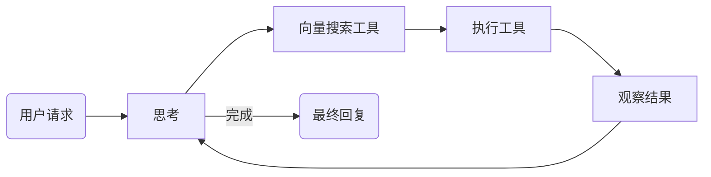

<div align="center">

# 🌉 ApexBridge

**AI Bridge Protocol — 连接 LLM 与工具的轻量级智能桥梁**

[](https://github.com/suntianc/apex-bridge/releases)
[](https://www.typescriptlang.org/)
[](https://nodejs.org/)
[](LICENSE)

[**Quick Start**](#-quick-start) | [**Features**](#-core-features) | [**Architecture**](#%EF%B8%8F-architecture) | [**API**](#-api-reference)

</div>

---


## 📖 What is ApexBridge?

**ApexBridge** 是一个**轻量级 AI 桥接服务**，旨在让 LLM 与外部工具实现无缝对话。它不只是一个 API 代理，而是一个完整的智能体（Agent）框架。

### Key Highlights

* 🧠 **多轮思考 (Multi-round Reasoning)**
    * 基于 ReAct 策略，支持最多 **50 轮** 迭代推理，解决复杂任务。
* 🔍 **工具发现 (Tool Discovery)**
    * 集成 **LanceDB** 向量数据库，通过语义搜索自动匹配最佳工具。
* ⚖️ **双轨并行 (Dual-Track)**
    * **Skills** (本地高性能工具) + **MCP** (远程标准化工具) 统一调度。
* 🌊 **流式输出 (Streaming)**
    * WebSocket 实时推送思考过程与结果，支持随时中断。

---

## 🚀 Quick Start

### Installation

```bash
# 安装依赖
npm install

# 启动开发服务器
npm run dev
```

### Basic Usage

测试聊天接口（OpenAI 兼容）：

```bash
curl -X POST http://localhost:8088/v1/chat/completions \
  -H "Content-Type: application/json" \
  -H "Authorization: Bearer your-api-key" \
  -d '{
    "messages": [{"role": "user", "content": "Hello, introduce yourself."}],
    "stream": false
  }'
```

---

## ✨ Core Features

### 1. Multi-LLM Support
统一适配器接口，支持运行时热切换模型。

```typescript
// 支持 6 个主流 LLM 提供商
const providers = ['openai', 'deepseek', 'zhipu', 'ollama', 'claude', 'custom'];

// API: POST /api/llm/providers/:id/models
```

### 2. Skills System & MCP Integration
支持本地 YAML 定义的 Skills 和标准的 MCP (Model Context Protocol) 服务。

| Type | Description | Definition |
|------|-------------|------------|
| **Skills** | 本地高性能自定义工具 | `.data/skills/my-skill/SKILL.md` |
| **MCP** | 标准化外部协议集成 | `curl -X POST /api/mcp/servers` |

### 3. Unified Tool Calling
LLM 输出统一格式化为 XML Action，便于解析与分发。

```xml
<tool_action name="web_search" type="mcp">
  <query value="latest AI news" />
</tool_action>

<tool_action name="git-commit-helper" type="skill">
  <message value="feat: add feature" />
</tool_action>
```

### 4. ReAct Strategy
自动化推理循环，处理复杂的用户请求。



---

## 🛠 Architecture

<details>
<summary><strong>📂 点击展开完整目录结构</strong></summary>

```
src/
├── core/                    # 核心引擎 (Core Engine)
│   ├── ProtocolEngine.ts    # ABP 协议解析
│   ├── LLMManager.ts        # LLM 适配器管理
│   ├── llm/adapters/        # 6 个 LLM 适配器
│   ├── tool-action/         # 工具调用系统
│   │   ├── ToolActionParser.ts   # <tool_action> 解析
│   │   └── ToolDispatcher.ts     # 类型路由调度
│   └── tools/builtin/       # 内置工具
│
├── services/                # 业务服务 (Business Services)
│   ├── ChatService.ts       # 聊天协调器 (~200行)
│   ├── SkillManager.ts      # Skills 管理
│   ├── MCPIntegrationService.ts  # MCP 集成
│   └── ToolRetrievalService.ts   # 向量检索
│
├── strategies/              # 策略模式 (Strategies)
│   ├── ReActStrategy.ts     # 多轮思考 (selfThinking=true)
│   └── SingleRoundStrategy.ts    # 单轮快速响应
│
└── api/                     # REST/WebSocket
    ├── controllers/         # 控制器
    ├── routes/              # 路由
    └── websocket/           # 实时通信
```
</details>

### Design Patterns

| Pattern | Application Context |
|---------|---------------------|
| 🔌 **Adapter** | 统一 OpenAI, Claude, Ollama 等不同 API 接口 |
| ♟️ **Strategy** | 运行时切换 `ReActStrategy` 或 `SingleRoundStrategy` |
| 🏭 **Factory** | 适配器创建与执行器实例化 |
| 📡 **Observer** | 事件总线 (EventBus) 与 MCP 状态监控 |

---

## 📚 API Reference

### Chat API (OpenAI Compatible)

| Method | Endpoint | Description |
|:------:|----------|-------------|
| `POST` | `/v1/chat/completions` | 标准聊天完成接口 |
| `POST` | `/v1/chat/simple-stream` | 简化版流式输出 |
| `POST` | `/v1/interrupt` | 中断当前生成/思考 |
| `GET` | `/v1/models` | 获取可用模型列表 |

### MCP Management

| Method | Endpoint | Description |
|:------:|----------|-------------|
| `GET/POST` | `/api/mcp/servers` | MCP 服务器注册与查询 |
| `GET` | `/api/mcp/servers/:id/tools` | 获取指定服务器的工具 |
| `POST` | `/api/mcp/tools/call` | 手动调试工具调用 |

> **WebSocket Info:** Connect to `ws://localhost:8088/chat/api_key=your-key` for real-time interaction.

---

## ⚙️ Configuration & Data

### Environment Variables
`.env` 文件配置：
```bash
API_KEY=your-secure-api-key
PORT=8088
LOG_LEVEL=info
```

### Storage
系统采用混合存储架构：

* 🗄️ **SQLite**: 用于结构化数据（LLM 配置, MCP 服务器, 对话历史）。
* ⚡ **LanceDB**: 用于向量索引（工具语义搜索）。

---

## 💻 Tech Stack


## 📄 License

This project is licensed under the [Apache License 2.0](LICENSE).

---

<div align="center">

**Made with ☕ curiosity and code**

[🐛 Report Issues](https://github.com/suntianc/apex-bridge/issues) · [💬 Discussions](https://github.com/suntianc/apex-bridge/discussions)

</div>