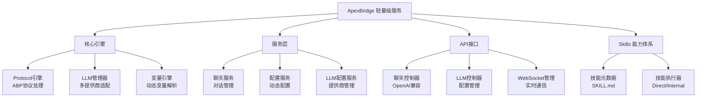

<div align="center">

# 🏠 ApexBridge - 轻量级ABP聊天服务

[](https://github.com/suntianc/apex-bridge)
[](https://github.com/suntianc/apex-bridge/releases)
[](LICENSE)
[](https://nodejs.org/)
[](https://www.typescriptlang.org/)

**一个专注于ABP协议和LLM集成的轻量级聊天服务，支持多LLM提供商、Skills体系和实时流式对话**

[📖 文档](./docs/) | [🚀 快速开始](#-快速开始)

</div>

## 🌟 项目特色

ApexBridge 是一个轻量级、高性能的ABP协议聊天服务，专注于核心聊天功能，采用简洁的架构设计。

### ✨ 核心特性

- 🧠 **多LLM支持** - 兼容 OpenAI、DeepSeek、智谱、Ollama 等主流LLM提供商
- 🔍 **RAG搜索** - 基于 abp-rag-sdk 的向量检索能力
- 🧩 **Skills 能力体系** - 轻量级技能系统，支持 Direct/Internal 执行模式
- 🛡️ **企业级安全** - API速率限制、输入验证、安全防护等完整安全体系
- ⚡ **实时通信** - WebSocket支持双向通信和请求中断
- 🔧 **动态配置** - SQLite存储LLM配置，支持运行时热更新

## 🏗️ 系统架构



## 📦 核心模块

| 模块 | 路径 | 职责 | 状态 |
|------|------|------|------|
| **核心引擎** | `src/core/` | ABP协议、LLM管理、变量引擎、Skills体系 | ✅ 活跃 |
| **API层** | `src/api/` | 聊天接口、LLM配置、WebSocket通信 | ✅ 活跃 |
| **服务层** | `src/services/` | 聊天服务、配置服务、LLM配置服务 | ✅ 活跃 |
| **中间件** | `src/api/middleware/` | 认证、限流、安全、验证 | ✅ 活跃 |

## 🚀 快速开始

### 📋 环境要求

- **Node.js** ≥ 16.0.0
- **npm** ≥ 8.0.0 或 **yarn** ≥ 1.22.0
- **Git** (用于克隆项目)

### ⚡ 一键启动

```bash
# 1. 克隆项目
git clone https://github.com/suntianc/apex-bridge.git
cd apex-bridge/apex-bridge

# 2. 安装依赖
npm install

# 3. 配置
cp config/admin-config-template.json config/admin-config.json
# 编辑 config/admin-config.json，配置你的LLM提供商API密钥

# 4. 启动开发服务器
npm run dev

# 🎉 访问应用
# API服务: http://localhost:8088
# 健康检查: http://localhost:8088/health
```

### 🔧 快速配置

编辑 `config/admin-config.json`：

```json
{
  "api": {
    "host": "0.0.0.0",
    "port": 8088
  },
  "auth": {
    "enabled": false,
    "apiKey": "your-api-key",
    "apiKeys": []
  },
  "rag": {
    "enabled": true,
    "storagePath": "./vector_store",
    "vectorizer": {
      "baseURL": "https://api.openai.com/v1/embeddings",
      "apiKey": "your-openai-api-key",
      "model": "text-embedding-ada-002"
    }
  }
}
```

### 🧪 验证安装

```bash
# 测试API健康状态
curl http://localhost:8088/health

# 测试聊天功能
curl -X POST http://localhost:8088/v1/chat/completions \
  -H "Content-Type: application/json" \
  -d '{
    "messages": [{"role": "user", "content": "你好"}],
    "stream": false
  }'
```

## 📖 使用指南

### 💬 基础对话

```bash
# 非流式聊天
curl -X POST http://localhost:8088/v1/chat/completions \
  -H "Content-Type: application/json" \
  -d '{
    "messages": [
      {"role": "system", "content": "你是一个有用的AI助手"},
      {"role": "user", "content": "今天天气怎么样？"}
    ],
    "stream": false
  }'

# 流式聊天
curl -X POST http://localhost:8088/v1/chat/completions \
  -H "Content-Type: application/json" \
  -d '{
    "messages": [{"role": "user", "content": "你好"}],
    "stream": true
  }'
```

### 🔧 LLM配置管理

```bash
# 列出所有提供商
curl http://localhost:8088/api/llm/providers

# 创建提供商
curl -X POST http://localhost:8088/api/llm/providers \
  -H "Content-Type: application/json" \
  -d '{
    "provider": "deepseek",
    "name": "DeepSeek AI",
    "baseConfig": {
      "apiKey": "your-api-key",
      "baseURL": "https://api.deepseek.com",
      "timeout": 60000,
      "maxRetries": 3
    },
    "enabled": true
  }'

# 添加模型
curl -X POST http://localhost:8088/api/llm/providers/1/models \
  -H "Content-Type: application/json" \
  -d '{
    "modelKey": "deepseek-chat",
    "modelName": "DeepSeek Chat",
    "modelType": "nlp",
    "enabled": true,
    "isDefault": true
  }'
```

详细配置指南请参考：[LLM配置手册](./docs/LLM_CONFIG_MANUAL_SETUP.md)

### 🌐 WebSocket实时通信

```javascript
// 连接WebSocket
const ws = new WebSocket('ws://localhost:8088/chat/api_key=your-api-key');

// 发送流式聊天请求
ws.send(JSON.stringify({
  type: 'stream_chat',
  payload: {
    messages: [{ role: 'user', content: '你好' }],
    options: { stream: true }
  }
}));

// 接收响应
ws.on('message', (data) => {
  const message = JSON.parse(data);
  if (message.type === 'stream_chunk') {
    console.log(message.payload.delta?.content || '');
  }
});
```

## 🧪 测试

### 运行测试

```bash
# 运行所有测试
npm test

# 生成覆盖率报告
npm run test:coverage

# 监视模式
npm run test:watch
```

### 人工测试

详细的测试用例和验证清单请参考：[测试文档中心](./docs/testing/README.md)

## 📚 文档资源

### 📖 配置文档

- [LLM配置手册](./docs/LLM_CONFIG_MANUAL_SETUP.md) - 详细的LLM配置步骤和API使用说明

### 🧪 测试文档

- [测试文档中心](./docs/testing/README.md) - 完整的测试指南与用例
- [测试总览指南](./docs/testing/MANUAL_TESTING_GUIDE.md) - 测试环境准备和执行流程
- [快速验证清单](./docs/testing/guides/QUICK_VALIDATION_CHECKLIST.md) - 10分钟快速验证
- [完整验证清单](./docs/testing/guides/FULL_VALIDATION_CHECKLIST.md) - 30分钟完整验证

### 🌐 在线资源

- [🌐 项目主页](https://github.com/suntianc/apex-bridge)
- [🐛 问题反馈](https://github.com/suntianc/apex-bridge/issues)
- [💬 讨论区](https://github.com/suntianc/apex-bridge/discussions)

## 🛣️ 发展路线图

### 🎯 已完成 (v1.0)

- ✅ 核心ABP协议引擎
- ✅ 多LLM提供商支持（SQLite配置管理）
- ✅ 高性能RAG搜索服务（abp-rag-sdk）
- ✅ 完整的安全防护体系
- ✅ Skills 体系与执行框架
- ✅ WebSocket实时通信

### 🚧 进行中 (v1.1)

- 🔄 性能优化和缓存增强
- 🔄 更多LLM提供商支持
- 🔄 高级监控和日志系统

## 🤝 贡献指南

我们欢迎所有形式的贡献！🎉

### 🛠️ 如何贡献

1. **Fork** 这个仓库
2. 创建你的特性分支 (`git checkout -b feature/AmazingFeature`)
3. 提交你的更改 (`git commit -m 'Add some AmazingFeature'`)
4. 推送到分支 (`git push origin feature/AmazingFeature`)
5. 打开一个 **Pull Request**

### 📝 开发环境设置

```bash
# 克隆仓库
git clone https://github.com/suntianc/apex-bridge.git
cd apex-bridge/apex-bridge

# 安装依赖
npm install

# 启动开发模式
npm run dev

# 运行测试
npm test

# 代码格式化
npm run format

# 代码检查
npm run lint
```

### 📋 贡献规范

- **代码风格**: 使用 ESLint + Prettier
- **提交信息**: 遵循 Conventional Commits
- **测试覆盖率**: 新功能需要包含测试
- **文档更新**: 重要变更需要更新相关文档

## 📄 许可证

本项目采用 [Apache License 2.0](LICENSE) 许可证。

---

<div align="center">

**[⬆️ 回到顶部](#-apexbridge---轻量级abp聊天服务)**

Built with ❤️ by [ApexBridge Team](https://github.com/suntianc/apex-bridge)

**如果这个项目对你有帮助，请给我们一个 ⭐️ Star！**

[🏠 返回首页](https://github.com/suntianc) | [📖 查看文档](./docs/) | [🐛 报告问题](https://github.com/suntianc/apex-bridge/issues) | [💡 功能建议](https://github.com/suntianc/apex-bridge/issues/new?template=feature_request.md)

</div>
