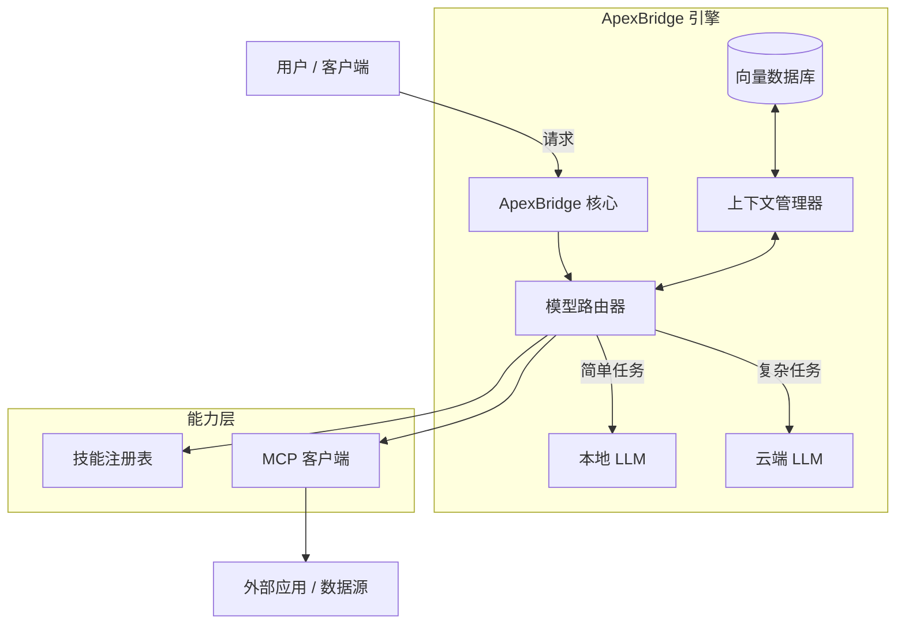

<div align="center">
  

# ApexBridge

**下一代轻量级 AI Agent 框架，MCP 协议集成专家**

连接智能的桥梁 · 轻量级架构 · 多模型编排 · 技能扩展

[](https://opensource.org/licenses/MIT)
[](https://www.typescriptlang.org/)
[](https://nodejs.org/)
[](https://github.com/model-context-protocol)
[](http://makeapullrequest.com)

[核心特性](#-核心特性) • [快速开始](#-快速开始) • [使用示例](#-使用示例) • [路线图](#-路线图) • [贡献指南](#-贡献指南)

</div>

---

## 📖 项目介绍

**ApexBridge** 是一个高性能的 AI Agent 框架，旨在构建孤立的大语言模型（LLM）与现实行动之间的桥梁。专为速度和灵活性而设计，是多智能体系统的连接纽带。

与笨重的传统框架不同，ApexBridge 专注于：

- **轻量级架构**：高效的内存管理，适合本地部署和边缘设备。
- **MCP 原生支持**：深度集成 **Model Context Protocol (MCP)**，标准化上下文共享和工具调用。
- **模型无关编排**：无缝切换 OpenAI、Claude、DeepSeek、Ollama 等多种 LLM。
- **智能上下文管理**：支持 4 层上下文压缩策略，长对话无忧。

> "连接智能与执行的桥梁，开启自主代理新时代。"

---

## ✨ 核心特性

| 特性                  | 描述                                                                                                      |
| :-------------------- | :-------------------------------------------------------------------------------------------------------- |
| 🧠 **多模型支持**     | 统一接口支持 GPT-4、Claude 3.5、Llama 3、DeepSeek 等，根据任务复杂度动态切换模型。                        |
| 🔌 **MCP 协议集成**   | 完全兼容 **Model Context Protocol**，实现代理间标准化上下文共享和工具使用。                               |
| 🛠️ **技能系统**       | 模块化技能注册，支持通过 YAML 定义工具并动态绑定到代理。                                                  |
| ⚡ **高性能执行**     | 核心逻辑针对低延迟进行优化，适合实时交互和边缘计算场景。                                                  |
| 🔄 **智能上下文压缩** | 4 层压缩策略（Truncate/Prune/Summary/Hybrid），100 条消息可压缩至 ~4000 tokens，节省高达 44% 上下文空间。 |
| 🌊 **流式响应**       | WebSocket 实时推送思考过程与结果，支持随时中断。                                                          |

---

## 🏗️ 系统架构



### 核心组件

| 组件                          | 功能                                                 |
| ----------------------------- | ---------------------------------------------------- |
| **ChatService**               | 聊天协调器，处理消息流和压缩逻辑                     |
| **LLMManager**                | 多模型适配器管理，支持 OpenAI/Claude/DeepSeek/Ollama |
| **ContextCompressionService** | 4 层上下文压缩引擎                                   |
| **ToolRetrievalService**      | 基于 LanceDB 的向量检索和工具匹配                    |
| **SkillManager**              | 本地技能管理和索引                                   |
| **MCPIntegrationService**     | MCP 协议客户端和服务端                               |

---

## 🚀 快速开始

### 环境要求

- **Node.js**: 18.0+
- **包管理器**: npm / yarn / pnpm
- **API Keys**: OpenAI / Anthropic / DeepSeek 等（根据使用的模型）

### 安装部署

```bash
# 克隆仓库
git clone https://github.com/suntianc/apex-bridge.git
cd apex-bridge

# 安装依赖
npm install

# 启动开发服务器
npm run dev

# 生产构建
npm run build
npm start
```

### 环境配置

在项目根目录创建 `.env` 文件：

```ini
# .env 配置示例
NODE_ENV=development
PORT=8088

# LLM API 配置
OPENAI_API_KEY=sk-...
ANTHROPIC_API_KEY=sk-ant-...
DEEPSEEK_API_KEY=...

# Embedding 模型（用于向量搜索）
EMBEDDING_PROVIDER=openai
EMBEDDING_MODEL=text-embedding-3-small

# 日志级别
LOG_LEVEL=info
```

---

## 💻 使用示例

### 1. 基础聊天请求

```bash
# 调用聊天完成接口（OpenAI 兼容）
curl -X POST http://localhost:8088/v1/chat/completions \
  -H "Content-Type: application/json" \
  -d '{
    "messages": [
      {"role": "system", "content": "你是一个专业助手"},
      {"role": "user", "content": "请介绍一下 ApexBridge"}
    ],
    "model": "gpt-4",
    "stream": false
  }'
```

### 2. 启用上下文压缩

```typescript
// 启用智能上下文压缩
const result = await chatService.processMessage(messages, {
  model: "gpt-4",
  contextCompression: {
    enabled: true,
    strategy: "hybrid", // truncate | prune | summary | hybrid
    auto: true, // 自动检测溢出
    preserveSystemMessage: true,
  },
});
```

### 3. 流式响应

```bash
# 启用流式输出
curl -X POST http://localhost:8088/v1/chat/completions \
  -H "Content-Type: application/json" \
  -d '{
    "messages": [{"role": "user", "content": "写一个 Python 快速排序"}],
    "model": "gpt-4",
    "stream": true
  }'
```

---

## 🗺️ 路线图

| 版本 | 状态      | 特性                           |
| ---- | --------- | ------------------------------ |
| v1.0 | ✅ 已完成 | 核心架构、事件循环、多模型支持 |
| v1.1 | ✅ 已完成 | MCP 协议完整实现、上下文压缩   |
| v1.2 | 🔄 开发中 | WebSocket 分布式代理节点       |

---

## 📁 项目结构

```
apex-bridge/
├── src/
│   ├── core/                    # 核心引擎
│   │   ├── ProtocolEngine.ts    # ABP 协议解析
│   │   ├── LLMManager.ts        # LLM 适配器管理
│   │   └── llm/adapters/        # 6 个 LLM 适配器实现
│   │
│   ├── services/                # 业务服务
│   │   ├── ChatService.ts       # 聊天协调器
│   │   ├── ContextCompression/  # 上下文压缩（4 层策略）
│   │   ├── ToolRetrievalService/ # 向量检索和工具匹配
│   │   ├── SkillManager.ts      # 技能管理
│   │   └── MCPIntegrationService.ts # MCP 集成
│   │
│   ├── strategies/              # 策略模式
│   │   ├── ReActStrategy.ts     # 多轮思考策略
│   │   └── SingleRoundStrategy.ts # 单轮快速响应
│   │
│   └── api/                     # 接口层
│       ├── controllers/         # 控制器
│       ├── routes/              # 路由定义
│       └── websocket/           # WebSocket 实时通信
│
├── tests/                       # 测试文件
├── assets/                      # 静态资源
├── docs/                        # 文档
└── .data/                       # 数据存储（SQLite + LanceDB）
```

---

## 🛠 技术栈

<div align="center">


</div>

---

## 📚 文档

| 文档                                      | 说明                 |
| ----------------------------------------- | -------------------- |
| [快速开始](docs/getting-started.md)       | 入门指南和安装配置   |
| [架构设计](docs/architecture.md)          | 系统设计深度解析     |
| [API 参考](docs/api-reference.md)         | 完整的 API 文档      |
| [上下文压缩](docs/context-compression.md) | 4 层压缩策略详解     |
| [MCP 集成指南](docs/mcp-integration.md)   | MCP 服务器配置和使用 |

---

## 📄 许可证

本项目基于 MIT 许可证开源 - 查看 [LICENSE](LICENSE) 文件了解详情。

---
