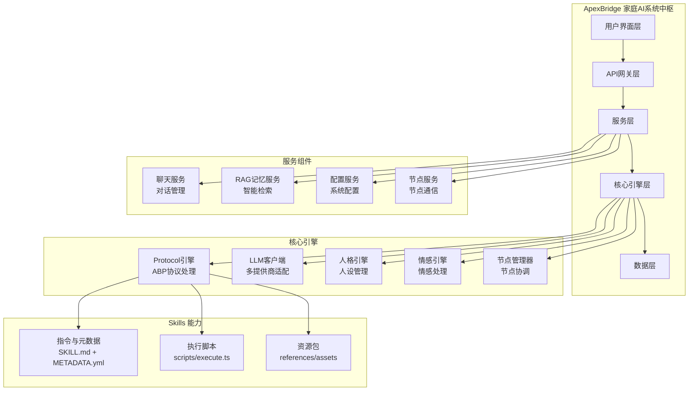

<div align="center">

# 🏠 ApexBridge - 家庭AI系统中枢

[](https://github.com/suntianc/apex-bridge)
[](https://github.com/suntianc/apex-bridge/releases)
[](LICENSE)
[](https://nodejs.org/)
[](https://www.typescriptlang.org/)

[](https://github.com/suntianc/apex-bridge/actions)
[](https://github.com/suntianc/apex-bridge/actions/workflows/security-tests.yml)
[](https://codecov.io/gh/suntianc/apex-bridge)

[](https://github.com/suntianc/apex-bridge/stargazers)
[](https://github.com/suntianc/apex-bridge/network/members)
[](https://github.com/suntianc/apex-bridge/issues)

**一个现代化的桥接应用项目，构建家庭AI系统中枢，集成多LLM支持、高级RAG搜索、人格引擎、情感引擎和节点管理功能**

[English](./README.en.md) | [简体中文](./README.md) | [📖 文档](./docs/) | [🚀 快速开始](#-快速开始)

</div>

## 🌟 项目特色

ApexBridge 是一个功能强大的家庭AI系统中枢，旨在为家庭用户提供智能化、个性化的AI服务体验。项目采用现代化的微服务架构，具有高度的可扩展性和模块化设计。

### ✨ 核心特性

- 🧠 **多LLM支持** - 兼容 OpenAI、DeepSeek、智谱、Ollama 等主流LLM提供商
- 🔍 **高级RAG搜索** - 基于HNSW算法的向量检索，支持时间感知和语义扩展
- 🎭 **人格引擎** - 动态人格配置，支持多种人设和个性化响应
- 💭 **情感引擎** - 情感状态管理和情感化交互体验
- 🧩 **Skills 能力体系** - 取代传统插件系统，标准化 `SKILL.md` + `scripts/execute.ts`，支持三段渐进式披露
- 🧷 **偏好学习（Preference Learning）** - 支持用户/会话偏好存取，影响提示注入与工具参数默认值
- 🌐 **Web管理后台** - 基于React的现代化管理界面
- 🛡️ **企业级安全** - API速率限制、输入验证、安全防护等完整安全体系

## 🏗️ 系统架构



## 📦 项目模块

| 模块 | 描述 | 技术栈 | 状态 | 📖 文档 |
|------|------|--------|------|------|
| **🚀 ApexBridge 主系统** | 家庭AI系统中枢，核心引擎和API | TypeScript + Node.js + Express | ✅ 稳定 | [📖 查看](./apex-bridge/README.md) |
| **🎨 管理后台** | Web管理界面，配置和监控 | React 18 + TypeScript + Vite | ✅ 稳定 | [📖 查看](./apex-bridge/admin/README.md) |
| **🔍 ABP RAG SDK** | 高性能RAG向量检索服务 | TypeScript + hnswlib-node | ✅ 稳定 | [📖 查看](./vcp-intellicore-rag/README.md) |

## 🚀 快速开始

### 📋 环境要求

- **Node.js** ≥ 16.0.0
- **npm** ≥ 8.0.0 或 **yarn** ≥ 1.22.0
- **Git** (用于克隆项目)

### ⚡ 一键启动

```bash
# 1. 克隆项目
git clone https://github.com/suntianc/apex-bridge.git
cd apex-bridge

# 2. 安装依赖
npm install

# 3. 配置环境变量
cp apex-bridge/env.template .env
# 编辑 .env 文件，配置你的LLM提供商API密钥

# 4. 启动开发服务器
npm run dev

# 🎉 访问应用
# API服务: http://localhost:8088
# 管理后台: http://localhost:3000/admin
# 健康检查: http://localhost:8088/health
```

### 🔧 快速配置

```bash
# 编辑 .env 文件
nano .env
```

```env
# 基础配置
PORT=8088
NODE_ENV=development

# LLM配置 (选择一个提供商)
LLM_PROVIDER=deepseek
DEEPSEEK_API_KEY=your_deepseek_api_key
# 或使用OpenAI
# LLM_PROVIDER=openai
# OPENAI_API_KEY=your_openai_api_key

# RAG配置 (可选)
RAG_ENABLED=true
RAG_VECTORIZER_API_URL=https://api.openai.com/v1/embeddings
RAG_VECTORIZER_API_KEY=your_openai_api_key
```

### 🧪 验证安装

```bash
# 测试API健康状态
curl http://localhost:8088/health

# 测试聊天功能
curl -X POST http://localhost:8088/v1/chat/completions \
  -H "Content-Type: application/json" \
  -d '{
    "messages": [{"role": "user", "content": "你好，请介绍一下你自己"}],
    "stream": false
  }'
```

## 📖 使用指南

### 💬 基础对话

```typescript
// 使用curl进行API调用
curl -X POST http://localhost:8088/v1/chat/completions \
  -H "Content-Type: application/json" \
  -d '{
    "messages": [
      {"role": "system", "content": "你是一个有用的AI助手"},
      {"role": "user", "content": "今天天气怎么样？"}
    ],
    "stream": true
  }'
```

### 🎭 人格配置

```json
// 配置文件示例: config/personality/温暖伙伴.json
{
  "name": "温暖伙伴",
  "systemPrompt": "你是一个温暖、贴心的AI伙伴，总是用关怀的语气回应。",
  "traits": ["温暖", "体贴", "耐心"],
  "responseStyle": "友好、轻松",
  "exampleResponses": [
    "主人，今天过得怎么样呀？",
    "有什么我可以帮助你的吗？"
  ]
}
```

### 🔍 RAG检索

```typescript
// 使用ABP变量进行RAG搜索
const query = "{{rag:diary:user:time}}"; // 搜索用户的日记，按时间排序

// 高级搜索模式
const advancedQuery = "{{rag:docs:technical:time+group+rerank}}"; // 结合多种搜索模式
```

### 🧩 Skills 开发

```ts
// 典型技能布局
// skills/WeatherInfo/
// ├─ SKILL.md           # 指令与说明（含 ABP 配置）
// ├─ scripts/execute.ts # 执行入口（导出默认异步函数）
// ├─ references/        # 参考资料（可选）
// └─ assets/            # 资源文件（可选）

// scripts/execute.ts
export default async function execute(params: { city?: string }, context: any) {
  const city = params.city || '北京';
  // 调用天气API...
  return { city, tempC: 25, condition: '晴' };
}
```

## 🧪 测试与质量

### 📊 测试覆盖率

- **总覆盖率**: **95.7%** (154/161 测试通过)
- **核心引擎**: 98% 覆盖率
- **服务层**: 96% 覆盖率
- **API接口**: 94% 覆盖率

### 🧪 运行测试

```bash
# 运行所有测试
npm test

# 生成覆盖率报告
npm run test:coverage

# 监视模式
npm run test:watch

# 运行特定测试套件
npm test -- PersonalityEngine
npm test -- RAGService
npm test -- rateLimit
```

### 🔒 安全测试

```bash
# 运行安全相关测试
npm test -- --testPathPattern="security|rateLimit|validation"

# 安全扫描
npm audit

# Trivy漏洞扫描
trivy fs .
```

## 📚 文档资源

### 📖 用户文档

- [📋 用户手册](./docs/USER_GUIDE.md) - 详细的使用说明
- [⚙️ 配置指南](./docs/CONFIGURATION.md) - 完整的配置说明
- [🔧 故障排除](./docs/TROUBLESHOOTING.md) - 常见问题解决方案
- [📖 API文档](./docs/API.md) - 完整的API参考

### 👨‍💻 开发者文档

- [🏗️ 架构设计](./docs/ARCHITECTURE.md) - 系统架构说明
- [🧩 Skills 开发](./docs/skills/DEVELOPMENT.md) - Skills 开发指南
- [🧷 偏好学习与披露](./docs/PREFERENCE_AND_DISCLOSURE.md) - 偏好API、披露阶段与覆盖关系
- [📦 Skills 迁移](./docs/skills/MIGRATION_GUIDE.md) - 从插件到 Skills 的迁移说明
- [🗂️ 历史插件样例说明](./docs/historical/PLUGINS_LEGACY.md) - 历史插件示例，仅供参考
- [🧪 测试文档目录](./docs/testing/README.md) - 完整的测试指南与场景
  - 🔄 [集成测试场景](./docs/testing/INTEGRATION_SCENARIOS.md) - Node Agent与Hub集成测试
  - 🎯 [M2.2 第二阶段测试](./docs/testing/M2.2_PHASE2_TESTING_GUIDE.md) - ABP协议迁移测试
  - 🔌 [端到端测试](./docs/testing/E2E_SCENARIO_COMPANION_WORKER.md) - Companion与Worker端到端场景
  - 🐛 [WebSocket故障排除](./docs/testing/WEBSOCKET_TROUBLESHOOTING.md) - WebSocket调试指南
  - 📝 [测试结果汇总](./docs/testing/TEST_RESULTS_SUMMARY.md) - 测试执行结果记录
- 📋 [功能测试指南](./docs/MEMORY_SERVICE_TEST_GUIDE.md) - 记忆服务测试
- 🎛️ [管理后台测试](./docs/ADMIN_PANEL_TEST_GUIDE.md) - AdminPanel功能测试
- 🧠 [RAG API测试](./docs/RAG_API_TEST_CASE.md) - RAG接口测试用例
- 📦 [部署指南](./docs/DEPLOYMENT.md) - 生产环境部署

### 🌐 在线资源

- [🌐 项目主页](https://github.com/suntianc/apex-bridge)
- [🐛 问题反馈](https://github.com/suntianc/apex-bridge/issues)
- [💬 讨论区](https://github.com/suntianc/apex-bridge/discussions)
- [📊 项目看板](https://github.com/suntianc/apex-bridge/projects)

## 🛣️ 发展路线图

### 🎯 已完成 (v1.0)

- ✅ 核心ABP引擎和LLM客户端
- ✅ 人格引擎和情感系统
- ✅ 高性能RAG搜索服务
- ✅ Web管理后台
- ✅ 完整的安全防护体系
- ✅ Skills 体系与执行框架（替代插件系统）

### 🚧 进行中 (v1.1)

- 🔄 三段渐进式披露完善（元数据/简述/全文）
- 🔄 性能优化和缓存增强
- 🔄 更多LLM提供商支持
- 🔄 高级监控和日志系统

### 🔮 计划中 (v2.0)

- 📅 分布式部署支持
- 📅 多模态AI集成
- 📅 企业级权限管理
- 📅 云原生部署方案
- 📅 移动端支持

## 🤝 贡献指南

我们欢迎所有形式的贡献！🎉

### 🛠️ 如何贡献

1. **Fork** 这个仓库
2. 创建你的特性分支 (`git checkout -b feature/AmazingFeature`)
3. 提交你的更改 (`git commit -m 'Add some AmazingFeature'`)
4. 推送到分支 (`git push origin feature/AmazingFeature`)
5. 打开一个 **Pull Request**

### 📝 开发环境设置

```bash
# 克隆仓库
git clone https://github.com/suntianc/apex-bridge.git
cd apex-bridge

# 安装依赖
npm install

# 启动开发模式
npm run dev

# 运行测试
npm test

# 代码格式化
npm run format

# 代码检查
npm run lint
```

### 📋 贡献规范

- **代码风格**: 使用 ESLint + Prettier
- **提交信息**: 遵循 Conventional Commits
- **测试覆盖率**: 新功能需要包含测试
- **文档更新**: 重要变更需要更新相关文档

### 🏆 贡献者

感谢所有为这个项目做出贡献的开发者！

<a href="https://github.com/suntianc/apex-bridge/graphs/contributors">
  
</a>

## 📄 许可证

本项目采用 [Apache License 2.0](LICENSE) 许可证。

---

<div align="center">

**[⬆️ 回到顶部](#-apexbridge---家庭ai系统中枢)**

Built with ❤️ by [ApexBridge Team](https://github.com/suntianc/apex-bridge)

**如果这个项目对你有帮助，请给我们一个 ⭐️ Star！**

[🏠 返回首页](https://github.com/suntianc) | [📖 查看文档](./docs/) | [🐛 报告问题](https://github.com/suntianc/apex-bridge/issues) | [💡 功能建议](https://github.com/suntianc/apex-bridge/issues/new?template=feature_request.md)

</div>