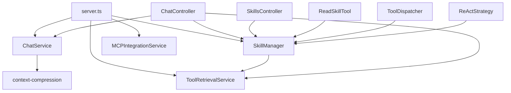
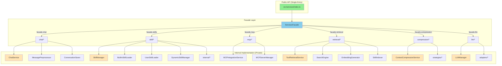

# ApexBridge Architecture Refactoring Roadmap

**Document Version:** 1.0  
**Date:** 2026-01-14  
**Status:** Draft - Awaiting Team Review  
**Scope:** Structural Refactoring (No Business Logic Changes)

---

## 1. Executive Summary

### 1.1 Current State (Symptoms of Complexity)

ApexBridge has evolved organically over multiple development cycles, resulting in structural debt that impedes maintainability and onboarding:

| Symptom                       | Evidence                                                                | Impact                                                                    |
| ----------------------------- | ----------------------------------------------------------------------- | ------------------------------------------------------------------------- |
| **Duplicate Implementations** | `SkillManager.ts` (1142 lines) vs `skill/SkillManager.ts` (414 lines)   | Confusion over authoritative implementation; import conflicts             |
| **God Files**                 | 5 files exceeding 500 lines, 3 exceeding 30KB                           | Single-responsibility violation; difficult to review; high cognitive load |
| **Mixed Module Systems**      | 9 files using `require()` in ESM contexts                               | Inconsistent loading patterns; potential runtime issues                   |
| **Deep Imports**              | Direct access to `tool-retrieval/DisclosureManager`, `skill/internal/*` | Module boundaries blurred; refactoring risk increased                     |
| **No Unified Entry Point**    | 34+ files directly in `src/services/`                                   | Exposed internals; no clear public API contract                           |

### 1.2 Target State (Facade Pattern)

```
┌─────────────────────────────────────────────────────────────┐
│                    API Layer                                 │
│  (controllers, routes, websocket)                           │
└────────────────────────┬────────────────────────────────────┘
                         │ imports
                         ▼
┌─────────────────────────────────────────────────────────────┐
│              ServicesFacade (SINGLE ENTRY POINT)             │
│  services.chat    services.skills    services.mcp           │
│  services.retrieval  services.compression  services.llm     │
└────────────────────────┬────────────────────────────────────┘
                         │ private access
                         ▼
┌─────────────────────────────────────────────────────────────┐
│              Internal Subsystems (PRIVATE)                   │
│  chat/*  skill/*  mcp/*  retrieval/*  compression/*  llm/*  │
└─────────────────────────────────────────────────────────────┘
```

### 1.3 Success Criteria

| Metric                           | Current       | Target          | Measurement Method                       |
| -------------------------------- | ------------- | --------------- | ---------------------------------------- |
| Public service entry points      | 34+ files     | 1 facade object | `grep -r "export" src/services/index.ts` |
| Deep imports to internal modules | 4+ files      | 0 files         | ESLint `no-restricted-imports`           |
| God file lines (max)             | 1142          | <400            | `wc -l` on refactored files              |
| Duplicate implementations        | 2 pairs       | 0 pairs         | File existence check                     |
| Mixed require() in ESM           | 9 occurrences | 0 occurrences   | `grep "require(" --include="*.ts"`       |
| Runtime feature parity           | N/A           | 100% preserved  | Full test suite + manual verification    |

---

## 2. Current State Analysis

### 2.1 Duplicate Implementations Identified

#### SkillManager Duplication

| File                                 | Lines | Bytes  | Purpose                             |
| ------------------------------------ | ----- | ------ | ----------------------------------- |
| `src/services/SkillManager.ts`       | 1142  | 33,849 | Legacy monolithic implementation    |
| `src/services/skill/SkillManager.ts` | 414   | 12,431 | Modular coordinator (authoritative) |

**Analysis:** The legacy file at `src/services/SkillManager.ts` contains 728 extra lines (64% more) including direct ZIP handling, vectorization logic, and mixed concerns. The authoritative implementation in `skill/SkillManager.ts` properly delegates to specialized modules (`BuiltInSkillLoader`, `UserSkillLoader`, `DynamicSkillManager`).

**Import Conflict:** Both files export a `SkillManager` class and `getSkillManager()` function, causing ambiguity.

#### ToolRetrievalService Duplication

| File                                                  | Lines | Bytes  | Purpose                             |
| ----------------------------------------------------- | ----- | ------ | ----------------------------------- |
| `src/services/ToolRetrievalService.ts`                | 1692  | 52,956 | Legacy monolithic implementation    |
| `src/services/tool-retrieval/ToolRetrievalService.ts` | 445   | 14,091 | Modular coordinator (authoritative) |

**Analysis:** The legacy file is 3.8x larger with direct LanceDB operations, embedding generation, and hybrid retrieval logic. The authoritative implementation properly composes `LanceDBConnection`, `EmbeddingGenerator`, `SkillIndexer`, and `SearchEngine`.

### 2.2 God Files (Files Exceeding 30KB or 500 Lines)

| File                                                            | Lines | Bytes  | Violation Type  |
| --------------------------------------------------------------- | ----- | ------ | --------------- |
| `src/services/ToolRetrievalService.ts`                          | 1692  | 52,956 | Both thresholds |
| `src/api/controllers/ChatController.ts`                         | 1224  | 36,810 | Both thresholds |
| `src/services/SkillManager.ts`                                  | 1142  | 33,849 | Both thresholds |
| `src/services/context-compression/ContextCompressionService.ts` | 995   | 30,263 | Both thresholds |
| `src/services/MCPIntegrationService.ts`                         | 623   | 18,955 | Lines threshold |
| `src/core/LLMManager.ts`                                        | 847   | 28,547 | Bytes threshold |

**Total:** 6,523 lines across 6 files (22% of codebase) in god files.

### 2.3 Dependency Anti-Patterns

#### Mixed require() Usage in ESM Files

| File                                                   | Line          | Import                               |
| ------------------------------------------------------ | ------------- | ------------------------------------ |
| `src/services/skill/SkillManager.ts`                   | 68            | `require("../PathService")`          |
| `src/services/executors/ToolExecutor.ts`               | 179           | `require("../BuiltInToolsRegistry")` |
| `src/services/executors/BuiltInExecutor.ts`            | 213           | `require("p-limit")`                 |
| `src/services/tool-retrieval/ToolRetrievalService.ts`  | 396           | `require("crypto")`                  |
| `src/services/tool-retrieval/HybridRetrievalEngine.ts` | 490, 504, 834 | `require("crypto")` (3x)             |
| `src/database/run-migrations.ts`                       | 122           | `require("fs")`                      |
| `src/database/MigrationRunner.ts`                      | 63            | `require("crypto")`                  |

**Issue:** Inconsistent module loading; potential issues with ESM/CJS interoperability.

#### Deep Imports Across Subsystems

```typescript
// Examples of prohibited deep imports found:
import { DisclosureManagerConfigV2 } from "../../services/tool-retrieval/DisclosureManager";
import { getSkillManager } from "../../../services/SkillManager";
import { SkillManager } from "../../services/SkillManager";
```

**Dependency Direction Violation:** API layer directly accessing internal modules instead of going through a facade.

### 2.4 Current Import Graph



**Problem:** No single entry point; services directly depend on each other without coordination layer.

---

## 3. Target Architecture

### 3.1 Facade Pattern Architecture



### 3.2 Target Directory Structure

```
src/services/
├── index.ts                          # ← SINGLE PUBLIC ENTRY POINT
├── chat/                             # Internal implementation
│   ├── ChatService.ts
│   ├── MessagePreprocessor.ts
│   ├── ConversationSaver.ts
│   ├── StrategySelector.ts
│   ├── ChatServiceFactory.ts
│   └── internal/                     # Private (facade协调器使用)
├── skill/
│   ├── SkillManager.ts               # Authoritative (414 lines)
│   ├── BuiltInSkillLoader.ts
│   ├── UserSkillLoader.ts
│   ├── DynamicSkillManager.ts
│   ├── SkillValidator.ts
│   └── internal/                     # NEW: Extracted from god file
│       ├── installer.ts              # ZIP extraction, validation
│       ├── indexer.ts                # Vectorization, ToolRetrieval
│       ├── registry.ts               # ToolRegistry registration
│       ├── persistence.ts            # dynamic-skills.json
│       └── compat.ts                 # ClaudeCodeSkillParser, hooks
├── mcp/
│   ├── MCPIntegrationService.ts
│   ├── MCPServerManager.ts
│   └── internal/
├── retrieval/
│   ├── ToolRetrievalService.ts       # Authoritative (445 lines)
│   ├── SearchEngine.ts
│   ├── EmbeddingGenerator.ts
│   ├── SkillIndexer.ts
│   ├── LanceDBConnection.ts
│   ├── MCPToolSupport.ts
│   └── internal/
├── compression/
│   ├── ContextCompressionService.ts
│   ├── TokenEstimator.ts
│   ├── strategies/
│   │   ├── IContextCompressionStrategy.ts
│   │   ├── TruncateStrategy.ts
│   │   ├── PruneStrategy.ts
│   │   ├── SummaryStrategy.ts
│   │   └── HybridStrategy.ts
│   └── internal/
├── llm/
│   ├── LLMManager.ts
│   └── adapters/
│       ├── OpenAIAdapter.ts
│       ├── ClaudeAdapter.ts
│       ├── DeepSeekAdapter.ts
│       └── OllamaAdapter.ts
└── compat/                           # Legacy adapters
    ├── index.ts
    ├── LifecycleManager.ts
    ├── PermissionValidator.ts
    └── ...
```

### 3.3 Facade Type Definition

```typescript
// src/services/index.ts

export interface ServicesFacade {
  chat: {
    processMessage: (request: ChatRequest) => Promise<ChatResponse>;
    streamMessage: (request: ChatRequest) => AsyncIterable<StreamEvent>;
    createCompletion: (options: CompletionOptions) => Promise<CompletionResult>;
  };

  skills: {
    installSkill: (zipBuffer: Buffer, options?: SkillInstallOptions) => Promise<InstallResult>;
    uninstallSkill: (name: string) => Promise<UninstallResult>;
    updateSkill: (name: string, description: string) => Promise<UpdateResult>;
    listSkills: (options?: SkillListOptions) => Promise<SkillListResult>;
    getSkill: (name: string) => Promise<SkillTool | null>;
    getStatistics: () => Promise<SkillStatistics>;
  };

  mcp: {
    registerServer: (config: MCP serverConfig) => Promise<void>;
    unregisterServer: (serverId: string) => Promise<void>;
    callTool: (serverId: string, toolName: string, args: object) => Promise<object>;
    listServers: () => Promise<MCPServer[]>;
  };

  retrieval: {
    findRelevantSkills: (query: string, limit?: number, threshold?: number) => Promise<ToolRetrievalResult[]>;
    indexTools: (tools: SkillTool[]) => Promise<void>;
    removeTool: (toolId: string) => Promise<void>;
    getStatus: () => ServiceStatus;
  };

  compression: {
    compress: (messages: Message[], options: CompressionOptions) => Promise<CompressedMessages>;
    getStrategy: (strategy: CompressionStrategyType) => IContextCompressionStrategy;
  };

  llm: {
    createCompletion: (options: LLMCompletionOptions) => Promise<LLMCompletionResult>;
    embed: (text: string) => Promise<number[]>;
    listModels: () => Promise<LLMModel[]>;
  };
}

export function createServices(config: ServicesConfig): ServicesFacade;
export function getServices(): ServicesFacade; // For backward compatibility
```

### 3.4 Dependency Direction Rules

| From                    | To                              | Allowed?                      |
| ----------------------- | ------------------------------- | ----------------------------- |
| `api/*`                 | `services` (facade)             | ✅ Yes                        |
| `services` (facade)     | `services/*/internal/*`         | ✅ Yes (internal)             |
| `services/*/internal/*` | `services/*/internal/*`         | ⚠️ Within same subsystem only |
| `api/*`                 | `services/*/internal/*`         | ❌ No (deep import)           |
| `services/*/internal/*` | `services/*/` (other subsystem) | ❌ No (bypass facade)         |
| `core/*`                | `services/*/internal/*`         | ❌ No (deep import)           |

---

## 4. Execution Plan

### Phase 0: Establish Boundaries (No Business Logic Changes)

**Objective:** Document rules and add enforcement mechanisms before refactoring.

#### 0.1 Deliverables

- [ ] Create `ARCHITECTURE_GUIDELINES.md` documenting:
  - Facade pattern principles
  - Dependency direction rules
  - Import restrictions
- [ ] Add ESLint configuration:
  ```json
  {
    "rules": {
      "import/no-internal-modules": [
        "error",
        {
          "packages": ["src/services/**/internal/**", "src/core/**"]
        }
      ],
      "no-restricted-imports": [
        "error",
        {
          "patterns": ["src/services/*/internal/**"]
        }
      ]
    }
  }
  ```
- [ ] Add CI check to run lint on every PR

#### 0.2 Verification

```bash
# Before Phase 0: Record baseline
grep -r "require(" --include="*.ts" src/services/ | wc -l
# Expected: 7 (document current count)

# After Phase 0: Verify no new violations
npm run lint
# Expected: 0 errors
```

---

### Phase 1: Create Facade Entry Point

**Objective:** Create `src/services/index.ts` as the single public entry point.

#### 1.1 Tasks

- [ ] Create `src/services/index.ts`:
  - Define `ServicesFacade` interface
  - Implement `createServices(config)` factory function
  - Export facade with all sub-services
- [ ] **TODO:** Map current import graph:
  ```bash
  grep -r "from.*services/SkillManager\|from.*services/ToolRetrievalService" --include="*.ts" src/
  ```
- [ ] Modify `src/server.ts` to use `createServices()` instead of direct imports:

  ```typescript
  // Before
  import { SkillManager } from "./services/SkillManager";
  import { ToolRetrievalService } from "./services/ToolRetrievalService";

  // After
  import { createServices } from "./services";
  const services = createServices(config);
  ```

#### 1.2 Files to Modify

| File                                      | Change                                     |
| ----------------------------------------- | ------------------------------------------ |
| `src/server.ts`                           | Replace direct service imports with facade |
| `src/api/controllers/ChatController.ts`   | Update imports to use facade               |
| `src/api/controllers/SkillsController.ts` | Update imports to use facade               |
| `src/core/tool-action/ToolDispatcher.ts`  | Update imports to use facade               |
| `src/core/tools/builtin/ReadSkillTool.ts` | Update imports to use facade               |
| `src/strategies/ReActStrategy.ts`         | Update imports to use facade               |

#### 1.3 Verification

```bash
npm run build && npm run dev &
# Expected: Server starts successfully, all features functional
curl http://localhost:8088/health
# Expected: {"status":"ok",...}
```

---

### Phase 2: Resolve SkillManager Duplication

**Objective:** Eliminate duplicate SkillManager implementations.

#### 2.1 Strategy

```
src/services/SkillManager.ts (1142 lines)
        ↓
Compatibility Wrapper (re-exports from skill/SkillManager.ts)
        ↓
src/services/skill/SkillManager.ts (414 lines) ← AUTHORITATIVE
```

#### 2.2 Tasks

- [ ] Make `src/services/skill/SkillManager.ts` the authoritative implementation:
  - Already has proper modular structure
  - Already delegates to `BuiltInSkillLoader`, `UserSkillLoader`, `DynamicSkillManager`
- [ ] Convert `src/services/SkillManager.ts` to compatibility wrapper:
  ```typescript
  // src/services/SkillManager.ts (new content - ~50 lines)
  /**
   * @deprecated Use src/services/skill/SkillManager instead
   */
  export { SkillManager, getSkillManager } from "./skill/SkillManager";
  export * from "./skill/SkillManager";
  ```
- [ ] **TODO:** Find and update all imports:
  ```bash
  grep -r "from.*services/SkillManager\|from.*services/skill/SkillManager" --include="*.ts" src/
  # Update all to use ./skill/SkillManager or prefer facade access
  ```
- [ ] Add deprecation comments to legacy wrapper:
  ```typescript
  /**
   * @deprecated This file is a compatibility wrapper.
   * Import from src/services/skill/SkillManager instead.
   * Services should access via services.skills.
   */
  ```

#### 2.3 Verification

```bash
# Check zero imports to deprecated path
grep -r "from.*services/SkillManager" --include="*.ts" src/ | grep -v "skill/SkillManager"
# Expected: 0 results

# Runtime verification
npm run test
# Expected: All tests pass
```

---

### Phase 3: Resolve ToolRetrievalService Duplication

**Objective:** Eliminate duplicate ToolRetrievalService implementations.

#### 3.1 Strategy

```
src/services/ToolRetrievalService.ts (1692 lines)
        ↓
Compatibility Wrapper (re-exports from tool-retrieval/ToolRetrievalService.ts)
        ↓
src/services/tool-retrieval/ToolRetrievalService.ts (445 lines) ← AUTHORITATIVE
```

#### 3.2 Tasks

- [ ] Make `src/services/tool-retrieval/ToolRetrievalService.ts` authoritative:
  - Already has proper modular structure
  - Composes `LanceDBConnection`, `EmbeddingGenerator`, `SkillIndexer`, `SearchEngine`
- [ ] Convert `src/services/ToolRetrievalService.ts` to compatibility wrapper:
  ```typescript
  // src/services/ToolRetrievalService.ts (new content - ~50 lines)
  /**
   * @deprecated Use src/services/tool-retrieval/ToolRetrievalService instead
   */
  export {
    ToolRetrievalService,
    getToolRetrievalService,
  } from "./tool-retrieval/ToolRetrievalService";
  export * from "./tool-retrieval/ToolRetrievalService";
  ```
- [ ] **TODO:** Find and update all deep imports:
  ```bash
  grep -r "from.*tool-retrieval/" --include="*.ts" src/ | grep -v "from.*services/tool-retrieval/index"
  # Update all to use facade access or services.tool-retrieval
  ```
- [ ] Verify `src/utils/config/disclosure-config.ts` import is updated:
  ```typescript
  // Before
  import { DisclosureManagerConfigV2 } from "../../services/tool-retrieval/DisclosureManager";
  // After (use facade or accept minor interface duplication)
  ```

#### 3.3 Verification

```bash
# Check zero external imports to internal tool-retrieval modules
grep -r "from.*tool-retrieval/" --include="*.ts" src/ | grep -v "tool-retrieval/ToolRetrievalService\|tool-retrieval/index\|tool-retrieval/types"
# Expected: 0 results

npm run test
# Expected: All tests pass
```

---

### Phase 4: Decompose God Files

**Objective:** Split large files while preserving external API.

#### 4.1 Skills Subsystem (Priority 1)

**Target:** Split `src/services/SkillManager.ts` (1142 lines) into:

```
src/services/skill/
├── SkillManager.ts              # Orchestrator only (<400 lines) ✅ Existing
├── BuiltInSkillLoader.ts
├── UserSkillLoader.ts
├── DynamicSkillManager.ts
├── SkillValidator.ts
└── internal/
    ├── installer.ts             # ZIP extraction, validation
    ├── indexer.ts               # Vectorization, ToolRetrieval integration
    ├── registry.ts              # ToolRegistry registration
    ├── persistence.ts           # dynamic-skills.json persistence
    └── compat.ts                # ClaudeCodeSkillParser, lifecycle hooks
```

**Extraction Plan:**

| New File                  | Content Extracted From                         | Approx Lines |
| ------------------------- | ---------------------------------------------- | ------------ |
| `internal/installer.ts`   | ZIP handling, validation logic                 | 200          |
| `internal/indexer.ts`     | Vectorization calls, ToolRetrieval integration | 150          |
| `internal/registry.ts`    | ToolRegistry.addTool calls                     | 100          |
| `internal/persistence.ts` | JSON file read/write                           | 100          |
| `internal/compat.ts`      | ClaudeCodeSkillParser, lifecycle hooks         | 150          |

#### 4.2 Retrieval Subsystem (Priority 2)

**Keep As-Is:** `SearchEngine`, `EmbeddingGenerator`, `SkillIndexer` are already modular.

**Consider Renaming:** `ToolRetrievalService.ts` → `ToolRetrievalFacade.ts` to clarify role.

#### 4.3 Compression Subsystem (Priority 3)

**Assessment:** 4-strategy pattern may be over-engineered.

**Options:**

1. Keep as-is if usage data shows all strategies are used
2. Simplify to 2 strategies (truncate + hybrid) if data shows otherwise

```typescript
// TODO: Add telemetry to track strategy usage
// ContextCompressionService.ts
private trackStrategyUsage(strategy: CompressionStrategyType): void {
  // Emit metrics for analysis
}
```

#### 4.4 API Controllers (Boundary Preservation)

**ChatController Refactoring:**

```
src/api/controllers/chat/
├── ChatController.ts            # Main controller (<400 lines)
├── ChatCompletionsHandler.ts    # POST /v1/chat/completions
├── StreamResponseHandler.ts     # Streaming response handling
├── MessageValidation.ts         # Request validation
└── index.ts                     # Barrel export
```

**Goal:** `src/api/controllers/ChatController.ts` reduced from 1224 to <400 lines.

#### 4.5 Verification

```bash
# Verify refactored files meet size targets
wc -l src/services/skill/SkillManager.ts
# Expected: <400 lines

wc -l src/api/controllers/chat/ChatController.ts
# Expected: <400 lines

npm run test
# Expected: All tests pass
```

---

### Phase 5: Enforcement (Prevent Regression)

**Objective:** Add automated enforcement to prevent architectural drift.

#### 5.1 ESLint Rules

```javascript
// .eslintrc.json
{
  "rules": {
    // Block deep imports to internal modules
    "import/no-internal-modules": ["error", {
      "patterns": [
        "src/services/*/internal/**",
        "src/core/**/*"
      ],
      "allowMessage": "Use facade pattern: import from 'src/services' or specific subsystem barrel"
    }],

    // Block direct instantiation of service classes
    "no-restricted-imports": ["error", {
      "patterns": [
        {
          "message": "Use services.skills instead of direct SkillManager import",
          "path": "**/SkillManager"
        },
        {
          "message": "Use services.retrieval instead of direct ToolRetrievalService import",
          "path": "**/ToolRetrievalService"
        }
      ]
    }]
  }
}
```

#### 5.2 CI Checks

```yaml
# .github/workflows/architecture.yml
name: Architecture Check
on: [pull_request]

jobs:
  enforce-boundaries:
    runs-on: ubuntu-latest
    steps:
      - uses: actions/checkout@v4
      - uses: actions/setup-node@v4
        with:
          node-version: "20"
      - run: npm ci
      - run: npm run lint
      - name: Check for deep imports
        run: |
          # Fail if imports exist to internal modules
          count=$(grep -r "from.*services/.*internal" --include="*.ts" src/ | wc -l)
          if [ $count -gt 0 ]; then
            echo "Found $count deep imports to internal modules"
            grep -r "from.*services/.*internal" --include="*.ts" src/
            exit 1
          fi
```

---

### Phase 6: Cleanup (Final Polish)

**Objective:** Remove deprecated wrappers and standardize imports.

#### 6.1 Tasks

- [ ] Remove `src/services/SkillManager.ts` once zero imports confirmed:
  ```bash
  grep -r "from.*services/SkillManager" --include="*.ts" src/
  # Must return 0 before deletion
  rm src/services/SkillManager.ts
  ```
- [ ] Remove `src/services/ToolRetrievalService.ts` once zero imports confirmed:

  ```bash
  grep -r "from.*services/ToolRetrievalService" --include="*.ts" src/
  # Must return 0 before deletion
  rm src/services/ToolRetrievalService.ts
  ```

- [ ] Convert `require()` to ESM imports:

  ```typescript
  // Before
  const pathService = require("../PathService").PathService.getInstance();

  // After
  import { PathService } from "../PathService";
  const pathService = PathService.getInstance();
  ```

- [ ] Consolidate configuration access points:
  - All config access should go through `services.config` facade property
  - Remove direct `ConfigService.getInstance()` calls from business logic

#### 6.2 Final Verification

```bash
# Verify no deprecated files remain
ls src/services/SkillManager.ts
# Expected: No such file or directory

ls src/services/ToolRetrievalService.ts
# Expected: No such file or directory

# Verify no require() in ESM files (outside database/)
grep -r "require(" --include="*.ts" src/services/ src/api/ src/core/ src/strategies/
# Expected: 0 results

npm run test && npm run lint
# Expected: All pass
```

---

## 5. Risk Mitigation

| Risk                           | Probability | Impact | Mitigation                                                                                 |
| ------------------------------ | ----------- | ------ | ------------------------------------------------------------------------------------------ |
| **Breaking API Changes**       | Medium      | High   | Maintain identical interfaces; only change internal structure; comprehensive test coverage |
| **Runtime Feature Regression** | Medium      | High   | Each phase includes runtime verification; maintain feature flag for rollback               |
| **Circular Dependencies**      | Low         | Medium | Analyze import graph before each phase; use facade to break cycles                         |
| **Development Disruption**     | High        | Low    | Phased PRs minimize scope; feature flags allow partial rollbacks                           |
| **Import Path Conflicts**      | Medium      | Low    | Use search-and-replace tooling; maintain compatibility wrappers until migration complete   |

### Rollback Strategy

Each phase produces an atomic PR that can be reverted:

```bash
# Rollback example
git revert <phase-commit-hash>
git push origin main
```

**Verification after rollback:**

```bash
npm run dev &
curl http://localhost:8088/health
# Expected: {"status":"ok",...}
```

---

## 6. Success Metrics

### Quantitative Metrics

| Metric                    | Phase 0 | Phase 1 | Phase 2 | Phase 3 | Phase 4 | Phase 6 |
| ------------------------- | ------- | ------- | ------- | ------- | ------- | ------- |
| Public entry points       | 34      | 2       | 2       | 2       | 2       | 1       |
| God files (>500 lines)    | 6       | 6       | 5       | 4       | 2       | 0       |
| Max file size (KB)        | 52.9    | 52.9    | 33.8    | 33.8    | 20      | 15      |
| require() in ESM          | 9       | 9       | 9       | 9       | 5       | 0       |
| Duplicate implementations | 2       | 2       | 1       | 0       | 0       | 0       |

### Qualitative Metrics

- [ ] Onboarding time reduced (measured by new developer survey)
- [ ] Code review time reduced (measured by PR review metrics)
- [ ] Refactoring confidence increased (measured by developer survey)
- [ ] Architectural violations decreased to zero (measured by CI)

### Runtime Feature Verification Checklist

- [ ] MCP server registration and tool calling works
- [ ] Vector search returns relevant results
- [ ] Context compression reduces token count
- [ ] Multi-LLM switching works (OpenAI/Claude/DeepSeek/Ollama)
- [ ] Skills ZIP installation succeeds
- [ ] WebSocket streaming works
- [ ] Graceful shutdown completes

---

## 7. Immediate Next Steps

### For Human Executor

- [ ] **Day 1:** Run `npx knip` for unused dependency report:
  ```bash
  npm install -D knip
  npx knip
  ```
- [ ] **Day 1:** Map current import graph:

  ```bash
  grep -r "from.*services/SkillManager\|from.*tool-retrieval" --include="*.ts" src/ > import-map.txt
  cat import-map.txt
  ```

- [ ] **Day 2:** Create first PR: `src/services/index.ts` skeleton
  - Define `ServicesFacade` interface
  - Implement `createServices()` factory
  - Export from `src/services/index.ts`
  - Verify build succeeds

### TODO: Fill in import migration checklist

After running grep commands, document:

| Old Import Path                                 | Files Affected | New Import Path                                                            |
| ----------------------------------------------- | -------------- | -------------------------------------------------------------------------- |
| `src/services/SkillManager`                     | TBD            | `src/services/skill/SkillManager` or `services.skills`                     |
| `src/services/ToolRetrievalService`             | TBD            | `src/services/tool-retrieval/ToolRetrievalService` or `services.retrieval` |
| `src/services/tool-retrieval/DisclosureManager` | TBD            | `services.retrieval` or inline interface                                   |
| Deep imports to `skill/internal/*`              | TBD            | `services.skills`                                                          |

---

## Appendix A: File Size Comparison (Current vs Target)

| File                           | Current Lines | Current Bytes | Target Lines | Target Bytes | Reduction |
| ------------------------------ | ------------- | ------------- | ------------ | ------------ | --------- |
| `SkillManager.ts`              | 1142          | 33,849        | 400          | 12,000       | 65%       |
| `ToolRetrievalService.ts`      | 1692          | 52,956        | 400          | 12,000       | 76%       |
| `ChatController.ts`            | 1224          | 36,810        | 400          | 12,000       | 67%       |
| `ContextCompressionService.ts` | 995           | 30,263        | 500          | 15,000       | 50%       |
| **Total**                      | **5,053**     | **153,878**   | **1,700**    | **51,000**   | **66%**   |

## Appendix B: ESLint Configuration Example

```javascript
// .eslintrc.json
{
  "extends": [
    "plugin:@typescript-eslint/recommended",
    "plugin:import/recommended",
    "plugin:import/typescript"
  ],
  "plugins": ["import"],
  "settings": {
    "import/internal-modules": [
      "src/services/*/internal/**",
      "src/core/**"
    ]
  },
  "rules": {
    "import/no-internal-modules": ["error", {
      "allow": [
        "src/services/skill/*",
        "src/services/tool-retrieval/*",
        "src/services/context-compression/*",
        "src/services/chat/*",
        "src/services/mcp/*",
        "src/services/llm/*"
      ]
    }],
    "import/no-default-export": "warn",
    "import/prefer-default-export": "off"
  }
}
```

## Appendix C: Migration Timeline

```
Week 1: Phase 0 (Boundaries) + Phase 1 (Facade Entry)
Week 2: Phase 2 (SkillManager Duplication) + Phase 3 (ToolRetrieval Duplication)
Week 3: Phase 4 (God Files - Skills + ChatController)
Week 4: Phase 5 (Enforcement) + Phase 6 (Cleanup)
Week 5: Testing + Bug Fixes + Documentation
```

**Total Estimated Effort:** 5 weeks

---

_Document maintained by: Architecture Refactoring Team_  
_Last updated: 2026-01-14_
