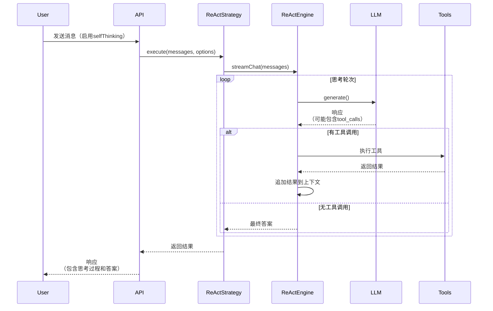

# 🤖 ApexBridge 工具调用完全指南

## 📋 目录

1. [工具调用触发机制](#工具调用触发机制)
2. [内置工具列表](#内置工具列表)
3. [API 使用示例](#api-使用示例)
4. [工作原理](#工作原理)
5. [最佳实践](#最佳实践)
6. [故障排除](#故障排除)

---

## 🔧 工具调用触发机制

### 触发条件

工具调用通过 **深度思考模式（ReAct策略）** 自动触发，需要满足以下条件：

#### 1. 启用自我思考
```typescript
{
  "messages": [...],  // 对话消息
  "selfThinking": {
    "enabled": true,  // ✅ 必须设置为 true
    "maxIterations": 5,  // 最大思考轮数（默认5）
    "enableStreamThoughts": true  // 是否流式输出思考过程
  }
}
```

#### 2. LLM 识别到工具需求

LLM 需要识别用户的意图并决定调用工具。这取决于：
- **用户请求**：明确需要工具辅助的任务（如搜索、读取文件等）
- **工具可用性**：系统必须有相关工具可用
- **LLM 质量**：模型需要能够理解工具调用协议

### 触发流程



---

## 🛠️ 内置工具列表

### 工具概览

| 工具名称 | 类型 | 描述 | 适用场景 |
|---------|------|------|---------|
| **vector-search** | BuiltIn | 向量搜索相关Skills | 需要查找工具时 |
| **file-read** | BuiltIn | 读取文件内容 | 查看代码、配置文件 |
| **file-write** | BuiltIn | 写入文件内容 | 修改代码、创建文件 |
| **platform-detector** | BuiltIn | 检测当前平台信息 | 环境判断、路径适配 |

### 1. vector-search（向量搜索）

**用途**：在Skills向量库中搜索相关工具

**参数**：
```typescript
interface VectorSearchArgs {
  query: string;           // 搜索查询（必需）
  limit?: number;          // 最大结果数（默认5，最大20）
  threshold?: number;      // 相似度阈值（0.0-1.0，默认0.6）
  includeMetadata?: boolean; // 是否包含元数据
}
```

**使用示例**：
```json
{
  "tool": "vector-search",
  "arguments": {
    "query": "搜索关于机器学习的资料",
    "limit": 5,
    "threshold": 0.6
  }
}
```

**返回值**：
```
Vector Search Results for: "搜索关于机器学习的资料"
Found 3 relevant tool(s)

1. knowledge-search
   Score: 85.23%
   Description: 搜索知识库中的相关信息
   Category: search
   Parameters:
     - query (required): 搜索关键词
       Type: string

2. web-scraper
   Score: 72.15%
   Description: 从网页抓取内容
   Category: data-collection
   Parameters:
     - url (required): 目标网页URL
       Type: string

Usage Example:
To use one of these tools, include it in your tool_calls array.
Example: {"tool": "knowledge-search", "arguments": {"query": "..."}}
```

### 2. file-read（读取文件）

**用途**：读取文件内容

**参数**：
```typescript
interface FileReadArgs {
  path: string;            // 文件路径（必需）
  encoding?: string;       // 编码（默认utf8）
  maxSize?: number;        // 最大读取字节数（默认100KB）
}
```

**使用示例**：
```json
{
  "tool": "file-read",
  "arguments": {
    "path": "/home/user/documents/note.txt",
    "encoding": "utf8"
  }
}
```

**返回值**：
```
File read successfully: /home/user/documents/note.txt
Size: 1.2KB
Content:
---
这是文件的内容...
---
```

### 3. file-write（写入文件）

**用途**：写入内容到文件

**参数**：
```typescript
interface FileWriteArgs {
  path: string;            // 文件路径（必需）
  content: string;         // 写入内容（必需）
  encoding?: string;       // 编码（默认utf8）
  overwrite?: boolean;     // 是否覆盖（默认false）
  createDir?: boolean;     // 自动创建目录（默认true）
}
```

**使用示例**：
```json
{
  "tool": "file-write",
  "arguments": {
    "path": "/home/user/documents/new-note.txt",
    "content": "这是新创建的文件内容",
    "createDir": true,
    "overwrite": false
  }
}
```

**返回值**：
```
File written successfully: /home/user/documents/new-note.txt
Size: 45 bytes
Mode: create
Directory created: /home/user/documents
```

### 4. platform-detector（平台检测）

**用途**：检测当前运行环境信息

**参数**：
```typescript
interface PlatformDetectorArgs {
  detailed?: boolean;      // 是否返回详细信息（默认false）
  detectGit?: boolean;      // 是否检测Git信息（默认true）
  detectDocker?: boolean;   // 是否检测Docker信息（默认true）
  detectIDE?: boolean;      // 是否检测IDE信息（默认true）
}
```

**使用示例**：
```json
{
  "tool": "platform-detector",
  "arguments": {
    "detailed": true,
    "detectGit": true,
    "detectDocker": false
  }
}
```

**返回值**：
```json
{
  "success": true,
  "platform": "linux",
  "arch": "x64",
  "nodeVersion": "v18.17.0",
  "cwd": "/home/user/project",
  "gitBranch": "main",
  "gitRemote": "origin",
  "isDocker": false,
  "vscodeDetected": true,
  "extensions": ["ms-vscode.vscode-typescript-next", "ms-python.python"]
}
```

---

## 📡 API 使用示例

### 前置条件

**启动服务**：
```bash
npm run dev
```

服务启动后，访问地址：`http://localhost:3000`

---

### 示例 1：触发向量搜索

**场景**：用户想搜索有关机器学习的资料，系统会自动调用 `vector-search` 工具查找相关Skills

**请求**：
```bash
curl -X POST http://localhost:3000/v1/chat/completions \
  -H "Content-Type: application/json" \
  -H "Authorization: Bearer your-api-key" \
  -d '{
    "conversationId": "test-vector-search-001",
    "messages": [
      {
        "role": "user",
        "content": "搜索关于机器学习的资料"
      }
    ],
    "selfThinking": {
      "enabled": true,
      "maxIterations": 5,
      "enableStreamThoughts": true
    },
    "stream": false
  }'
```

**预期响应**：
```json
{
  "id": "chatcmpl-123",
  "object": "chat.completion",
  "model": "deepseek-chat",
  "choices": [
    {
      "index": 0,
      "message": {
        "role": "assistant",
        "content": "根据向量搜索结果，我找到了以下相关工具：\n\n1. knowledge-search (相似度: 85.23%)\n   - 描述：搜索知识库中的相关信息\n   - 参数：query (必需)\n\n2. web-scraper (相似度: 72.15%)\n   - 描述：从网页抓取内容\n   - 参数：url (必需)\n\n建议您使用 knowledge-search 工具来搜索机器学习相关的知识。"
      },
      "finish_reason": "stop"
    }
  ],
  "usage": {
    "prompt_tokens": 120,
    "completion_tokens": 150,
    "total_tokens": 270
  }
}
```

**流式版本**：
```bash
curl -X POST http://localhost:3000/v1/chat/completions \
  -H "Content-Type: application/json" \
  -H "Authorization: Bearer your-api-key" \
  -d '{
    "conversationId": "test-vector-search-002",
    "messages": [
      {
        "role": "user",
        "content": "搜索机器学习工具"
      }
    ],
    "selfThinking": {
      "enabled": true,
      "maxIterations": 5
    },
    "stream": true
  }'
```

**流式响应**：
```
data: {"id":"chatcmpl-123","object":"chat.completion.chunk","choices":[{"index":0,"delta":{"role":"assistant"}}]}

data: __THOUGHT__:{"iteration":1,"content":"用户想搜索机器学习工具，我应该使用vector-search工具"}

data: __ACTION__:vector-search started

data: {"choices":[{"delta":{"content":"正在搜索相关工具..."}}]}

[等待工具执行]

data: __OBSERVATION__:vector-search completed

data: {"choices":[{"delta":{"content":"根据搜索结果，找到了3个相关工具："}}]}

data: [DONE]
```

---

### 示例 2：读取项目文件

**场景**：用户询问项目配置文件的内容，系统自动调用 `file-read` 工具

**请求**：
```bash
curl -X POST http://localhost:3000/v1/chat/completions \
  -H "Content-Type: application/json" \
  -d '{
    "conversationId": "test-read-file-001",
    "messages": [
      {
        "role": "user",
        "content": "请读取项目的package.json文件"
      }
    ],
    "selfThinking": {
      "enabled": true,
      "maxIterations": 3
    }
  }'
```

**预期响应**：
```json
{
  "id": "chatcmpl-456",
  "object": "chat.completion",
  "model": "deepseek-chat",
  "choices": [
    {
      "index": 0,
      "message": {
        "role": "assistant",
        "content": "<thinking>用户想查看package.json，我需要使用file-read工具读取这个文件</thinking>\n\npackage.json内容如下：\n\n```json\n{\n  \"name\": \"apex-bridge\",\n  \"version\": \"1.0.1\",\n  \"description\": \"轻量级ABP聊天服务\",\n  \"main\": \"dist/src/server.js\",\n  \"scripts\": {\n    \"dev\": \"ts-node-dev --respawn --transpile-only src/server.ts\",\n    ...\n  }\n}\n```\n\n这是一个Node.js项目的package.json文件，包含了项目名称、版本、依赖等信息。"
      }
    }
  ]
}
```

---

### 示例 3：检测平台信息

**场景**：询问当前运行环境，系统自动调用 `platform-detector` 工具

**请求**：
```bash
curl -X POST http://localhost:3000/v1/chat/completions \
  -H "Content-Type: application/json" \
  -d '{
    "conversationId": "test-platform-001",
    "messages": [
      {
        "role": "user",
        "content": "当前运行环境是什么？"
      }
    ],
    "selfThinking": {
      "enabled": true,
      "maxIterations": 2
    }
  }'
```

**预期响应**：
```json
{
  "choices": [
    {
      "message": {
        "role": "assistant",
        "content": "<thinking>用户想了解当前运行环境，我应该使用platform-detector工具检测</thinking>\n\n当前运行环境信息如下：\n\n- **操作系统**: Linux (x64)\n- **Node.js版本**: v18.17.0\n- **当前目录**: /home/user/project/apex-bridge\n- **Git分支**: main (远程: origin)\n- **Docker环境**: 否\n- **VSCode**: 已检测到，安装了TypeScript和Python扩展"
      }
    }
  ]
}
```

---

### 示例 4：写入文件

**场景**：要求创建一个新的配置文件

**请求**：
```bash
curl -X POST http://localhost:3000/v1/chat/completions \
  -H "Content-Type: application/json" \
  -d '{
    "conversationId": "test-write-file-001",
    "messages": [
      {
        "role": "user",
        "content": "创建一个名为config.json的配置文件，内容为：{\"debug\": true, \"port\": 3000}"
      }
    ],
    "selfThinking": {
      "enabled": true,
      "maxIterations": 3
    }
  }'
```

**预期响应**：
```json
{
  "choices": [
    {
      "message": {
        "role": "assistant",
        "content": "<thinking>用户想创建一个配置文件，我需要使用file-write工具</thinking>\n\n文件创建成功：\n\n✅ 已创建 config.json\n- 路径: /home/user/project/apex-bridge/config.json\n- 大小: 45 bytes\n- 内容: {\"debug\": true, \"port\": 3000}\n\n文件已保存到当前项目目录。"
      }
    }
  ]
}
```

---

### 示例 5：复杂任务（多次工具调用）

**场景**：搜索相关工具后，使用找到的工具执行任务

**请求**：
```bash
curl -X POST http://localhost:3000/v1/chat/completions \
  -H "Content-Type: application/json" \
  -d '{
    "conversationId": "test-multi-tools-001",
    "messages": [
      {
        "role": "user",
        "content": "先搜索代码格式化工具，然后帮我格式化src/server.ts文件"
      }
    ],
    "selfThinking": {
      "enabled": true,
      "maxIterations": 8  // 需要更多轮次完成复杂任务
    },
    "stream": true
  }'
```

**预期流程**：
```
轮次 1: 思考 "用户有两个任务，先搜索工具，然后格式化文件"
         -> 调用 vector-search: {"query": "代码格式化工具"}

轮次 2: 思考 "找到了prettier工具，现在需要读取文件"
         -> 调用 file-read: {"path": "src/server.ts"}

轮次 3: 思考 "已经读取文件，现在应该使用prettier格式化"
         <- 生成最终答案
```

---

## 🔍 工作原理

### 工具发现机制

ReAct策略会自动发现和注册工具：

1. **内置工具**：系统启动时自动注册
2. **向量检索**：根据用户查询动态搜索相关Skills

### 双执行器架构

```typescript
// 1. 尝试内置执行器（高性能，零开销）
const builtInResult = await this.builtInExecutor.execute(toolCall)

// 2. 如果失败，尝试Skills执行器（进程隔离）
if (!builtInResult.success) {
  const skillResult = await this.skillsExecutor.execute(toolCall)
  return skillResult.output
}
```

### 工具调用协议

LLM需要生成符合以下格式的tool_calls：

```typescript
interface ToolCall {
  id: string;
  type: "function";
  function: {
    name: string;      // 工具名称
    arguments: string; // JSON字符串，包含参数
  };
}
```

示例：
```json
{
  "id": "call_123",
  "type": "function",
  "function": {
    "name": "vector-search",
    "arguments": "{\"query\": \"搜索内容\", \"limit\": 5}"
  }
}
```

---

## 💡 最佳实践

### 1. 选择合适的maxIterations

- **简单任务**：3-5轮（如单次搜索、读取文件）
- **中等任务**：5-8轮（如搜索+使用工具）
- **复杂任务**：8-10轮（如多步骤分析）

### 2. 使用流式模式

对于复杂任务，建议使用流式模式：
```bash
curl ... "stream": true
```

可以看到：
- 思考过程
- 工具调用开始/结束
- 实时进度

### 3. 监控工具使用

查看日志：
```bash
# 查看工具调用日志
tail -f data/ace/logs.db | grep -i "tool"
```

### 4. 错误处理

工具调用可能失败，原因包括：
- 工具不存在
- 参数无效
- 权限不足
- 资源不存在

建议在对话历史中保留失败记录，便于后续分析。

---

## 🔧 添加自定义工具

### 步骤 1：创建工具实现

在 `src/core/tools/builtin/` 目录创建新工具：

```typescript
// src/core/tools/builtin/MyCustomTool.ts

import { ToolResult, BuiltInTool } from '../../../types/tool-system';

interface MyCustomToolArgs {
  param1: string;
  param2?: number;
}

export class MyCustomTool {
  static async execute(args: MyCustomToolArgs): Promise<ToolResult> {
    try {
      // 实现工具逻辑
      const result = await doSomething(args.param1, args.param2);

      return {
        success: true,
        output: result,
        duration: 0,
        exitCode: 0
      };
    } catch (error) {
      return {
        success: false,
        error: error.message,
        duration: 0,
        exitCode: 1
      };
    }
  }

  static getMetadata() {
    return {
      name: 'my-custom-tool',
      description: '我的自定义工具描述',
      category: 'utility',
      parameters: {
        type: 'object',
        properties: {
          param1: {
            type: 'string',
            description: '参数1描述'
          },
          param2: {
            type: 'number',
            description: '参数2描述（可选）'
          }
        },
        required: ['param1']
      }
    };
  }
}

export function createMyCustomTool() {
  return {
    ...MyCustomTool.getMetadata(),
    type: 'builtin',
    enabled: true,
    execute: (args: Record<string, any>) => MyCustomTool.execute(args as MyCustomToolArgs)
  } as BuiltInTool;
}
```

### 步骤 2：注册工具

在 `BuiltInToolsRegistry.ts` 中注册：

```typescript
// src/services/BuiltInToolsRegistry.ts

import { createMyCustomTool } from '../core/tools/builtin/MyCustomTool';

private initializeBuiltinTools(): void {
  // ... 现有工具注册

  // 注册自定义工具
  this.registerTool(createMyCustomTool());
}
```

### 步骤 3：重新编译

```bash
npm run build
npm run dev
```

---

## 🐛 故障排除

### 问题 1：工具未被调用

**症状**：启用selfThinking，但LLM没有调用工具

**可能原因**：
1. 用户请求不够明确，LLM认为无需工具
2. LLM不支持工具调用协议
3. 工具未正确注册

**解决方案**：
```typescript
// 明确表达需要工具辅助
"messages": [{
  "role": "user",
  "content": "搜索相关工具并帮助我完成任务"
}]

// 检查日志
tail -f logs/app.log | grep "Tool system initialized"
```

### 问题 2：工具调用失败

**症状**：LLM生成了工具调用，但执行失败

**可能原因**：
1. 参数格式错误
2. 权限不足
3. 资源不存在

**解决方案**：
```typescript
// 检查错误信息
console.log(result);
// { success: false, error: "File not found: /path/to/file" }

// 确保参数正确
"arguments": {
  "path": "/correct/path/to/file.txt"  // 必须是存在的路径
}
```

### 问题 3：maxIterations 不足

**症状**：任务未完成就提前结束

**解决方案**：
```typescript
"selfThinking": {
  "enabled": true,
  "maxIterations": 10,  // 增加到10或更高
  "includeThoughtsInResponse": true
}
```

### 问题 4：工具调用超时

**症状**：工具执行时间过长

**解决方案**：
```typescript
// 检查工具实现
// 添加超时控制
const timeout = 30000; // 30秒
const result = await Promise.race([
  tool.execute(args),
  new Promise((_, reject) => setTimeout(() => reject(new Error('Timeout')), timeout))
]);
```

---

## 📊 监控与调优

### 查看工具使用统计

```bash
# 查询工具使用次数
sqlite3 data/conversation_history.db

SELECT
  COUNT(*) as total_calls,
  SUM(CASE WHEN content LIKE '%<thinking>%' THEN 1 ELSE 0 END) as react_calls
FROM conversation_messages
WHERE role = 'assistant';
```

### 性能指标

- **平均工具执行时间**：查看日志中的 `duration` 字段
- **工具成功率**：`success` 为 true 的比例
- **平均迭代次数**：完成任务的轮次统计

### 优化建议

1. **缓存频繁使用的工具结果**
2. **调整相似度阈值**（vector-search 的 threshold）
3. **限制并发工具数量**（maxConcurrentTools）
4. **使用流式模式降低延迟**

---

## 🔗 相关文档

- [ABP协议规范](../docs/abp-protocol.md)
- [ReAct策略详解](../docs/react-strategy.md)
- [Skills体系](../docs/skills-system.md)
- [API参考](../docs/api-reference.md)

---

## 📞 技术支持

如遇到问题，请：
1. 查看日志：`logs/app.log`
2. 检查数据库：`data/conversation_history.db`
3. 提交Issue：https://github.com/your-username/apex-bridge/issues

---

**文档版本**: 1.0.0
**最后更新**: 2025-12-06
**ApexBridge版本**: 1.0.1
