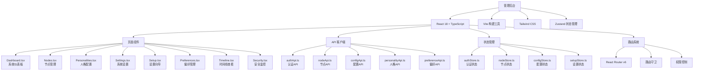

<!-- OPENSPEC:START -->
# OpenSpec Instructions

These instructions are for AI assistants working in this project.

Always open `@/openspec/AGENTS.md` when the request:
- Mentions planning or proposals (words like proposal, spec, change, plan)
- Introduces new capabilities, breaking changes, architecture shifts, or big performance/security work
- Sounds ambiguous and you need the authoritative spec before coding

Use `@/openspec/AGENTS.md` to learn:
- How to create and apply change proposals
- Spec format and conventions
- Project structure and guidelines

Keep this managed block so 'openspec update' can refresh the instructions.

<!-- OPENSPEC:END -->

# ApexBridge 管理后台

> **模块职责**: Web管理界面，提供系统配置、节点管理、人格配置、偏好管理、时间线查看等功能的React前端应用

## 🏗️ 架构概览



## 📁 项目结构

```
admin/
├── src/
│   ├── api/              # API客户端
│   │   ├── authApi.ts    # 认证相关API
│   │   ├── client.ts     # Axios客户端配置
│   │   ├── configApi.ts  # 配置管理API
│   │   ├── nodeApi.ts    # 节点管理API
│   │   ├── personalityApi.ts # 人格管理API
│   │   ├── preferenceApi.ts  # 偏好管理API
│   │   ├── relationshipApi.ts # 关系管理API
│   │   └── setupApi.ts   # 设置向导API
│   ├── components/       # 共享组件
│   │   ├── Layout.tsx    # 主布局组件
│   │   └── common/       # 通用组件
│   ├── pages/            # 页面组件
│   │   ├── Dashboard.tsx # 系统仪表板
│   │   ├── Login.tsx     # 登录页面
│   │   ├── Nodes.tsx     # 节点管理
│   │   ├── Personalities.tsx # 人格配置
│   │   ├── Preferences.tsx # 偏好管理
│   │   ├── Relationships.tsx # 关系管理
│   │   ├── Security.tsx  # 安全监控
│   │   ├── Settings.tsx  # 系统设置
│   │   ├── Setup.tsx     # 设置向导
│   │   └── Timeline.tsx  # 时间线查看
│   ├── router/           # 路由配置
│   │   └── index.tsx     # 路由定义
│   ├── store/            # 状态管理
│   │   ├── authStore.ts  # 认证状态
│   │   ├── configStore.ts # 配置状态
│   │   ├── nodeStore.ts  # 节点状态
│   │   └── setupStore.ts # 设置状态
│   ├── styles/           # 样式文件
│   │   └── index.css     # 主样式文件
│   ├── utils/            # 工具函数
│   │   └── cn.ts         # 样式合并工具
│   ├── main.tsx          # 应用入口
│   └── App.tsx           # 根组件
├── public/               # 静态资源
├── dist/                 # 构建输出
├── package.json          # 包配置
├── tsconfig.json         # TypeScript配置
├── vite.config.ts        # Vite配置
├── tailwind.config.js    # Tailwind配置
└── postcss.config.js     # PostCSS配置
```

## 🚀 技术栈

### 核心依赖
- **React 18**: 现代React框架，支持并发特性
- **TypeScript**: 类型安全的JavaScript超集
- **Vite**: 快速的构建工具和开发服务器
- **Tailwind CSS**: 实用优先的CSS框架
- **Zustand**: 轻量级状态管理库
- **React Router v6**: 声明式路由
- **Axios**: HTTP客户端

### 开发工具
- **ESLint**: 代码质量检查
- **TypeScript**: 类型检查
- **Vite**: 开发服务器和构建
- **clsx + tailwind-merge**: 样式工具函数

## 🔧 核心功能

### 🔐 认证系统
- **独立认证**: 与主系统API认证分离的管理后台认证
- **JWT Token**: 基于token的认证机制
- **路由守卫**: 自动重定向未认证用户到登录页
- **权限控制**: 基于角色的访问控制

### 📊 仪表板
- **系统状态**: 实时显示系统运行状态
- **统计信息**: 节点数量、活跃会话、API调用统计
- **图表展示**: 使用图表库展示趋势数据
- **快速操作**: 常用功能的快捷入口

### 🖥️ 节点管理
- **节点列表**: 显示所有注册节点的状态
- **节点详情**: 查看节点的详细信息和配置
- **节点操作**: 启动、停止、重启节点
- **任务调度**: 向节点分发任务
- **实时监控**: WebSocket实时更新节点状态

### 🎭 人格配置
- **人格列表**: 管理系统中的人格配置
- **人格编辑**: 创建和编辑人格定义
- **人格预览**: 实时预览人格效果
- **人格切换**: 动态切换当前使用的人格

### ⚙️ 系统设置
- **配置管理**: 修改系统配置参数
- **LLM配置**: 配置多LLM提供商
- **安全配置**: 管理API密钥和访问控制
- **备份恢复**: 配置导入导出功能

### 🎯 偏好管理
- **用户偏好**: 管理用户个性化设置
- **工具披露**: 控制工具描述的详细程度
- **参数默认值**: 设置工具参数的默认值
- **批量操作**: 支持偏好的批量导入导出

### 📈 时间线查看
- **记忆时间线**: 查看系统的记忆记录
- **搜索过滤**: 按时间、类型、关键词搜索
- **详情查看**: 查看记忆的详细内容
- **导出功能**: 支持时间线数据导出

### 🛡️ 安全监控
- **安全统计**: 显示安全相关的统计数据
- **安全警报**: 显示和处理安全警报
- **访问日志**: 查看系统的访问记录
- **异常检测**: 自动检测异常行为

## 📱 响应式设计

### 断点设置
- **移动端**: < 768px
- **平板端**: 768px - 1024px
- **桌面端**: > 1024px

### 布局适配
- **侧边栏**: 移动端自动隐藏，桌面端固定显示
- **表格**: 支持横向滚动，重要列优先显示
- **表单**: 自适应布局，移动端单列显示
- **图表**: 响应式图表，适配不同屏幕尺寸

## 🔄 状态管理

### Zustand Store结构
```typescript
// 认证状态
interface AuthState {
  token: string | null;
  user: User | null;
  isAuthenticated: boolean;
  login: (credentials) => Promise<void>;
  logout: () => void;
}

// 节点状态
interface NodeState {
  nodes: Node[];
  loading: boolean;
  fetchNodes: () => Promise<void>;
  updateNode: (id, data) => Promise<void>;
}

// 配置状态
interface ConfigState {
  config: Config | null;
  loading: boolean;
  fetchConfig: () => Promise<void>;
  updateConfig: (data) => Promise<void>;
}
```

## 🌐 API集成

### 统一的API客户端
```typescript
// client.ts - Axios实例配置
const apiClient = axios.create({
  baseURL: '/api/admin',
  timeout: 10000,
  headers: {
    'Content-Type': 'application/json',
  },
});

// 请求拦截器 - 添加认证token
apiClient.interceptors.request.use((config) => {
  const token = useAuthStore.getState().token;
  if (token) {
    config.headers.Authorization = `Bearer ${token}`;
  }
  return config;
});

// 响应拦截器 - 统一错误处理
apiClient.interceptors.response.use(
  (response) => response,
  (error) => {
    if (error.response?.status === 401) {
      // 认证失败，跳转到登录页
      useAuthStore.getState().logout();
    }
    return Promise.reject(error);
  }
);
```

### API端点映射
- **认证**: `/api/admin/auth/*`
- **配置**: `/api/admin/config/*`
- **节点**: `/api/admin/nodes/*`
- **人格**: `/api/admin/personalities/*`
- **偏好**: `/api/admin/preferences/*`
- **时间线**: `/api/admin/timeline/*`
- **关系**: `/api/admin/relationships/*`

## 🎨 UI组件规范

### 设计原则
- **一致性**: 统一的视觉风格和交互模式
- **可用性**: 清晰的信息层次和操作流程
- **响应式**: 适配不同设备和屏幕尺寸
- **可访问性**: 支持键盘导航和屏幕阅读器

### 组件库
- **按钮**: 多种样式（主要、次要、危险等）
- **表单**: 输入框、选择器、开关等
- **表格**: 支持排序、筛选、分页
- **卡片**: 信息展示和分组
- **模态框**: 对话框和确认框
- **加载**: 加载状态和骨架屏

## 🚀 开发指南

### 开发环境
```bash
# 进入管理后台目录
cd admin

# 安装依赖
npm install

# 启动开发服务器
npm run dev

# 构建生产版本
npm run build

# 类型检查
npm run typecheck

# 代码检查
npm run lint
```

### 创建新页面
```typescript
// 1. 创建页面组件
// src/pages/NewPage.tsx
import { useState, useEffect } from 'react';

export default function NewPage() {
  const [data, setData] = useState(null);

  return (
    <div className="p-6">
      <h1 className="text-2xl font-bold mb-6">新页面</h1>
      {/* 页面内容 */}
    </div>
  );
}

// 2. 添加路由
// src/router/index.tsx
import NewPage from '../pages/NewPage';

{
  path: '/new-page',
  element: <NewPage />,
  meta: { title: '新页面', requireAuth: true }
}

// 3. 添加导航菜单
// src/components/Layout.tsx
<NavLink to="/new-page" className={navLinkClass}>
  新页面
</NavLink>
```

### API集成最佳实践
```typescript
// 1. 创建API函数
// src/api/newApi.ts
import { apiClient } from './client';

export interface NewData {
  id: string;
  name: string;
}

export const newApi = {
  getAll: () => apiClient.get<NewData[]>('/new-items'),
  getById: (id: string) => apiClient.get<NewData>(`/new-items/${id}`),
  create: (data: Partial<NewData>) => apiClient.post<NewData>('/new-items', data),
  update: (id: string, data: Partial<NewData>) => apiClient.put<NewData>(`/new-items/${id}`, data),
  delete: (id: string) => apiClient.delete(`/new-items/${id}`),
};

// 2. 创建状态管理
// src/store/newStore.ts
import { create } from 'zustand';
import { newApi, NewData } from '../api/newApi';

interface NewState {
  items: NewData[];
  loading: boolean;
  error: string | null;
  fetchItems: () => Promise<void>;
  createItem: (data: Partial<NewData>) => Promise<void>;
}

export const useNewStore = create<NewState>((set, get) => ({
  items: [],
  loading: false,
  error: null,

  fetchItems: async () => {
    set({ loading: true, error: null });
    try {
      const response = await newApi.getAll();
      set({ items: response.data, loading: false });
    } catch (error) {
      set({ error: error.message, loading: false });
    }
  },

  createItem: async (data) => {
    set({ loading: true, error: null });
    try {
      const response = await newApi.create(data);
      set({ items: [...get().items, response.data], loading: false });
    } catch (error) {
      set({ error: error.message, loading: false });
    }
  },
}));
```

## 📊 性能优化

### 代码分割
- **路由级分割**: 自动按路由拆分代码
- **组件级分割**: 大组件按需加载
- **第三方库**: 外部依赖单独打包

### 缓存策略
- **API缓存**: 合理使用React Query缓存
- **静态资源**: 长期缓存策略
- **图片优化**: 使用现代图片格式

### 渲染优化
- **虚拟滚动**: 大数据列表使用虚拟滚动
- **防抖节流**: 频繁操作使用防抖节流
- **懒加载**: 图片和组件懒加载

## 🔒 安全考虑

### 前端安全
- **XSS防护**: 用户输入内容自动转义
- **CSRF防护**: 使用token验证
- **输入验证**: 前端基础验证 + 后端严格验证

### 认证安全
- **Token安全**: 使用HttpOnly Cookie存储token
- **会话管理**: 合理的token过期策略
- **权限控制**: 前端路由守卫 + 后端权限验证

## 📊 变更记录 (Changelog)

### 2025-11-16 - 管理后台模块分析
- ✅ 完成管理后台架构分析
- ✅ 识别技术栈：React 18 + TypeScript + Vite + Tailwind CSS
- ✅ 分析核心功能：认证、节点管理、人格配置、系统设置
- ✅ 建立模块文档结构和开发指南
- ✅ 识别关键组件和状态管理架构

### 扫描覆盖率
- **总文件数**: 28个文件
- **已扫描**: 8个核心文件
- **主要功能**: 9个主要功能模块
- **下一步**: 详细分析各页面组件实现

## 🎯 下一步建议

### 高优先级任务
1. **页面组件深度分析** - 详细分析Dashboard、Nodes、Personalities等核心页面
2. **状态管理分析** - 研究Zustand状态管理实现细节
3. **API集成分析** - 分析Axios客户端和API调用模式

### 中等优先级任务
4. **路由系统分析** - 研究React Router配置和路由守卫
5. **UI组件库分析** - 分析共享组件和样式系统
6. **性能优化分析** - 识别性能瓶颈和优化机会

### 建议扫描重点
- `admin/src/pages/Dashboard.tsx` - 仪表板实现
- `admin/src/pages/Nodes.tsx` - 节点管理页面
- `admin/src/pages/Personalities.tsx` - 人格配置页面
- `admin/src/store/` - 状态管理实现
- `admin/src/api/` - API客户端实现
- `admin/src/router/index.tsx` - 路由配置

**预计深度分析时间**: 2-3个工作日
**推荐续扫目录**:
- `apex-bridge/admin/src/pages/` - 页面组件
- `apex-bridge/admin/src/store/` - 状态管理
- `apex-bridge/admin/src/api/` - API集成
- `apex-bridge/admin/src/components/` - 共享组件