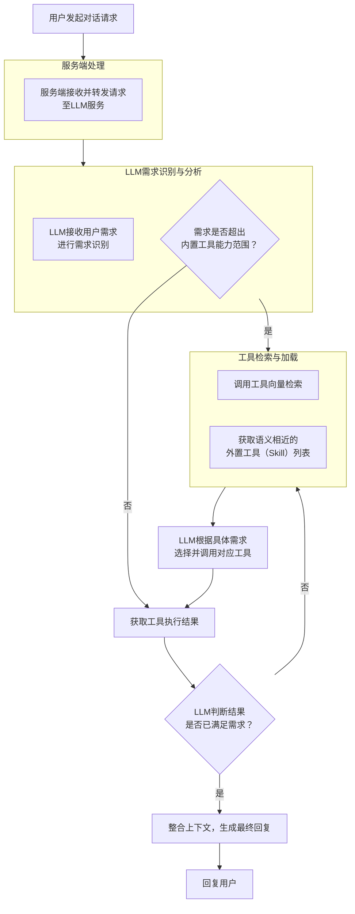

# 核心需求
完全重构当前工具系统

# 需求详情

## 工具类型

### 内置工具

集成在系统代码内的常用工具，可直接调用方法执行。

如：`FileRead`, `FileWrite`, `VectorSearch`, `PlatformDetector` 等
### 外置工具

Claude Code Skills 形式能力包。
根据官方文档和社区实践，Claude Code Skills（能力包）的文件夹结构遵循以下规范：

#### 基本文件夹结构

每个Skill是一个独立的文件夹，必须包含**SKILL.md**核心文件，其他均为可选：

```
my-skill/
├── SKILL.md              # 核心指令文件（必需）
├── reference.md          # 参考文档（可选）
├── examples.md           # 示例说明（可选）
├── scripts/              # 可执行脚本目录（可选）
│   ├── helper.py
│   └── process.sh
└── resources/ 或 assets/ 或 templates/  # 资源文件目录（可选）
    └── template.xlsx
```

#### 核心文件：SKILL.md

##### YAML Frontmatter（必填字段）
```yaml
---
name: skill-name                # 小写字母+数字+连字符，最多64字符
description: 功能描述和触发条件  # 最多1024字符，需包含关键词
version: 1.0.0                  # 可选，版本号
allowed-tools:                  # 可选，限制可用工具
  - Read
  - Grep
  - Glob
---
```

#### Markdown正文
包含详细的使用说明、工作流程、最佳实践等。可通过自然语言引用其他文件：
```markdown
详细参数见 [reference.md](reference.md)
表单填写流程见 [forms.md](forms.md)
```

#### 存储位置

**1. Skills 存放地址**（全局可用）
```
path/skills/skill-name/
```

**2. 插件Skills**（随插件自动安装）
#### 目录功能说明

| 目录/文件 | 用途 | 加载时机 |
|-----------|------|----------|
| `SKILL.md` | 核心指令和元数据 | 始终加载（约100 tokens） |
| `reference.md` | 详细参考文档 | 按需加载 |
| `examples.md` | 使用示例 | 按需加载 |
| `scripts/` | Python/Shell脚本 | 执行时加载 |
| `resources/` | 模板、数据文件等 | 按需加载 |

#### 最佳实践

1. **保持SKILL.md精简**：控制在5000 tokens内，避免上下文窗口过载
2. **模块化拆分**：功能复杂时拆分为多个markdown文件，按需加载
3. **清晰的描述**：description字段需包含具体触发词，避免模糊描述
4. **文件命名规范**：使用小写字母、连字符，避免特殊字符
5. **路径格式**：所有路径使用正斜杠（Unix风格）

#### 打包要求

分享给他人时，需打包成ZIP文件，**正确结构**为：
```
my-skill.zip
└── my-skill/          # 文件夹作为根目录
    ├── SKILL.md
    └── scripts/
```

**错误结构**（文件直接在ZIP根目录）会导致安装失败。

## 工具调用逻辑

### 逻辑文本描述

1、用户在客户端侧发起对话（chat）请求
2、服务端接收chat请求，转发给LLM服务
3、LLM服务接收用户需求后，进行需求识别（此时系统提示词内包含：全局系统提示词、用户提示词、内置常用工具列表：文件读写、工具向量搜索等高频工具）
4、需求识别完毕后，如此需求需要额外工具进行辅助，则调用工具向量检索工具进行检索，获取一批语义相似度相近的工具名和描述（Skills渐进式披露增强版，缩小预加载Skills能力包的范围，降低上下文占用）
5、LLM获取工具列表后根据需求具体选择能力包进行调用（此处按照Skills后续能力执行逻辑执行）
6、LLM获取Skills能力执行完毕后的结果，再次判断是否已经满足需求，如满足，整合上下文进行回复，不满足继续下一步思考-调用工具-执行-直到满足需求

根据您当前笔记中“逻辑文本描述”章节的内容，可以将其转化为以下清晰的流程图。该流程描述了从用户发起请求到系统生成回复的完整闭环逻辑，特别强调了工具的**按需检索**与**循环调用**机制。

### 流程图描述



## 工具向量化与生命周期

### 工程启动扫描

工程启动后，扫描Skills文件夹：
- 如果Skills能力包已向量化则跳过
- 如果Skills能力包未向量化，则根据能力包名称、描述生成标签进行向量化，并在Skills能力包根目录根据Skills能力包大小生成已向量化标识
- 如果Skills能力包大小与已向量化标识文件中的大小不一致，则删除向量库中对应Skills进行重新向量化，并修改已向量化标识
### Skills生命周期管理

#### Skills列表

提供Skills列表API，包含Skills名称和描述
#### Skills安装

提供Skills安装API

用户上传Skills压缩包，判断当前是否已存在同名Skills：
- 存在，拒绝安装，并返回提示
- 不存在，解压到Skills目录下，进行SKills向量化并删除Skills压缩包
#### Skills修改

提供Skills修改API，根据Skills名称定位修改

用户只能修改SKILL.md中的描述，便于调试向量化，不允许修改其它文件文件，也不建议修改其它文件
#### Skills卸载

提供Skills卸载API，根据Skills名称定位卸载

根据Skills名称找到对应Skills，删除指定Skills文件夹和向量

## Skills沙箱隔离

### 执行流程（文本版）

1. **调用入口**：`executeSkill(skillName, args)`
2. **加载验证**：读取 `SKILL.md` 验证技能存在性
3. **环境准备**：创建临时工作区，清理环境变量
4. **进程派生**：`spawn('node', [scriptPath, ...args])`
5. **监控捕获**：监听 stdout/stderr，实施超时/大小限制
6. **结果返回**：收集输出、退出码、执行时长
7. **资源清理**：终止残留进程，删除临时文件
### 流程图（文本）

```plaintext
┌─────────────────────────────────────────────┐
│  用户调用: executeSkill("git-commit", args) │
└─────────────────┬───────────────────────────┘
                  │
                  ▼
┌─────────────────────────────────────────────┐
│  1. SkillsManager.loadSkills()              │
│     └─ 扫描 ./skills/*/SKILL.md             │
└─────────────────┬───────────────────────────┘
                  │
                  ▼
┌─────────────────────────────────────────────┐
│  2. 验证与定位                              │
│     ├─ 技能是否存在? ──► 否 → 抛错          │
│     └─ 定位 index.js 脚本路径               │
└─────────────────┬───────────────────────────┘
                  │
                  ▼
┌─────────────────────────────────────────────┐
│  3. NodeExecutor.prepare()                  │
│     ├─ 创建 /tmp/agent-workspace-{uuid}/    │
│     └─ 清理环境变量 (NODE_OPTIONS/DEBUG)    │
└─────────────────┬───────────────────────────┘
                  │
                  ▼
┌─────────────────────────────────────────────┐
│  4. spawn() 派生子进程                      │
│     cmd: node /path/to/index.js ...args     │
│     mode: 继承PATH, 清理其他环境变量        │
└─────────────────┬───────────────────────────┘
                  │
                  ▼
┌─────────────────────────────────────────────┐
│  5. 实时监控 (并行)                         │
│     ├─ stdout ◄──► 累积输出 (限10MB)       │
│     ├─ stderr ◄──► 错误流                  │
│     └─ 计时器 ◄──► 60秒超时 → SIGKILL      │
└─────────────────┬───────────────────────────┘
                  │
                  ▼
┌─────────────────────────────────────────────┐
│  6. 事件处理                                │
│     ├─ on('close') ──► 成功/失败           │
│     ├─ on('error') ──► 进程启动失败        │
│     └─ on('timeout') ──► 强制终止          │
└─────────────────┬───────────────────────────┘
                  │
                  ▼
┌─────────────────────────────────────────────┐
│  7. 结果封装                                │
│     { stdout, stderr, exitCode, duration }  │
└─────────────────┬───────────────────────────┘
                  │
                  ▼
┌─────────────────────────────────────────────┐
│  8. 资源清理                                │
│     ├─ 清除超时计时器                       │
│     └─ 删除临时工作区 (可选)               │
└─────────────────┬───────────────────────────┘
                  │
                  ▼
┌─────────────────────────────────────────────┐
│  返回结果给调用方                           │
└─────────────────────────────────────────────┘
```

### 关键决策点说明

```
进程启动失败?
├─ 是 → 返回 { exitCode: null, error: "ENOENT" }
└─ 否 → 进入监控循环

输出大小 > 10MB?
├─ 是 → process.kill('SIGKILL') + 结果标记 [TRUNCATED]
└─ 否 → 继续累积

执行时间 > 60秒?
├─ 是 → SIGKILL + 返回 timeout 错误
└─ 否 → 等待进程自然退出

进程退出码?
├─ 0 → 成功
├─ 124 → 超时
└─ 其他 → 业务错误
```

### 错误处理路径

```
正常流程 ──────── 成功 ────────► 返回结果
   │
   ├─ 技能不存在 ──► 抛 SkillNotFoundError
   ├─ 脚本无权限 ──► 抛 PermissionError
   ├─ 启动失败 ────► 返回 { error: spawn error }
   ├─ 执行超时 ────► 返回 { error: "timeout" }
   └─ 输出超限 ────► 返回 { stdout: "[TRUNCATED]" }
```