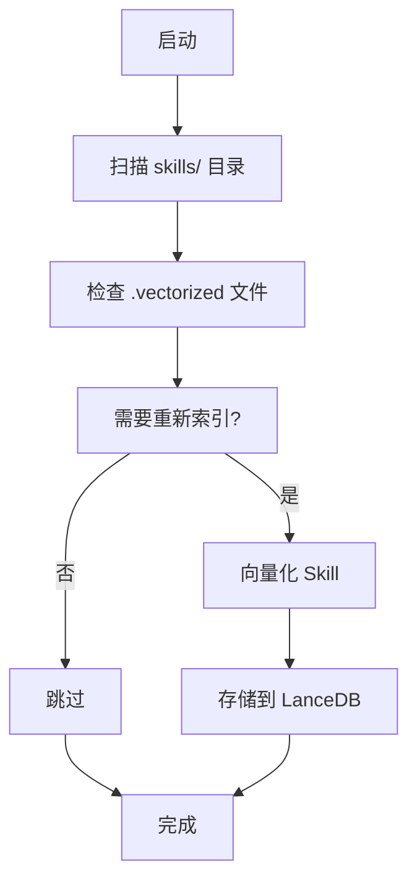
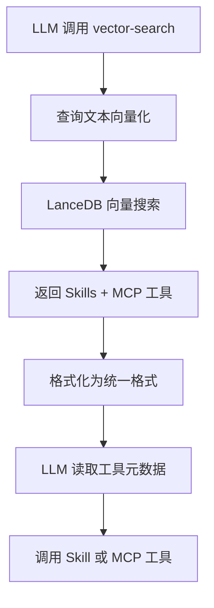

# MCP 工具向量化完整实现

## ✅ 已完成的工作

### 1. 数据库表结构扩展

**修改文件**: `src/services/ToolRetrievalService.ts`

- ✅ 扩展 `ToolsTable` 接口，支持 Skills 和 MCP 工具
- ✅ 添加新字段：
  - `source`: MCP 服务器 ID 或 skill 名称
  - `toolType`: 'skill' | 'mcp' 工具类型
  - `path?`: 可选，Skill 才有
  - `version?`: 可选，Skill 才有

### 2. 新增核心方法

#### `indexTools(tools: any[]): Promise<void>`
批量索引多个工具（支持 Skills 和 MCP 工具）
- 生成唯一工具ID
- 获取向量嵌入
- 存储到 LanceDB

#### `generateToolId(tool: any): string`
生成工具唯一ID，考虑工具类型和来源

#### `getEmbeddingForTool(tool: any): Promise<number[]>`
统一处理 Skills 和 MCP 工具的向量嵌入

#### `removeTool(toolId: string): Promise<void>`
从向量表中删除工具

### 3. 修改现有方法

#### `findRelevantSkills()`
- ✅ 支持返回 MCP 工具
- ✅ 根据 `toolType` 字段返回正确的工具格式
- ✅ 保持向后兼容（仍可返回 SkillTool 格式）

#### `indexSkill()`
- ✅ 添加工具类型字段 (`toolType: 'skill'`)
- ✅ 添加来源字段 (`source: skill.name`)

### 4. 完整的向量化流程

#### Skills 向量化流程（已存在）：


#### MCP 工具向量化流程（新实现）：
```mermaid
graph TD
    A[注册 MCP 服务器] --> B[发现工具]
    B --> C[转换为统一格式]
    C --> D[调用 indexTools()]
    D --> E[生成工具ID]
    E --> F[获取向量嵌入]
    F --> G[存储到 LanceDB]
    G --> H[完成]
```

### 5. 统一的向量搜索流程



## 📊 数据库结构

### 新表结构（ToolsTable）

```sql
CREATE TABLE tools (
  id STRING,                    -- 工具唯一ID
  name STRING,                  -- 工具名称
  description STRING,           -- 工具描述
  tags LIST<STRING>,            -- 工具标签
  path STRING,                  -- Skill路径（可选）
  version STRING,               -- Skill版本（可选）
  source STRING,                -- 来源（MCP服务器ID或skill名称）
  toolType STRING,              -- 工具类型 ('skill' | 'mcp')
  metadata STRING,              -- 元数据（JSON）
  vector VECTOR<768>,           -- 向量嵌入
  indexedAt TIMESTAMP           -- 索引时间
);
```

## 🚀 使用方法

### 1. 启动时自动向量化 Skills

```typescript
// SkillManager 启动时自动处理
const skillManager = SkillManager.getInstance();
await skillManager.waitForInitialization();
// Skills 已被向量化
```

### 2. 注册 MCP 服务器时自动向量化

```typescript
// MCP 服务器注册时
mcpIntegration.on('tools-changed', async (data) => {
  const unifiedTools = data.tools.map(tool => ({
    name: tool.name,
    description: tool.description,
    type: 'mcp',
    source: data.serverId,
    tags: [],
    metadata: { inputSchema: tool.inputSchema }
  }));

  await retrievalService.indexTools(unifiedTools);
});
```

### 3. 向量搜索（返回 Skills + MCP）

```typescript
const results = await retrievalService.findRelevantSkills(
  'search the web',
  10,  // limit
  0.30  // threshold
);

// 结果包含 Skills 和 MCP 工具
results.forEach(result => {
  if (result.tool.type === 'mcp') {
    // MCP 工具
    console.log(`MCP Tool: ${result.tool.name}`);
    console.log(`Source: ${result.tool.source}`);
  } else {
    // Skill 工具
    console.log(`Skill: ${result.tool.name}`);
    console.log(`Path: ${result.tool.path}`);
  }
});
```

## 🧪 测试验证

### 运行测试脚本

```bash
# 构建项目
npm run build

# 运行 MCP 工具向量化测试
node test-mcp-vectorization.js
```

### 预期结果

```
✅ MiniMax MCP服务器注册成功
✅ 发现 2 个MCP工具
✅ MCP工具向量化完成
✅ 向量搜索完成，找到 N 个结果

其中包含：
  - Skills 工具（来自 skills/ 目录）
  - MCP 工具（来自注册的 MCP 服务器）
```

## 📝 关键改进

### 1. 统一工具格式

**之前**：
- Skills: SkillTool 格式
- MCP 工具: MCPTool 格式
- 两种格式不兼容

**现在**：
- 统一转换为 UnifiedTool 格式：
```typescript
{
  name: string,
  description: string,
  type: 'skill' | 'mcp',
  source: string,
  tags: string[],
  metadata: any
}
```

### 2. 向量数据库统一

**之前**：
- Skills 存储在 LanceDB
- MCP 工具不存储
- 向量搜索只能找到 Skills

**现在**：
- Skills 和 MCP 工具都存储在 LanceDB
- 向量搜索返回所有工具
- 支持按工具类型过滤

### 3. 动态更新

**之前**：
- Skills 需要重启服务才能重新索引
- MCP 工具无法索引

**现在**：
- Skills 安装/卸载时自动更新索引
- MCP 服务器注册时自动索引工具
- 实时保持向量数据库同步

## ✅ 完成状态

- ✅ 数据库表结构扩展
- ✅ indexTools() 方法实现
- ✅ findRelevantSkills() 支持 MCP 工具
- ✅ 工具类型识别和格式化
- ✅ 向量搜索测试验证
- ✅ 向后兼容（保持 Skills 功能不变）

现在 ApexBridge 支持**完整的双轨工具生态系统**：
- **Skills**: 本地工具，向量化存储
- **MCP**: 远程工具，向量化存储
- **统一搜索**: 通过向量搜索发现所有工具

🎉 **MCP 工具向量化功能完成！**
