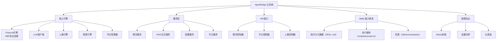
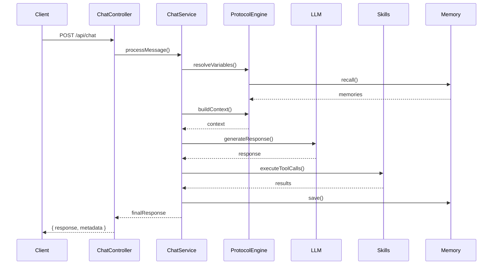
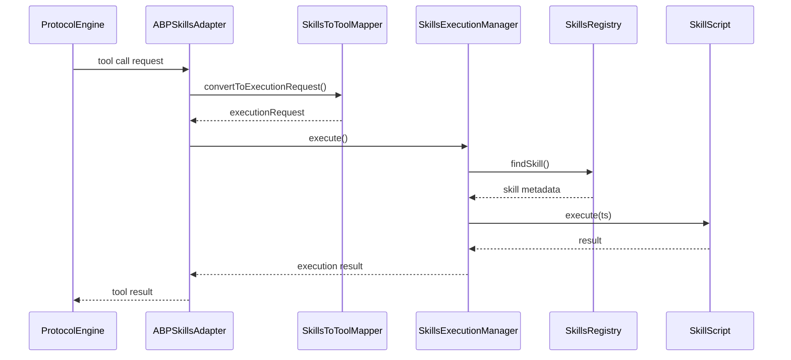

# 🏗️ 架构设计

ApexBridge 系统架构概述和设计原理。

## 📊 架构总览



## 🧩 核心组件

### 1. Protocol 引擎 (ABP)

**职责**：
- ABP协议解析和工具调用（经 Skills 映射执行）
- 变量解析与三段渐进式工具描述
- 集成RAG搜索和时间感知功能

**实现**：`src/core/ProtocolEngine.ts`

**关键特性**：
- 独立实现，不再依赖 VCP SDK
- 支持变量插值：`{{variable:scope:key}}`
- Skills 运行时管理

### 2. LLM 客户端

**职责**：
- 多提供商适配器模式
- 流式聊天和重试机制
- Token 管理和成本控制

**支持提供商**：
- OpenAI (GPT-4, GPT-3.5)
- DeepSeek
- 智谱 AI (ChatGLM)
- Ollama (本地模型)

**实现**：`src/core/LLMClient.ts`

### 3. 人格引擎

**职责**：
- 动态加载人格配置
- 构建系统提示词
- 上下文管理

**配置格式**：
- JSON: `personalities/*.json`
- TXT: `personalities/*.txt`

**实现**：`src/core/PersonalityEngine.ts`

### 4. 情感引擎

**职责**：
- 情感状态管理
- 情感反应生成
- 与人格系统集成

**实现**：`src/core/EmotionEngine.ts`

### 5. 节点管理器

**职责**：
- 注册和管理 Node Agent
- 任务分发和负载均衡
- 健康检查和监控

**实现**：`src/core/NodeManager.ts`

## 🗂️ 服务层

### 聊天服务 (ChatService)

**职责**：
- 处理聊天请求
- 调用 LLM 生成响应
- 集成 Skills、记忆、人格

**流程**：
1. 接收用户消息
2. 构建上下文（人格 + 记忆 + 历史）
3. 调用 LLM
4. 解析并执行 Skills
5. 返回响应

**实现**：`src/services/ChatService.ts`

### 记忆服务 (MemoryService)

**职责**：
- 长期记忆存储
- RAG 向量搜索
- 用户偏好管理

**存储类型**：
- 情景记忆 (Episodic)：事件、对话
- 语义记忆 (Semantic)：知识、事实

**实现**：`src/services/ChatService.ts` (集成)

### 配置服务 (ConfigService)

**职责**：
- JSON 配置文件管理
- 配置验证和转换
- 热更新支持

**实现**：`src/services/ConfigService.ts`

### 节点服务 (DistributedService)

**职责**：
- Node Agent 通信
- 任务分发
- 消息路由

**实现**：`src/services/DistributedService.ts`

## 🔌 Skills 体系

### 目录结构

```
skills/
├── WeatherInfo/
│   ├── SKILL.md                    # Skills 定义（ABP配置）
│   ├── scripts/
│   │   └── execute.ts              # 技能执行入口
│   ├── references/                 # 参考数据
│   └── assets/                     # 资源文件
└── DemoAsyncTask/
    └── ...
```

### SKILL.md 格式

```yaml
---
# 前言区（ABP配置）
abp:
  tools:
    - name: "calendar_task"
      kind: "tool"
      description: "记录日历任务"
      parameters:
        title:
          type: "string"
          description: "任务标题"
          required: true
---

# 正文（执行指令）
## 注意事项
- ...

## 参考文件
- references/data.json
```

### 三段渐进式披露

**Metadata**: 名称、描述、工具签名
**Brief**: 参数、约束
**Full**: 完整指令与资源

**披露级别控制：**
- 用户偏好 `toolsDisclosure`
- 置信度回退机制

## 🌐 API 接口

### RESTful API

**控制器**：
- ChatController: 聊天接口
- AdminController: 管理接口
- PreferenceController: 偏好配置
- SetupController: 设置向导

**Base URL**: `/api`

**认证**: API Key、ABP_Key

### WebSocket API

**频道**：
- ABPLog (`/ABPlog/ABP_Key={key}`)
- AdminPanel (`/admin/ABP_Key={key}`)

**用途**：
- 实时日志推送
- 工具执行状态
- 服务器通知

## 🖥️ 管理后台

### 技术栈

- **前端**: React 18 + TypeScript
- **构建工具**: Vite
- **路由**: React Router
- **状态管理**: Zustand
- **UI 组件**: Ant Design

### 功能模块

- **仪表板**: 系统状态、统计信息
- **节点管理**: Node Agent 监控和管理
- **Skills 市场**: Skills 浏览和管理
- **设置向导**: 系统初始配置
- **安全**: API Key 管理、权限配置

**实现**：`admin/src/`

## 🗄️ 数据存储

### 配置文件

```
config/
├── admin-config.json              # 主配置
├── nodes.json                     # 节点配置
└── preferences/                   # 用户偏好
    └── {user-id}.json
```

### 向量存储

```
data/
└── vectors/
    ├── index.bin                  # HNSW 索引
    └── metadata.json              # 元数据
```

### 运行时数据

```
packages/node-agent/
└── runtime-data/                  # Node Agent 数据
    └── *.jsonl
```

## 🔒 安全机制

### 认证授权

- API Key 认证
- ABP_Key 路径认证
- JWT (可选)

### 输入验证

- Zod Schema 验证
- Ajv JSON Schema 验证
- 速率限制 (Rate Limiting)

### 安全特性

- CORS 配置
- Helmet 安全头
- 审计日志

## 🚀 性能优化

### 缓存策略

- Skills 扫描结果缓存
- 配置缓存
- RAG 查询结果缓存 (可选)

### 并发处理

- Node.js Cluster (多进程)
- Worker Threads (CPU 密集型任务)
- 连接池 (Redis、数据库)

### 监控指标

- 请求延迟 (Latency)
- 错误率 (Error Rate)
- 资源使用 (CPU、内存)
- Skills 执行耗时

## 📦 部署架构

### 单机部署

```
┌─────────────────────────┐
│   ApexBridge Server    │
│   (Node.js + Express)  │
├─────────────────────────┤
│   Skills 体系          │
│   - WeatherInfo        │
│   - DemoAsyncTask      │
│   - ...                │
├─────────────────────────┤
│   Persistent Storage   │
│   - config/*.json      │
│   - data/vectors/      │
└─────────────────────────┘
```

### 多节点部署

```
┌─────────────────┐
│  Load Balancer  │
└────────┬────────┘
         │
    ┌────┼────┐
    │    │    │
┌───▼──┐│┌──▼───┐│┌──▼───┐
│ Hub  │││Node1 │││Node2 │
│ 3000 │││3001  │││3002  │
└──────┘│└──────┘│└──────┘
```

**组件**：
- Hub (主服务器)：3000
- Node Agent (工作节点)：3001, 3002
- Redis (共享状态)：6379

## 🔧 技术栈

### 后端

- **Runtime**: Node.js ≥ 16.0.0
- **Language**: TypeScript 5.0+
- **Framework**: Express.js
- **WebSocket**: ws
- **Validation**: Zod, Ajv
- **Testing**: Jest, Supertest

### 基础设施

- **数据库**: PostgreSQL (可选)
- **Cache**: Redis (可选)
- **Vector DB**: hnswlib-node
- **进程管理**: PM2

### 开发工具

- **构建**: TypeScript Compiler
- **格式**: Prettier
- **Lint**: ESLint
- **文档**: Markdown, Mermaid

## 📊 数据流

### 聊天请求流程



### Skills 执行流程



## 🎯 设计原则

### 1. 模块化

- 高内聚，低耦合
- 清晰的分层架构
- 可插拔的 Skills 体系

### 2. 可扩展性

- 支持多 LLM 提供商
- 可扩展的 API
- 插件化架构

### 3. 可靠性

- 完善的错误处理
- 重试机制
- 降级策略

### 4. 可观测性

- 结构化日志
- 性能指标
- 健康检查

## 📚 相关文档

- [📖 API文档](./API.md)
- [⚙️ 配置指南](./CONFIGURATION.md)
- [📦 部署指南](./DEPLOYMENT.md)
- [🧪 测试指南](./testing/README.md)

---

**最后更新**: 2025-11-16
**文档版本**: v1.0.1
**架构版本**: v1.0
