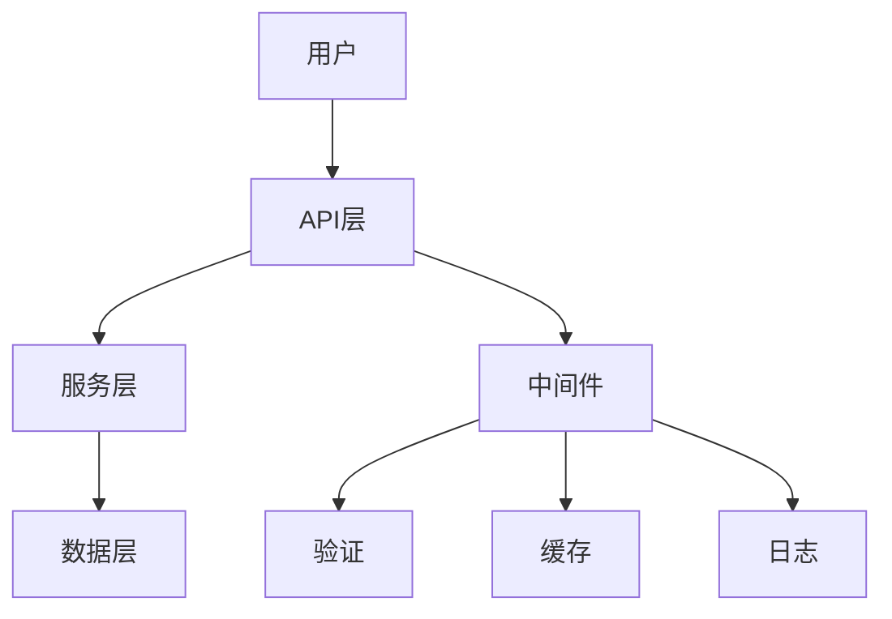

# [项目名称]

<!-- 徽章区域 -->
<p align="center">
  <!-- 状态徽章 -->
  
  
  
  <!-- 技术栈徽章 -->
  
  
  <!-- CI/CD徽章 -->
  
  
  <!-- 下载量徽章 -->
  
  
</p>

<!-- 项目简介 -->
<p align="center">
  <strong>[项目一句话描述]</strong>
</p>

<p align="center">
  [项目详细描述，2-3句话说明核心价值和主要特性]
</p>

<!-- 目录导航 -->
## 📑 目录

- [✨ 特性](#-特性)
- [🚀 快速开始](#-快速开始)
- [📦 安装](#-安装)
- [🔧 配置](#-配置)
- [📖 使用指南](#-使用指南)
- [🏗️ 架构设计](#️-架构设计)
- [🧪 测试](#-测试)
- [📚 API文档](#-api文档)
- [🤝 贡献](#-贡献)
- [📄 许可证](#-许可证)
- [🙏 致谢](#-致谢)

<!-- 特性展示 -->
## ✨ 特性

<!-- 使用图标增强视觉效果 -->
- 🎯 **核心特性1** - 详细描述这个特性和它带来的价值
- ⚡ **核心特性2** - 详细描述这个特性和它带来的价值
- 🔧 **核心特性3** - 详细描述这个特性和它带来的价值
- 🛡️ **核心特性4** - 详细描述这个特性和它带来的价值
- 🎨 **核心特性5** - 详细描述这个特性和它带来的价值

<!-- 快速开始 -->
## 🚀 快速开始

### 环境要求

```bash
# Node.js版本要求
node >= 16.0.0
npm >= 8.0.0
```

### 一键安装

```bash
# 使用npm
npm install [package-name]

# 使用yarn
yarn add [package-name]

# 使用pnpm
pnpm add [package-name]
```

### 快速示例

```typescript
// 基础使用示例
import { [MainClass] } from '[package-name]';

// 创建实例
const instance = new [MainClass]({
  // 配置参数
});

// 基础使用
const result = await instance.method();
console.log(result);
```

<!-- 详细安装说明 -->
## 📦 安装

### 稳定版安装

```bash
# npm
npm install [package-name]

# yarn
yarn add [package-name]

# pnpm
pnpm add [package-name]
```

### 开发版安装

```bash
# npm
npm install [package-name]@next

# yarn
yarn add [package-name]@next

# pnpm
pnpm add [package-name]@next
```

### 从源码构建

```bash
# 克隆仓库
git clone https://github.com/[owner]/[repo].git
cd [repo]

# 安装依赖
npm install

# 构建
npm run build

# 测试
npm test
```

<!-- 配置说明 -->
## 🔧 配置

### 基础配置

```typescript
interface [ConfigInterface] {
  // 配置选项
  option1: string;        // 选项说明
  option2: number;        // 选项说明
  option3?: boolean;      // 可选选项说明
}
```

### 配置示例

```typescript
const config = {
  option1: "value1",
  option2: 100,
  option3: true
};
```

### 环境变量

```bash
# .env 文件配置
OPTION1=value1
OPTION2=100
OPTION3=true
```

<!-- 使用指南 -->
## 📖 使用指南

### 基础用法

```typescript
import { [MainClass], [HelperClass] } from '[package-name]';

// 创建实例
const service = new [MainClass](config);

// 基础方法调用
const result = await service.basicMethod({
  parameter: 'value'
});
```

### 高级用法

```typescript
// 高级功能示例
const advancedConfig = {
  // 高级配置
};

const advancedService = new [MainClass](advancedConfig);

// 复杂操作
const complexResult = await advancedService.complexOperation({
  // 参数
});
```

### 常见用例

#### 用例1：[用例名称]

```typescript
// 具体用例代码
```

#### 用例2：[用例名称]

```typescript
// 具体用例代码
```

<!-- 架构设计 -->
## 🏗️ 架构设计

### 系统架构图



### 核心组件

| 组件 | 描述 | 状态 |
|------|------|------|
| **组件1** | 组件功能描述 | ✅ 完成 |
| **组件2** | 组件功能描述 | ✅ 完成 |
| **组件3** | 组件功能描述 | 🚧 开发中 |

### 项目结构

```
[project-name]/
├── src/                    # 源代码
│   ├── core/              # 核心模块
│   ├── utils/             # 工具函数
│   ├── types/             # 类型定义
│   └── index.ts           # 入口文件
├── tests/                  # 测试文件
│   ├── unit/              # 单元测试
│   ├── integration/       # 集成测试
│   └── e2e/               # 端到端测试
├── docs/                   # 文档
├── examples/               # 示例代码
├── scripts/                # 构建脚本
├── package.json            # 包配置
├── tsconfig.json          # TypeScript配置
├── jest.config.js         # Jest测试配置
└── README.md              # 项目说明
```

<!-- 测试说明 -->
## 🧪 测试

### 运行测试

```bash
# 运行所有测试
npm test

# 运行测试并生成覆盖率报告
npm run test:coverage

# 监视模式运行测试
npm run test:watch

# 运行特定测试
npm test -- --testNamePattern="[test-name]"
```

### 测试覆盖率

- **总覆盖率**: [覆盖率数值]%
- **语句覆盖率**: [覆盖率数值]%
- **分支覆盖率**: [覆盖率数值]%
- **函数覆盖率**: [覆盖率数值]%
- **行覆盖率**: [覆盖率数值]%

### 测试分类

- **单元测试**: 测试单个函数和类
- **集成测试**: 测试模块间的交互
- **端到端测试**: 测试完整的用户流程

<!-- API文档 -->
## 📚 API文档

### 主要类

#### [ClassName]

```typescript
class [ClassName] {
  constructor(config: [ConfigType]);

  // 主要方法
  async method1(): Promise<[ReturnType]>;
  method2(param: [ParamType]): [ReturnType];

  // 事件监听
  on(event: string, callback: Function): void;
  off(event: string, callback: Function): void;
}
```

#### 使用示例

```typescript
// 创建实例
const instance = new [ClassName](config);

// 调用方法
const result = await instance.method1();

// 监听事件
instance.on('event', (data) => {
  console.log('Received:', data);
});
```

### 类型定义

```typescript
// 主要类型定义
interface [InterfaceName] {
  property1: string;
  property2: number;
  property3?: boolean;
}

type [TypeName] = string | number;
```

<!-- 贡献指南 -->
## 🤝 贡献

我们欢迎所有形式的贡献！🎉

### 如何贡献

1. **Fork** 这个仓库
2. 创建你的特性分支 (`git checkout -b feature/AmazingFeature`)
3. 提交你的更改 (`git commit -m 'Add some AmazingFeature'`)
4. 推送到分支 (`git push origin feature/AmazingFeature`)
5. 打开一个 **Pull Request**

### 开发环境设置

```bash
# 克隆仓库
git clone https://github.com/[owner]/[repo].git
cd [repo]

# 安装依赖
npm install

# 启动开发模式
npm run dev

# 运行测试
npm test

# 代码格式化
npm run format

# 代码检查
npm run lint
```

### 代码规范

- **编码风格**: 使用 [ESLint](https://eslint.org/) + [Prettier](https://prettier.io/)
- **提交信息**: 遵循 [Conventional Commits](https://www.conventionalcommits.org/)
- **测试覆盖率**: 新功能需要包含测试
- **文档更新**: 重要变更需要更新相关文档

### 问题报告

如果发现了bug或有功能建议，请：

1. 检查 [已有issues](https://github.com/[owner]/[repo]/issues)
2. 如果没有相关issue，请创建新的issue
3. 提供详细的问题描述和复现步骤

<!-- 许可证 -->
## 📄 许可证

本项目采用 [MIT License](LICENSE) 许可证。

<!-- 致谢 -->
## 🙏 致谢

- [感谢的项目1] - 提供了什么帮助
- [感谢的项目2] - 提供了什么帮助
- 所有贡献者 - 感谢你们的贡献

<!-- 联系方式 -->
## 📞 联系我们

- **项目主页**: https://github.com/[owner]/[repo]
- **问题反馈**: https://github.com/[owner]/[repo]/issues
- **讨论区**: https://github.com/[owner]/[repo]/discussions
- **邮箱**: [email@example.com]

---

<div align="center">
  <sub>Built with ❤️ by [项目名称]</sub>
</div>