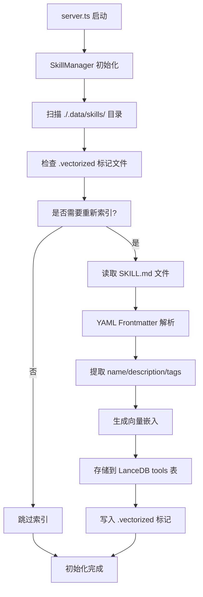
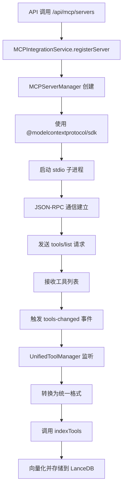
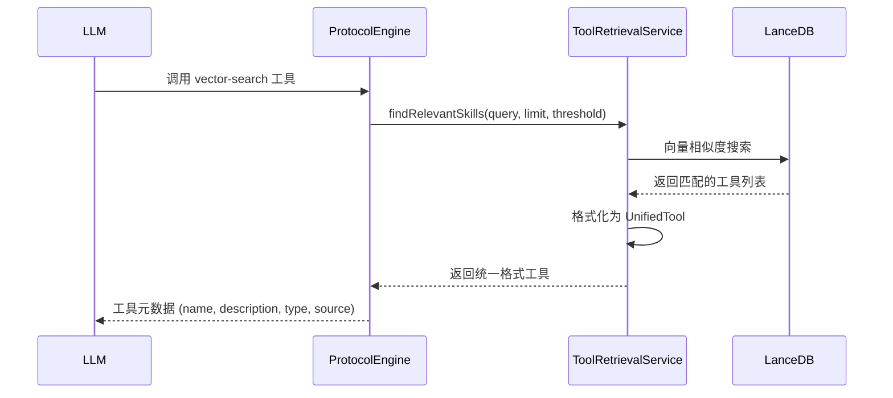
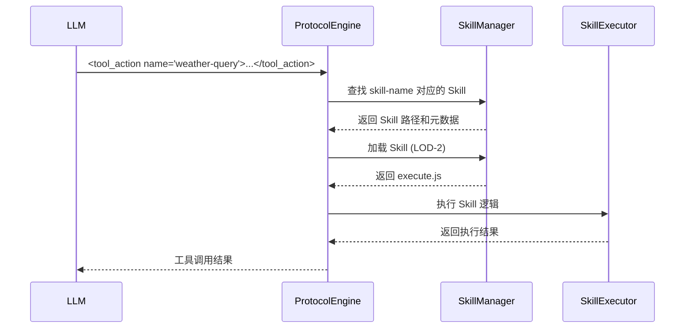
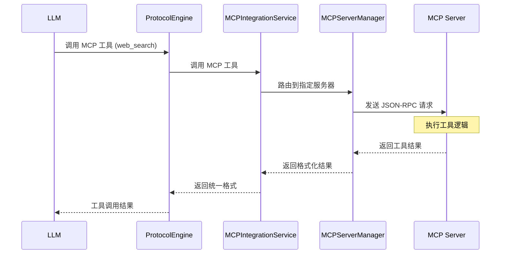
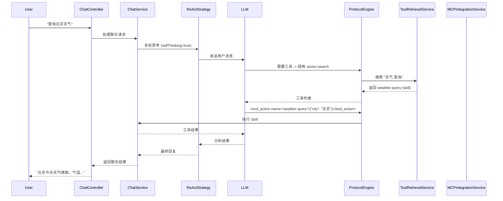

### 规范核心要点
| **项目**         | **核心规范**                                                                                              |
| ---------------- | --------------------------------------------------------------------------------------------------------- |
| **核心文件**     | **`SKILL.md`**：必备入口文件，包含YAML Frontmatter元数据和详细指令。                                      |
| **命名规范**     | **名称 (`name`)**：小写字母、数字、连字符，≤64字符。                                                      |
|                  | **描述 (`description`)**：≤1024字符，清晰说明功能和触发场景。                                            |
| **目录结构**     | 结构清晰，可选`scripts/`目录存放执行脚本。                                                                |
| **设计原则**     | 功能专一、描述清晰、提供示例、信息分层（LOD）、向量化存储、ReAct集成。                                    |
| **存储与部署**   | **项目级**：存放在项目目录的`./.data/skills/`下，按Skill名称分目录管理。                                  |
| **检索机制**     | **向量检索 + 语义匹配**：使用embedding模型向量化存储，支持语义相似度匹配。                                |
| **集成方式**     | **ReAct集成**：通过`tool_action` XML标签调用，支持流式执行、中断和超时控制。                              |
| **执行模式**     | **Direct/Internal**：内置工具（零开销）或Skills执行器（进程隔离）。                                       |
| **安全规范**     | 避免硬编码敏感信息；沙盒执行；参数验证；遵循最小权限原则。                                                |

---

### 📁 Skill的核心结构与设计哲学

一个Skill本质上是一个包含 **`SKILL.md`** 文件和相关资源的文件夹。ApexBridge中的Skill继承并扩展了经典的Skill设计理念，强调 **"信息分层"** 和 **"向量化智能检索"**，并深度集成ReAct策略以实现动态工具调用。

**核心设计理念：信息分层（LOD）**

借鉴游戏中的细节层次（LOD）理念，ApexBridge的Skill实现三级信息分层：

- **LOD-0 (摘要层)**：即YAML中的`name`和`description`。系统启动时预加载所有Skill的此层信息到向量数据库，用于快速相关性判断。
- **LOD-1 (核心层)**：即`SKILL.md`的详细内容。仅当语义检索判断该Skill相关时才会详细加载，足以支撑80%-90%的任务规划。
- **LOD-2 (执行层)**：可选的`scripts/execute.js`文件。仅在需要实际执行逻辑时按需加载：
  - **工具Skill**：支持两种执行模式
    - **Direct模式**：零开销的内置工具执行
    - **Internal模式**：进程隔离的沙盒执行
  - **知识Skill**：不需要执行脚本，仅提供知识指导

**1. 核心文件：SKILL.md - AI产品说明书+工作手册**

每个Skill的必备入口文件，采用 **"YAML Frontmatter + Markdown内容"** 的两层结构。本质上是一份**给AI看的说明书+工作手册**，核心目标是让AI能够**快速理解、准确调用、正确执行**。

### 1.1 YAML Frontmatter (AI的"身份证")

这是AI决定何时调用此Skill的核心依据，必须精准、具体：

- `name`: Skill的唯一标识（小写+连字符，如 `pdf-form-filler`）
- `version`: 版本号（语义化版本）
- `description`: **最关键字段！**
  - ❌ 差的描述："处理文件"（太模糊，永远不会被触发）
  - ✅ 优秀的描述："根据代码变更的git diff输出，自动生成符合约定式提交规范的提交信息"
  - 必须包含**触发关键词**和**具体场景**
- `tags`: 标签数组，用于语义增强
- `parameters`: JSON Schema格式的参数定义（工具Skill必需）
- `author`、`dependencies`、`category`等附加信息

### 1.2 Markdown内容 (核心工作手册)

**核心原则：分层呈现信息，教会AI正确协作**

- **功能说明**：详细展开YAML中的`description`，明确Skill的边界和能力范围
- **使用示例**：
  - **工具Skill**：展示完整的"用户请求→AI调用→期望输出"的链条
  - **知识Skill**：提供知识咨询场景的具体对话示例
- **操作指南**：
  - **工具Skill**：用步骤化方式"教会"AI如何思考和执行逻辑
  - **知识Skill**：提供知识应用的最佳实践和指导原则
- **边界说明**：明确什么能做、什么不能做（避免AI错误调用）
- **注意事项**：重要的使用限制和最佳实践

### 1.3 SKILL.md完整编写模板

```markdown
---
name: "example-skill-name"
description: "一个清晰、具体的描述，说明此Skill能做什么，通常在什么场景下触发。"
version: "1.0"
author: "Your Name"
---

# [Skill名称] - 功能详述

## 1. 核心功能概述
*（详细展开description，明确边界和能力）*

**主要用途**：
- 用途一：例如，将Markdown文档转换为结构精美的PPT大纲
- 用途二：例如，按照特定模板格式化代码片段

**不适用于**：
- 无法处理二进制文件（如.exe）
- 不进行复杂的数学计算

## 2. 使用示例
*（这是最关键的部分！必须提供AI学习的训练范例）*

**场景1：基础转换**
- **用户输入**："帮我将这篇博客草稿转换成PPT大纲，主题是'人工智能的未来'"
- **AI应调用此Skill并生成**：
  ```markdown
  # 人工智能的未来
  ## 一、引言
  - 当前AI的发展现状
  - 本次分享的核心议题
  ```

**场景2：使用特定参数**
- **用户请求**："用'学术风格'的模板格式化这段Python代码"
- **AI的响应**：调用此Skill，并引用相关模板

## 3. 操作指南与工作流程
*（用步骤化方式教会AI如何思考）*

当AI决定调用此Skill后，应执行：
1. **步骤一：解析输入**。识别用户请求中的核心要素（如目标格式、风格关键词）
2. **步骤二：定位资源**。检查Skill目录下的templates/或references/文件夹
3. **步骤三：应用逻辑**。按照既定规则处理内容
4. **步骤四：输出与验证**。生成结果，确保符合预期格式

## 4. 技能内部资源说明
- `scripts/format.py`: 核心格式化脚本
- `templates/academic.md`: 学术风格输出模板
- `references/style_guide.pdf`: 详细设计规范（备查，非必需不加载）

## 5. 边界说明与注意事项
- 输入内容应为纯文本，否则可能失败
- 如果输出格式异常，请检查输入中是否包含未支持的标记
- 不支持处理超过10MB的文件
```

**2. Skill类型：工具Skill vs 知识Skill**

ApexBridge支持两种类型的Skill，各有特点：

**2.1 工具Skill（Tool-based Skill）**
- **定位**：具备工具调用能力，可执行实际操作
- **能力**：调用API、操作文件、访问数据库、执行计算等
- **LOD-2层**：需要`scripts/execute.js`实现执行逻辑
- **执行流程**：ReAct策略 → 参数验证 → 选择执行模式 → 流式返回结果
- **适用场景**：天气查询、数据分析、文件处理、API调用等

**2.2 知识Skill（Knowledge-based Skill）**
- **定位**：提供专业技术指导和知识库
- **能力**：提供最佳实践、写作指南、技术文档、知识咨询等
- **LOD-2层**：不需要执行脚本，仅提供知识内容
- **执行流程**：ReAct策略 → 语义检索 → 知识内容返回
- **适用场景**：写作指导、技术咨询、最佳实践、问题诊断等

**对比示例**：

| 维度 | 工具Skill | 知识Skill |
|------|-----------|-----------|
| **是否可执行** | 是 | 否 |
| **是否需要脚本** | 需要 | 不需要 |
| **调用方式** | `tool_action`标签 | 语义检索匹配 |
| **返回内容** | 执行结果 | 知识指导 |
| **典型例子** | weather-query, data-processor | writing-guide, api-design-guide |

**3. 可选执行资源**

```
skill-name/
├── SKILL.md              # 核心描述文件（必需）
├── scripts/              # 可执行脚本目录（可选）
│   ├── execute.js        # 主执行入口（严格模式下必需）
│   ├── utils.js          # 工具函数
│   └── ...               # 其他辅助脚本
├── templates/            # 模板文件目录（可选）
│   └── output_template.md
└── references/           # 参考文档目录（可选）
    └── api_docs.pdf      # 大型参考文档
```

---

### 🔧 完整的Skill开发规范

遵循以下规范，可以创建出高效、安全且易于维护的ApexBridge Skill。

**存储位置**：
- **项目级存储**：存放在项目目录的 `./.data/skills/<skill-name>/` 下
- **独立目录管理**：每个Skill占用独立目录，避免命名冲突
- **自动索引**：安装时自动向量化并建立索引

**4. 内容编写规范**

### 4.1 核心原则

- **功能专一性**：每个Skill应聚焦于解决一个明确、单一的任务
- **与人和AI同时沟通**：既要人看得懂，也要AI能理解并执行

### 4.2 description字段编写指南

**这是最重要的字段！决定AI何时会调用此Skill。**

- ✅ **优秀示例**：
  - "根据代码变更的git diff输出，自动生成符合约定式提交规范的提交信息"
  - "当用户询问天气情况时，调用此工具查询指定城市的实时天气、未来预报或空气质量"
  - "当用户需要撰写技术文档、商业文案或学术论文时，提供结构化的写作指导和最佳实践"

- ❌ **避免的写法**：
  - "帮助处理文件"（太模糊）
  - "提供一些指导"（没有触发点）
  - "有用的工具"（没有具体场景）

**关键要素**：
- **包含触发关键词**（如"git diff"、"天气情况"、"撰写技术文档"）
- **明确使用场景**（何时被触发）
- **说明预期产出**（能得到什么结果）

### 4.3 使用示例编写指南

**这是AI学习的"训练集"，必须展示完整的协作链条。**

- **工具Skill示例**：必须包含
  - 用户自然语言请求
  - AI应调用的`tool_action` XML
  - 期望的返回结果（JSON格式或文本）

- **知识Skill示例**：必须包含
  - 用户咨询场景
  - AI自动检索并激活的过程
  - 系统返回的知识指导内容

**示例结构模板**：
```markdown
**场景X：[具体场景描述]**
- **用户请求**："[用户的自然语言表达]"
- **AI响应**：
  1. （知识Skill）自动检索并匹配此Skill
  2. （工具Skill）调用 `<tool_action name="skill-name">`
  3. **期望输出**：
     ```[具体格式示例]```
```

### 4.4 操作指南编写指南

**用步骤化方式"教会"AI如何思考，避免模糊词汇。**

- ✅ **好的描述**：
  - "首先，提取用户查询中的日期和城市信息。然后，调用weather-query工具，传入这些参数。最后，将返回的JSON数据整理成用户可读的摘要。"

- ❌ **避免的描述**：
  - "适当处理一下"（AI不知道怎么做）
  - "优化输出"（没有具体逻辑）
  - "调用相关功能"（不明确）

**结构化步骤模板**：
```markdown
当AI决定调用此Skill后，应执行：
1. **步骤一：[具体动作]**。说明如何解析/提取/验证输入
2. **步骤二：[具体动作]**。说明如何定位资源/调用工具
3. **步骤三：[具体动作]**。说明如何应用逻辑/处理数据
4. **步骤四：[具体动作]**。说明如何格式化/验证输出
```

### 4.5 边界说明编写指南

**明确Skill的局限性，避免AI在不适用场景错误调用。**

**必须包含**：
- **输入限制**（文件大小、格式、类型）
- **能力边界**（能做什么、不能做什么）
- **前置条件**（需要什么数据或环境）
- **异常处理**（遇到问题怎么办）

**示例**：
```markdown
## 边界说明与注意事项

**输入限制**：
- 仅支持纯文本文件，不支持二进制文件（如.exe、.jpg）
- 文件大小不超过10MB
- 编码格式必须为UTF-8

**不适用于**：
- 需要复杂数学计算的场景
- 实时数据处理（仅支持静态数据）
- 涉及敏感信息处理
```

### 4.6 需要避免的常见错误

**编写SKILL.md时的典型误区，看看你中了几个？**

1. **描述过于空泛**
   - ❌ "处理文件"
   - ❌ "提供帮助"
   - ❌ "有用的工具"
   - ✅ 改为具体场景+触发词+预期产出

2. **缺少具体示例**
   - 没有示例，AI无法将抽象描述转化为具体行动
   - 必须提供"用户请求→AI调用→期望输出"的完整链条

3. **步骤描述模糊**
   - ❌ "适当处理"
   - ❌ "优化一下"
   - ❌ "调用相关功能"
   - ✅ 使用具体、明确的操作动词

4. **忽略边界说明**
   - 没有指出局限性，AI可能在不适用的场景错误调用
   - 必须明确"能做什么"和"不能做什么"

5. **信息组织混乱**
   - 重要信息埋没在长篇文字中
   - 没有清晰的结构和层次

6. **触发词不明确**
   - 用户不知道说什么才能激活此Skill
   - description中必须包含用户可能使用的关键词

### 4.7 进阶技巧：如何写出"智能"的Skill

**让SKILL.md真正"聪明"起来的高级技巧**

#### 技巧1：使用明确的触发词
在描述和示例中，嵌入你希望用户使用的关键词：
```markdown
description: "当用户说'生成图表'、'可视化数据'、'制作图表'时，自动识别需求并调用图表生成工具"
```

#### 技巧2：模拟完整对话
在"使用示例"部分，设计用户与AI的自然对话：
```markdown
用户：这些销售数据我想做成图表展示
AI：好的，我为您生成一个柱状图来可视化这些数据
（调用chart-generator工具）
```

#### 技巧3：分层引用策略
清楚告诉AI哪里是主要指南，哪里是备查资料：
```markdown
## 资源说明
- SKILL.md：主要指南（必读）
- references/：详细规范（复杂情况下备查，非必需不加载）
- scripts/：执行逻辑（仅在需要深度处理时调用）
```

#### 技巧4：前置条件检查
告诉AI在调用前需要验证什么：
```markdown
## 调用前置条件
调用此Skill前，AI应检查：
1. 用户是否提供了数据文件路径
2. 文件格式是否为CSV或JSON
3. 数据是否包含至少两列（X轴和Y轴）
```

#### 技巧5：错误处理指南
当出现问题时，告诉AI如何处理：
```markdown
## 异常处理
- 如果API调用失败，返回："抱歉，天气服务暂时不可用，请稍后重试"
- 如果城市名称无法识别，返回："未找到该城市的天气信息，请检查城市名称是否正确"
- 如果网络超时，返回："请求超时，请检查网络连接后重试"
```

---

### 🧪 项目中测试Skill

ApexBridge提供了完整的Skill测试方法，确保开发的Skill能够正常工作：

#### 方法1：通过现有Skill示例学习

项目中已有两个完整的Skill示例：

**工具Skill示例**：`./.data/skills/weather-query/SKILL.md`
- 包含完整的YAML Frontmatter（name、description、tags、parameters）
- 展示JSON Schema参数定义
- 提供多个tool_action调用示例

**知识Skill示例**：`./.data/skills/writing-guide/SKILL.md`
- 无parameters字段
- 重点展示知识内容结构
- 提供咨询场景示例

#### 方法2：通过Web界面测试

1. **启动项目**：
```bash
npm run dev
```

2. **打开浏览器**：访问 `http://localhost:3000`

3. **测试知识Skill**：
   - 在对话框输入："我想学习如何写好技术文档"
   - 观察系统是否自动检索并匹配writing-guide
   - 检查返回的写作指导内容是否完整

4. **测试工具Skill**：
   - 输入："查询北京天气"
   - 观察是否调用weather-query工具
   - 检查返回的JSON格式是否正确

#### 方法3：通过API测试

**测试知识Skill检索**：
```bash
curl -X POST http://localhost:3000/v1/chat/completions \
  -H "Content-Type: application/json" \
  -d '{
    "messages": [
      {
        "role": "user",
        "content": "我想学习如何写好技术文档"
      }
    ],
    "options": {
      "selfThinking": {
        "enabled": true
      }
    }
  }'
```

**测试工具Skill调用**：
```bash
curl -X POST http://localhost:3000/v1/chat/completions \
  -H "Content-Type: application/json" \
  -d '{
    "messages": [
      {
        "role": "user",
        "content": "查询北京天气"
      }
    ],
    "options": {
      "selfThinking": {
        "enabled": true
      }
    }
  }'
```

#### 方法4：通过日志调试

项目会输出详细的调试日志：

```bash
# 查看Skill检索日志
npm run dev 2>&1 | grep "Skill"

# 查看向量检索日志
npm run dev 2>&1 | grep "vector"

# 查看工具调用日志
npm run dev 2>&1 | grep "tool_action"
```

#### 方法5：验证SKILL.md格式

**使用项目自带的验证**：

```bash
# 检查TypeScript编译（会自动验证部分格式）
npm run build
```

**手动检查清单**：

- [ ] YAML Frontmatter格式正确（`---`包裹）
- [ ] name字段使用小写+连字符
- [ ] description包含触发关键词和具体场景
- [ ] 工具Skill包含完整的JSON Schema参数定义
- [ ] Markdown内容结构清晰（功能说明、使用示例、操作指南、边界说明）
- [ ] 使用示例展示完整的"用户请求→AI调用→期望输出"链条

#### 方法6：验证向量数据库

**检查Skill是否正确索引**：

```bash
# 查看技能目录
ls -la ./.data/skills/

# 查看向量数据库文件（如果存在）
ls -la ./.data/lancedb/
```

#### 常见问题排查

**Skill无法被检索**：
- 检查description是否包含足够的关键词
- 检查tags是否合理
- 确认Skill文件放置在正确目录（`./.data/skills/<skill-name>/`）

**工具调用失败**：
- 检查JSON Schema参数定义是否正确
- 检查scripts/execute.js是否存在且可执行
- 查看服务器日志中的错误信息

**知识内容不匹配**：
- 检查知识内容的关键词密度
- 确认内容结构清晰、层次分明
- 验证是否与用户查询语义相关

---

### 🔄 MCP + Skill 双轨并行架构端到端流程机制详解

ApexBridge采用**双轨并行架构**，实现Skills（本地工具）与MCP（远程工具）的完美兼容与统一管理。本章节详细解析从系统启动到工具调用的完整端到端流程。

#### 核心架构概览

```
┌─────────────────────────────────────────────────────────────┐
│                   ApexBridge 主系统                         │
├─────────────────────────────────────────────────────────────┤
│  Skills 系统 (本地工具)    │  MCP 系统 (远程工具)            │
│  ┌─────────────────────┐  │  ┌─────────────────────────────┐ │
│  │ ./.data/skills/     │  │  │ MCPIntegrationService      │ │
│  │  - weather-query    │  │  │  - ServerManager           │ │
│  │  - writing-guide    │  │  │  - 10+ API Routes          │ │
│  └─────────────────────┘  │  └─────────────────────────────┘ │
│                            │                                 │
├────────────────────────────┼─────────────────────────────────┤
│          统一向量数据库 (LanceDB)                            │
│  ┌───────────────────────────────────────────────────────┐  │
│  │ ToolsTable:                                          │  │
│  │  - Skills: toolType='skill', source='skill-name'     │  │
│  │  - MCP:   toolType='mcp',   source='mcp-server-id'   │  │
│  └───────────────────────────────────────────────────────┘  │
├─────────────────────────────────────────────────────────────┤
│              vector-search (内置工具)                        │
│  动态发现并返回所有可用工具 (Skills + MCP)                    │
└─────────────────────────────────────────────────────────────┘
```

#### 第一阶段：系统初始化流程

**1.1 Skills 初始化**


**1.2 MCP 服务器初始化**


**关键组件协作**：
- **SkillManager** (`src/services/SkillManager.ts`) - 负责本地Skills的发现和索引
- **MCPIntegrationService** (`src/services/MCPIntegrationService.ts`) - 负责MCP服务器的注册和管理
- **MCPServerManager** (`src/services/MCPServerManager.ts`) - 负责单个MCP服务器的进程生命周期
- **UnifiedToolManager** (`src/services/UnifiedToolManager.ts`) - 统一工具管理器，监听工具变化事件

#### 第二阶段：向量化与存储流程

**2.1 统一向量格式**
所有工具（Skills和MCP）都被转换为统一的 `UnifiedTool` 格式：

```typescript
interface UnifiedTool {
  name: string;              // 工具名称
  description: string;       // 工具描述（用于向量嵌入）
  type: 'skill' | 'mcp';     // 工具类型
  source: string;            // 来源标识（skill-name 或 mcp-server-id）
  tags: string[];            // 标签数组
  metadata: any;             // 额外元数据
  // Skill 特有
  path?: string;             // Skill 路径
  version?: string;          // Skill 版本
  // MCP 特有
  inputSchema?: any;         // MCP 工具输入模式
}
```

**2.2 存储到 LanceDB**
```typescript
// ToolsTable 表结构
interface ToolsTable {
  id: string;                // 工具唯一ID (source:name)
  name: string;
  description: string;
  tags: string[];
  path?: string;             // Skill 路径
  version?: string;          // Skill 版本
  source: string;            // 来源 (mcp-server-id 或 skill-name)
  toolType: 'skill' | 'mcp'; // 工具类型
  metadata: string;          // JSON 字符串
  vector: number[];          // 向量嵌入 (768维)
  indexedAt: Date;           // 索引时间
}
```

**2.3 向量化核心代码流程**
```typescript
// ToolRetrievalService.ts
async function indexTools(tools: UnifiedTool[]): Promise<void> {
  for (const tool of tools) {
    // 1. 生成唯一ID
    const toolId = generateToolId(tool);

    // 2. 获取向量嵌入
    const embedding = await getEmbeddingForTool(tool);

    // 3. 构建数据库记录
    const record = {
      id: toolId,
      name: tool.name,
      description: tool.description,
      tags: tool.tags,
      toolType: tool.type,
      source: tool.source,
      path: tool.path,
      version: tool.version,
      metadata: JSON.stringify(tool.metadata || {}),
      vector: embedding,
      indexedAt: new Date()
    };

    // 4. 存储到 LanceDB
    await this.table.insert(record);
  }
}
```

#### 第三阶段：向量搜索与工具发现流程

**3.1 LLM 调用 vector-search**


**3.2 搜索查询流程**
```typescript
// 实际搜索实现
async function findRelevantSkills(
  query: string,
  limit: number = 10,
  threshold: number = 0.30
): Promise<VectorToolResult[]> {
  // 1. 查询文本向量化
  const queryEmbedding = await this.embeddingService.embed(query);

  // 2. LanceDB 向量搜索
  const results = await this.table
    .search(queryEmbedding)
    .where('vector IS NOT NULL')
    .limit(limit)
    .toArray();

  // 3. 过滤相似度阈值
  const filtered = results.filter(r => r.score >= threshold);

  // 4. 格式化返回
  return filtered.map(result => ({
    id: result.id,
    tool: {
      name: result.name,
      description: result.description,
      type: result.toolType,
      source: result.source,
      tags: result.tags,
      path: result.path,
      version: result.version,
      metadata: JSON.parse(result.metadata || '{}')
    },
    score: result.score
  }));
}
```

**3.3 搜索结果示例**
```json
[
  {
    "tool": {
      "name": "weather-query",
      "description": "当用户询问天气情况时，调用此工具查询指定城市的实时天气",
      "type": "skill",
      "source": "weather-query",
      "path": "./.data/skills/weather-query",
      "version": "1.0.0"
    },
    "score": 0.89
  },
  {
    "tool": {
      "name": "web_search",
      "description": "Search the web for information",
      "type": "mcp",
      "source": "minimax-mcp"
    },
    "score": 0.85
  }
]
```

#### 第四阶段：工具调用执行流程

**4.1 Skill 调用流程**


**4.2 MCP 工具调用流程**


**4.3 MCP 工具调用核心代码**
```typescript
// MCPIntegrationService.ts
async function callTool(toolName: string, arguments: any): Promise<any> {
  // 1. 根据工具名查找 MCP 服务器
  const server = this.findServerByToolName(toolName);
  if (!server) {
    throw new Error(`MCP server not found for tool: ${toolName}`);
  }

  // 2. 构建 JSON-RPC 请求
  const request = {
    jsonrpc: '2.0',
    id: Date.now(),
    method: 'tools/call',
    params: {
      name: toolName,
      arguments: arguments
    }
  };

  // 3. 发送到 MCP 服务器
  const result = await this.serverManager.callTool(server.id, request);

  // 4. 返回结果
  return result;
}
```

#### 第五阶段：完整用户请求示例

**场景：用户查询天气**



#### 组件间协作关系图

```
┌─────────────────────────────────────────────────────────────────┐
│                        核心服务组件                               │
├─────────────────────────────────────────────────────────────────┤
│                                                                  │
│  ┌──────────────────────┐         ┌──────────────────────────┐  │
│  │   SkillManager       │         │  MCPIntegrationService   │  │
│  │  - 扫描skills目录    │         │  - 注册MCP服务器         │  │
│  │  - 解析SKILL.md      │         │  - 管理服务器生命周期    │  │
│  │  - 索引到LanceDB     │         │  - 工具调用路由          │  │
│  └──────────────────────┘         └──────────────────────────┘  │
│           │                                │                    │
│           └────────────┬───────────────────┘                    │
│                        │                                        │
│  ┌──────────────────────────────────────────────────────────┐  │
│  │         UnifiedToolManager (统一工具管理器)                │  │
│  │  - 监听 tools-changed 事件                                │  │
│  │  - 转换工具为统一格式                                      │  │
│  │  - 触发重新索引                                           │  │
│  └──────────────────────────────────────────────────────────┘  │
│                            │                                    │
│  ┌──────────────────────────────────────────────────────────┐  │
│  │         ToolRetrievalService (向量检索服务)                │  │
│  │  - indexTools() - 批量索引工具                            │  │
│  │  - findRelevantSkills() - 向量搜索                        │  │
│  │  - removeTool() - 删除工具                                │  │
│  └──────────────────────────────────────────────────────────┘  │
│                            │                                    │
│  ┌──────────────────────────────────────────────────────────┐  │
│  │           LanceDB (统一向量数据库)                         │  │
│  │  - 存储 Skills (toolType='skill')                         │  │
│  │  - 存储 MCP 工具 (toolType='mcp')                         │  │
│  │  - 向量相似度搜索                                         │  │
│  └──────────────────────────────────────────────────────────┘  │
└─────────────────────────────────────────────────────────────────┘
```

#### 数据流总结

**1. 启动阶段数据流**：
```
./.data/skills/ → SkillManager → indexSkill() → LanceDB
MCP Server 注册 → MCPIntegrationService → tools-changed → indexTools() → LanceDB
```

**2. 搜索阶段数据流**：
```
用户查询 → 向量化 → LanceDB 搜索 → 相似度排序 → 统一格式返回
```

**3. 调用阶段数据流**：
```
LLM 工具调用 → ProtocolEngine →
  ├─ Skill: SkillManager → execute.js → 返回结果
  └─ MCP: MCPIntegrationService → JSON-RPC → MCP Server → 返回结果
```

#### 关键优势

1. **双轨并行**：Skills和MCP完全独立，互不影响
2. **统一检索**：通过向量搜索同时发现所有工具
3. **动态扩展**：支持运行时动态注册MCP服务器
4. **类型安全**：通过toolType字段明确区分工具类型
5. **向后兼容**：现有Skills系统完全不受影响

---

### 🌟 总结

**编写SKILL.md的本质：与人（开发者）和AI同时进行清晰沟通**

**核心设计理念：SKILL.md = 产品说明书 + 工作手册**

ApexBridge支持**两种类型的Skill**：

1. **工具Skill** - 可执行的动态工具
   - 具备工具调用能力，能执行实际操作
   - 支持Direct/Internal双执行模式
   - 通过`tool_action`标签调用
   - SKILL.md重点：参数定义、调用示例、执行流程

2. **知识Skill** - 可检索的知识库
   - 提供专业技术指导和最佳实践
   - 无需执行脚本，纯内容价值
   - 通过语义检索自动匹配
   - SKILL.md重点：知识内容、使用场景、应用指导

**关键成功要素**：

1. **精准的description** - 包含触发词、使用场景、预期产出
2. **完整的使用示例** - 展示"用户请求→AI调用→期望输出"的完整链条
3. **清晰的操作指南** - 用步骤化方式教会AI如何思考和执行
4. **明确的边界说明** - 避免AI在不适用场景错误调用

**一句话记住**：
> 写SKILL.md就是写一份让AI能**快速理解、准确调用、正确执行**的产品说明书+工作手册。