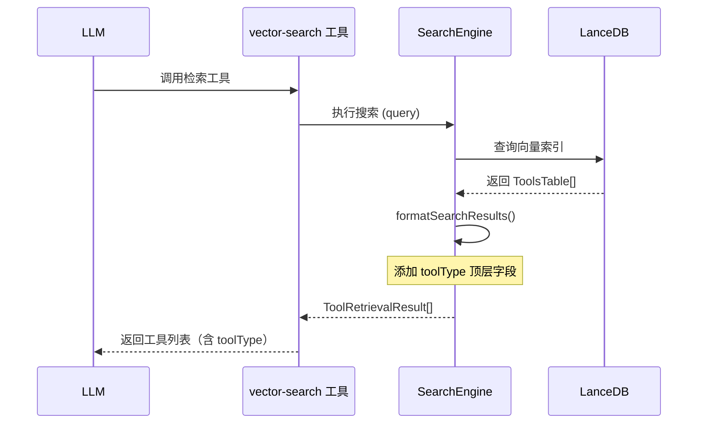

# R-003: Vector-Search 工具类型返回功能设计

**功能编号**: FD-006
**状态**: ✅ 评审通过
**评审日期**: 2025-12-30

## 变更版本记录

| 版本 | 日期 | 变更内容 | 变更人 |
|------|------|----------|--------|
| 1.0 | 2025-12-30 | 初始版本 | - |
| 1.1 | 2025-12-30 | 评审通过 | - |

## 关联文档

- 需求文档：[03-vector-search-tool-type.md](../requirements/03-vector-search-tool-type.md)
- 需求讨论纪要：[03-vector-search-tool-type-meeting.md](../meeting-minutes/03-vector-search-tool-type-meeting.md)

---

## 1. 功能概述

### 1.1 功能描述

为 `vector-search` 工具的检索结果添加 `toolType` 顶层字段，使 LLM 能够区分三类工具（mcp、builtin、skill），正确选择工具调用策略。

### 1.2 所属需求

- **需求名称**：R-003: Vector-Search 工具类型返回
- **需求文档路径**：[03-vector-search-tool-type.md](../requirements/03-vector-search-tool-type.md)

### 1.3 功能范围

**包含**：
- `ToolRetrievalResult` 接口添加 `toolType` 字段
- `SearchEngine.formatSearchResults` 方法返回 `toolType`
- `SearchEngine.formatTool` 方法添加 `builtin` 类型处理分支

**不包含**：
- LLM 工具调用决策逻辑变更
- 数据库 Schema 变更
- `SkillIndexer` 修改（`toolType` 已存入数据库）

---

## 2. 业务流程

### 2.1 流程图



### 2.2 流程说明

| 步骤 | 操作 | 说明 |
|------|------|------|
| 1 | LLM 调用 vector-search | 传入检索 query |
| 2 | SearchEngine 执行搜索 | 调用 LanceDB 查询向量索引 |
| 3 | 获取 ToolsTable 数据 | 数据库返回包含 toolType 字段的数据 |
| 4 | formatSearchResults | 格式化结果，添加顶层 toolType |
| 5 | 返回 ToolRetrievalResult | 包含 id, name, description, score, toolType |

---

## 3. 功能详细设计

### 3.1 功能模块结构

```
src/services/tool-retrieval/
├── types.ts                    # 修改 ToolRetrievalResult 接口
├── SearchEngine.ts             # 修改 formatSearchResults 和 formatTool
├── ToolRetrievalService.ts     # 可能需要调整（视情况）
├── LanceDBConnection.ts        # 已有 toolType 支持
├── SkillIndexer.ts             # 已有 skill 类型索引
└── MCPToolSupport.ts           # 已有 mcp 类型支持
```

### 3.2 接口设计

#### 3.2.1 数据结构变更

**ToolRetrievalResult 接口（修改前）**

```typescript
export interface ToolRetrievalResult {
  id: string;
  name: string;
  description: string;
  score: number;
  metadata?: Record<string, unknown>;
  tags?: string[];
}
```

**ToolRetrievalResult 接口（修改后）**

```typescript
export interface ToolRetrievalResult {
  id: string;
  name: string;
  description: string;
  score: number;
  toolType: 'mcp' | 'builtin' | 'skill';  // ✅ 新增字段
  metadata?: Record<string, unknown>;
  tags?: string[];
}
```

**ToolsTable 接口（现有，已支持）**

```typescript
export interface ToolsTable {
  id: string;
  name: string;
  description: string;
  tags: string[];
  path?: string;
  version?: string;
  source?: string;
  toolType: 'skill' | 'mcp';  // 现有（需扩展为三类）
  metadata: string;
  vector: number[];
  indexedAt: Date;
}
```

#### 3.2.2 接口详细设计

**formatSearchResults 方法**

| 项目 | 值 |
|------|-----|
| 方法名 | `formatSearchResults` |
| 所属类 | `SearchEngine` |
| 访问修饰符 | `private` |

**方法签名**：

```typescript
private formatSearchResults(
  results: unknown[],
  limit: number,
  threshold: number
): ToolRetrievalResult[]
```

**参数说明**：

| 参数名 | 类型 | 必填 | 说明 |
|--------|------|------|------|
| results | unknown[] | 是 | LanceDB 查询结果 |
| limit | number | 是 | 返回结果数量限制 |
| threshold | number | 是 | 相似度阈值 |

**返回结果**：

| 字段名 | 类型 | 说明 |
|--------|------|------|
| id | string | 工具 ID |
| name | string | 工具名称 |
| description | string | 工具描述 |
| score | number | 相似度分数 (0-1) |
| toolType | 'mcp' \| 'builtin' \| 'skill' | 工具类型 |
| metadata | Record<string, unknown> | 元数据 |
| tags | string[] | 标签 |

**formatTool 方法（扩展）**

| 项目 | 值 |
|------|-----|
| 方法名 | `formatTool` |
| 所属类 | `SearchEngine` |
| 访问修饰符 | `private` |

**方法签名**：

```typescript
private formatTool(
  data: ToolsTable,
  metadata: Record<string, unknown>
): Record<string, unknown>
```

### 3.3 数据设计

#### 3.3.1 工具类型枚举

```typescript
export enum ToolType {
  SKILL = 'skill',
  MCP = 'mcp',
  BUILTIN = 'builtin'
}
```

#### 3.3.2 返回数据结构

| 字段名 | 类型 | 必填 | 说明 |
|--------|------|------|------|
| id | string | 是 | 工具唯一标识 |
| name | string | 是 | 工具名称 |
| description | string | 是 | 工具描述 |
| score | number | 是 | 相似度分数 |
| toolType | 'mcp' \| 'builtin' \| 'skill' | 是 | 工具类型 |
| metadata | Record<string, unknown> | 否 | 扩展元数据 |
| tags | string[] | 否 | 标签列表 |

### 3.4 业务规则

1. **工具类型规则**：
   - `mcp`：来源于外部 MCP 服务器的工具
   - `builtin`：系统内置工具（如 vector-search、read-file）
   - `skill`：用户定义的 skill 工具（来源于 `.data/skills` 目录）

2. **类型默认值**：
   - 如果 `data.toolType` 为 `undefined`，默认视为 `skill`
   - 数据库中 `ToolsTable.toolType` 只支持 `skill` 和 `mcp`，需扩展支持 `builtin`

3. **返回格式规则**：
   - `toolType` 必须为顶层字段
   - `metadata` 中的 `type` 字段保留，用于向后兼容

### 3.5 异常处理

| 异常情况 | 处理方式 |
|----------|----------|
| `data.toolType` 为 undefined | 默认返回 `skill`，记录 debug 日志 |
| `data.toolType` 为非法值 | 跳过该结果，记录 warn 日志 |
| 数据库查询失败 | 抛出异常，由上层处理 |

---

## 4. 安全设计

- **输入验证**：对 `toolType` 值进行白名单校验
- **日志脱敏**：toolType 不包含敏感信息，可正常日志输出
- **类型安全**：使用 TypeScript 枚举约束，防止非法值

---

## 5. 性能考虑

- **无额外开销**：`toolType` 直接从数据库读取，无额外计算
- **内存占用**：新增字段为字符串类型，单条记录增加约 10-20 字节
- **查询性能**：无影响，字段已存在于数据库行中

---

## 6. 测试要点

### 6.1 功能测试

| 测试点 | 预期结果 |
|--------|----------|
| skill 类型工具返回正确 | `toolType` 为 `'skill'` |
| mcp 类型工具返回正确 | `toolType` 为 `'mcp'` |
| builtin 类型工具返回正确 | `toolType` 为 `'builtin'` |
| toolType 为空时默认处理 | 默认返回 `'skill'` |

### 6.2 接口测试

| 测试点 | 输入 | 预期输出 |
|--------|------|----------|
| 返回结果包含 toolType | 任意 query | 结果包含 `toolType` 字段 |
| toolType 值正确 | mcp 工具 | `toolType: 'mcp'` |
| 返回结果结构完整 | 任意 query | 包含所有必填字段 |

### 6.3 边界测试

| 测试点 | 输入 | 预期结果 |
|--------|------|----------|
| 空结果 | query 无匹配 | 返回空数组 |
| 单个结果 | query 匹配一个 | 返回单元素数组 |
| 多个结果 | query 匹配多个 | 返回多个结果，各含 toolType |

---

## 7. 与其他功能的关系

### 7.1 被依赖

- `vector-search` 工具：依赖返回的 `toolType` 进行工具调用决策
- LLM Agent：根据 `toolType` 选择正确的工具调用策略

### 7.2 依赖

- `LanceDBConnection`：提供 `ToolsTable` 数据
- `SkillIndexer`：索引时设置 `toolType: 'skill'`
- `MCPToolSupport`：MCP 工具索引时设置 `toolType: 'mcp'`

---

## 8. 实现清单

| 任务 | 文件 | 修改内容 |
|------|------|----------|
| 修改接口 | `types.ts` | `ToolRetrievalResult` 添加 `toolType` 字段 |
| 修改格式化 | `SearchEngine.ts` | `formatSearchResults` 添加 `toolType` |
| 添加 builtin | `SearchEngine.ts` | `formatTool` 添加 `builtin` 处理 |
| 扩展 Schema | `types.ts` | `ToolsTable.toolType` 扩展为三类 |
| 编译验证 | - | `npm run build` |
