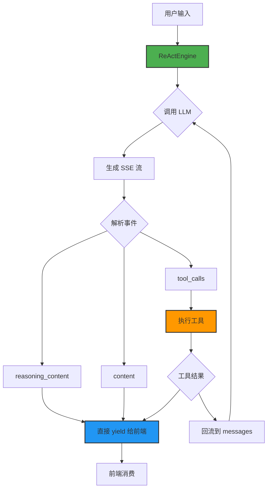

# ReAct Engine 使用文档

> 极简 ReAct 实现，专注流式处理与工具调用

## 📚 目录

- [快速开始](#快速开始)
- [架构设计](#架构设计)
- [API 参考](#api参考)
- [工具定义](#工具定义)
- [前端集成](#前端集成)
- [最佳实践](#最佳实践)
- [常见问题](#常见问题)
- [性能优化](#性能优化)

---

## 🚀 快速开始

### 安装依赖

```bash
# 确保已安装 TypeScript 和 Node.js (>= 16)
npm install typescript --save-dev

# 安装依赖
npm install axios
```

### 基本使用

```typescript
import { ReActEngine } from './src/core/react/ReActEngine';
import { tools } from './src/core/react/tools';
import { BaseOpenAICompatibleAdapter } from './src/core/llm/adapters/BaseAdapter';

// 初始化 LLM 客户端
const llmClient = new BaseOpenAICompatibleAdapter('custom', {
  baseURL: 'https://open.bigmodel.cn/api/paas/v4',
  apiKey: process.env.GLM_API_KEY!, // 设置你的 API Key
  timeout: 60000
}) as any;

// 初始化 ReAct 引擎
const engine = new ReActEngine(tools);

// 执行对话
const messages = [{
  role: 'user',
  content: '今天北京天气如何？'
}];

for await (const event of engine.execute(messages, llmClient)) {
  console.log(event.type, event.data);
}
```

### 输出示例

```
tool_start: { toolName: 'web_search', args: '{"query": "北京天气 today"}' }
tool_end: { toolName: 'web_search', result: { query: '...', results: [...] } }
content: { content: '今天北京天气晴朗，气温 25°C' }
done: null
```

---

## 🏗️ 架构设计



### 核心设计原则

1. **单一职责**：ReActEngine 只负责协调 LLM 和工具，不处理事件缓冲或任务调度
2. **流式优先**：所有输出（思考、回答、工具调用）都通过流式事件传递
3. **错误隔离**：工具执行失败不影响整体流程，会自动回流错误信息
4. **背压天然**：直接 `await tool.execute()`，不需要额外的并发控制

---

## 📖 API 参考

### ReActEngine 类

#### 构造函数

```typescript
constructor(tools: Tool[] = [])
```

- **参数**: `tools` - 工具数组
- **说明**: 初始化 ReAct 引擎，注册可用的工具

#### execute 方法

```typescript
async *execute(
  messages: any[],
  llmClient: any,
  options: ReActOptions = {}
): AsyncGenerator<StreamEvent, string, void>
```

**参数**

| 参数 | 类型 | 说明 |
|------|------|------|
| `messages` | `any[]` | 对话历史，符合 OpenAI 格式 |
| `llmClient` | `any` | LLM 客户端（需要有 streamChat 方法） |
| `options` | `ReActOptions` | 配置选项 |

**返回**

- `AsyncGenerator<StreamEvent, string, void>` - 流式事件生成器
- 最终返回完整回答字符串

**配置选项**

```typescript
interface ReActOptions {
  maxIterations?: number;  // 默认 10
  timeout?: number;        // 默认 300000ms (5分钟)
  enableThink?: boolean;   // 默认 true
}
```

**StreamEvent 类型**

```typescript
type StreamEventType = 'reasoning' | 'content' | 'tool_start' | 'tool_end' | 'error' | 'done';

interface StreamEvent {
  type: StreamEventType;
  data: any;
  timestamp: number;
}
```

### 事件类型说明

#### reasoning 事件

```typescript
{
  type: 'reasoning',
  data: {
    content: string  // 思考内容
  },
  timestamp: 1234567890
}
```

- **触发时机**: LLM 生成 reasoning_content 时
- **使用场景**: 前端实时显示 AI 的思考过程
- **注意**: 需要 `enableThink: true` 才能输出

#### content 事件

```typescript
{
  type: 'content',
  data: {
    content: string  // 回答内容
  },
  timestamp: 1234567890
}
```

- **触发时机**: LLM 生成最终回答时
- **使用场景**: 流式显示回答内容

#### tool_start 事件

```typescript
{
  type: 'tool_start',
  data: {
    toolName: string,  // 工具名称
    args: string       // 参数（JSON 字符串）
  },
  timestamp: 1234567890
}
```

- **触发时机**: 开始执行工具时
- **使用场景**: 前端显示工具执行状态

#### tool_end 事件

```typescript
{
  type: 'tool_end',
  data: {
    toolName: string,  // 工具名称
    result: any        // 执行结果
  },
  timestamp: 1234567890
}
```

- **触发时机**: 工具执行完成时
- **使用场景**: 前端显示工具结果

#### error 事件

```typescript
{
  type: 'error',
  data: {
    message: string  // 错误信息
  },
  timestamp: 1234567890
}
```

- **触发时机**: 工具执行失败或其他错误时
- **使用场景**: 前端显示错误信息
- **注意**: 流程会继续执行，不会中断

#### done 事件

```typescript
{
  type: 'done',
  data: null,
  timestamp: 1234567890
}
```

- **触发时机**: 整个流程完成时
- **使用场景**: 前端标识对话结束

---

## 🛠️ 工具定义

### Tool 接口

```typescript
interface Tool {
  name: string;
  description: string;
  parameters: Record<string, any>;  // OpenAI JSON Schema
  execute: (args: any) => Promise<any>;
}
```

### 示例工具

#### 1. 日期工具

```typescript
export const dateTool: Tool = {
  name: 'get_current_date',
  description: '获取当前日期和时间，返回 ISO 8601 格式',
  parameters: {
    type: 'object',
    properties: {},
    required: []
  },
  execute: async () => {
    return new Date().toISOString();
  }
};
```

#### 2. Web 搜索工具

```typescript
export const webSearchTool: Tool = {
  name: 'web_search',
  description: '搜索互联网获取最新信息',
  parameters: {
    type: 'object',
    properties: {
      query: { type: 'string', description: '搜索关键词' }
    },
    required: ['query']
  },
  execute: async (args) => {
    // 调用搜索 API（如 Google, Bing, SerpAPI 等）
    const results = await searchAPI.search(args.query);
    return results;
  }
};
```

#### 3. 自定义工具

```typescript
export const calculatorTool: Tool = {
  name: 'calculator',
  description: '执行数学计算',
  parameters: {
    type: 'object',
    properties: {
      expression: { type: 'string', description: '数学表达式，如: 2 + 2' }
    },
    required: ['expression']
  },
  execute: async (args) => {
    // 注意：实际使用时需要安全沙箱
    return eval(args.expression); // ⚠️ 仅作示例，生产环境请使用更安全的方案
  }
};
```

### 使用自定义工具

```typescript
import { ReActEngine } from './src/core/react/ReActEngine';

const myTools = [
  dateTool,
  webSearchTool,
  calculatorTool  // 添加自定义工具
];

const engine = new ReActEngine(myTools);
```

---

## 🖥️ 前端集成

### Node.js 环境

```typescript
import { ReActEngine } from './src/core/react/ReActEngine';
import { tools } from './src/core/react/tools';

const engine = new ReActEngine(tools);

async function runConversation() {
  const messages = [{
    role: 'user',
    content: '今天北京天气如何？'
  }];

  for await (const event of engine.execute(messages, llmClient)) {
    switch (event.type) {
      case 'reasoning':
        console.log('思考:', event.data.content);
        break;

      case 'content':
        console.log('回答:', event.data.content);
        break;

      case 'tool_start':
        console.log(`执行工具: ${event.data.toolName}`);
        break;

      case 'tool_end':
        console.log('工具结果:', event.data.result);
        break;

      case 'error':
        console.error('错误:', event.data.message);
        break;

      case 'done':
        console.log('对话完成');
        break;
    }
  }
}
```

### 浏览器环境

在浏览器中直接使用 ReActEngine 需要解决 CORS 问题。建议使用后端代理：

#### 后端 API

```typescript
// src/api/controllers/ReActController.ts
import { Router } from 'express';
import { ReActEngine } from '../../core/react/ReActEngine';
import { tools } from '../../core/react/tools';

const router = Router();
const engine = new ReActEngine(tools);

router.post('/v1/react/chat', async (req, res) => {
  const { messages, apiKey } = req.body;

  // 设置响应头
  res.setHeader('Content-Type', 'text/plain; charset=utf-8');
  res.setHeader('Cache-Control', 'no-cache');
  res.setHeader('Connection', 'keep-alive');

  // 初始化 LLM 客户端
  const llmClient = new BaseOpenAICompatibleAdapter('custom', {
    baseURL: 'https://open.bigmodel.cn/api/paas/v4',
    apiKey: apiKey,
    timeout: 60000
  }) as any;

  // 流式输出
  for await (const event of engine.execute(messages, llmClient)) {
    const line = `data: ${JSON.stringify(event)}\n\n`;
    res.write(line);
  }

  res.end();
});

export default router;
```

#### 前端代码

```javascript
// 使用 EventSource 消费 SSE
async function startConversation(apiKey, messages) {
  const response = await fetch('/api/v1/react/chat', {
    method: 'POST',
    headers: {
      'Content-Type': 'application/json'
    },
    body: JSON.stringify({ messages, apiKey })
  });

  const reader = response.body.getReader();
  const decoder = new TextDecoder();

  while (true) {
    const { done, value } = await reader.read();
    if (done) break;

    const text = decoder.decode(value);
    const lines = text.split('\n\n');

    for (const line of lines) {
      if (line.startsWith('data: ')) {
        const event = JSON.parse(line.substring(6));

        // 处理事件
        handleEvent(event);
      }
    }
  }
}

function handleEvent(event) {
  switch (event.type) {
    case 'reasoning':
      appendToThinkingPanel(event.data.content);
      break;

    case 'content':
      appendToChatPanel(event.data.content);
      break;

    case 'tool_start':
      showToolStatus(`执行工具: ${event.data.toolName}`);
      break;

    case 'tool_end':
      showToolResult(event.data.result);
      break;

    case 'error':
      showError(event.data.message);
      break;

    case 'done':
      onConversationComplete();
      break;
  }
}
```

---

## 💡 最佳实践

### 1. 合理设置 maxIterations

```typescript
// 简单查询：3-5 次迭代足够
engine.execute(messages, llmClient, { maxIterations: 3 });

// 复杂任务：可能需要更多迭代
engine.execute(messages, llmClient, { maxIterations: 10 });

// 分段任务：可以设置更高限制
engine.execute(messages, llmClient, { maxIterations: 20 });
```

### 2. 错误处理和重试

```typescript
async function executeWithRetry(engine, messages, llmClient, maxRetries = 3) {
  for (let i = 0; i < maxRetries; i++) {
    try {
      const events: any[] = [];
      const generator = engine.execute(messages, llmClient);

      for await (const event of generator) {
        events.push(event);
      }

      return events;
    } catch (error) {
      console.error(`Attempt ${i + 1} failed:`, error);

      if (i === maxRetries - 1) {
        throw error;
      }

      // 等待后重试
      await new Promise(resolve => setTimeout(resolve, 1000 * (i + 1)));
    }
  }
}
```

### 3. 工具返回值优化

```typescript
// 好的实践：结构化返回值
export const weatherTool: Tool = {
  name: 'get_weather',
  execute: async (args) => {
    const data = await fetchWeatherAPI(args.location);

    return {
      location: args.location,
      temperature: data.temp,
      condition: data.condition,
      humidity: data.humidity,
      timestamp: new Date().toISOString()
    };
  }
};

// 不好的实践：返回原始数据
export const badWeatherTool: Tool = {
  name: 'get_weather',
  execute: async (args) => {
    return await fetchWeatherAPI(args.location); // 太多无关字段
  }
};
```

### 4. 工具描述优化

```typescript
// 好的实践：详细的描述和参数说明
export const searchTool: Tool = {
  name: 'web_search',
  description: '搜索互联网获取最新信息。适用于查询实时新闻、天气、股票等动态信息。',
  parameters: {
    type: 'object',
    properties: {
      query: {
        type: 'string',
        description: '精确描述你要搜索的内容，包含关键信息如地点、时间等'
      }
    },
    required: ['query']
  },
  execute: async (args) => { /* ... */ }
};

// 不好的实践：描述过于简单
export const badSearchTool: Tool = {
  name: 'search',
  description: '搜索', // 太简单，LLM 不知道何时使用
  parameters: {
    type: 'object',
    properties: {
      q: { type: 'string' } // 参数名不清晰
    }
  },
  execute: async (args) => { /* ... */ }
};
```

### 5. 日志监控

```typescript
import { logger } from './utils/logger';

async function monitoredExecute(engine, messages, llmClient) {
  const startTime = Date.now();
  const eventCounts: Record<string, number> = {};

  try {
    for await (const event of engine.execute(messages, llmClient)) {
      // 统计事件
      eventCounts[event.type] = (eventCounts[event.type] || 0) + 1;

      // 记录日志
      logger.debug('ReAct event:', {
        type: event.type,
        timestamp: event.timestamp
      });

      // 处理 event...
    }

    const duration = Date.now() - startTime;

    logger.info('ReAct execution completed', {
      duration,
      eventCounts
    });

  } catch (error) {
    logger.error('ReAct execution failed', {
      duration: Date.now() - startTime,
      error: error.message
    });
    throw error;
  }
}
```

---

## ❓ 常见问题

### Q1: 工具调用失败怎么办？

**A**: ReActEngine 会自动捕获工具执行错误，并将错误信息回流到 LLM。流程会继续执行，不需要手动干预。

```typescript
// 工具执行失败时，会产生 error 事件
case 'error':
  console.error('Tool failed:', event.data.message);
  // 前端可以显示错误提示
  break;
```

### Q2: 如何实现工具的异步执行？

**A**: ReActEngine 在内部使用 `await tool.execute()`，已经是异步执行。前端不需要额外处理。

### Q3: 如何限制工具调用的并发数？

**A**: 由于 ReActEngine 使用直接 `await` 的方式，同一时间只执行一个工具。如果 LLM 返回多个 tool_calls，它们会按顺序执行。

### Q4: SSE 连接中断怎么办？

**A**: 需要在客户端实现重连逻辑：

```typescript
let lastEventId: string | null = null;

async function startWithReconnect() {
  try {
    for await (const event of engine.execute(messages, llmClient)) {
      lastEventId = event.id;
      handleEvent(event);
    }
  } catch (error) {
    if (error.message.includes('connection')) {
      // 重连
      console.log('Reconnecting...');
      await startWithReconnect();
    }
  }
}
```

### Q5: 如何缓存工具结果？

**A**: 可以在工具层面实现缓存：

```typescript
const cache = new Map<string, any>();

export const cachedWeatherTool: Tool = {
  name: 'get_weather',
  execute: async (args) => {
    const cacheKey = JSON.stringify(args);

    if (cache.has(cacheKey)) {
      return cache.get(cacheKey);
    }

    const result = await fetchWeatherAPI(args.location);
    cache.set(cacheKey, result);

    return result;
  }
};
```

---

## ⚡ 性能优化

### 1. 工具执行优化

```typescript
// 使用连接池
const connectionPool = createConnectionPool();

export const dbTool: Tool = {
  name: 'query_db',
  execute: async (args) => {
    const conn = await connectionPool.getConnection();
    try {
      return await conn.query(args.sql);
    } finally {
      conn.release();
    }
  }
};
```

### 2. LLM 调用优化

```typescript
// 复用 LLM 客户端连接
const llmClient = new BaseOpenAICompatibleAdapter(...);

// 不要每次调用都创建新客户端
// ❌ Bad
for (const msg of messages) {
  const client = new BaseOpenAICompatibleAdapter(...);
  await engine.execute([msg], client);
}

// ✅ Good
const client = new BaseOpenAICompatibleAdapter(...);
for (const msg of messages) {
  await engine.execute([msg], client);
}
```

### 3. 事件处理优化

```typescript
// 批量处理事件，减少 UI 重绘
const eventBuffer: StreamEvent[] = [];
const BATCH_SIZE = 5;

for await (const event of engine.execute(messages, llmClient)) {
  eventBuffer.push(event);

  if (eventBuffer.length >= BATCH_SIZE || event.type === 'done') {
    // 批量更新 UI
    renderEvents(eventBuffer);
    eventBuffer.length = 0;
  }
}
```

### 4. 内存优化

```typescript
// 限制事件历史记录
const MAX_EVENTS = 1000;
const events: StreamEvent[] = [];

for await (const event of engine.execute(messages, llmClient)) {
  events.push(event);

  // 超过限制时移除最老的事件
  if (events.length > MAX_EVENTS) {
    events.shift();
  }
}
```

---

## 📊 性能指标参考

| 场景 | 平均响应时间 | 工具调用次数 | 事件数量 |
|------|-------------|-------------|----------|
| 简单聊天 | 1-2s | 0 | 2-5 |
| 单工具调用 | 3-5s | 1 | 5-10 |
| 多工具调用 | 5-10s | 2-3 | 10-20 |
| 复杂任务 | 10-30s | 5-10 | 20-50 |

---

## 🔄 更新日志

### v1.0.0 (2025-11-29)

- ✅ 初始版本
- ✅ 支持 reasoning_content、content、tool_calls
- ✅ 支持工具执行和结果回流
- ✅ 支持错误处理和重试
- ✅ 提供 Node.js 和浏览器示例

---

## 📄 许可证

MIT License

---

## 🤝 贡献

欢迎提交 Issue 和 Pull Request！

---

**文档版本**: 1.0.0
**最后更新**: 2025-11-29
