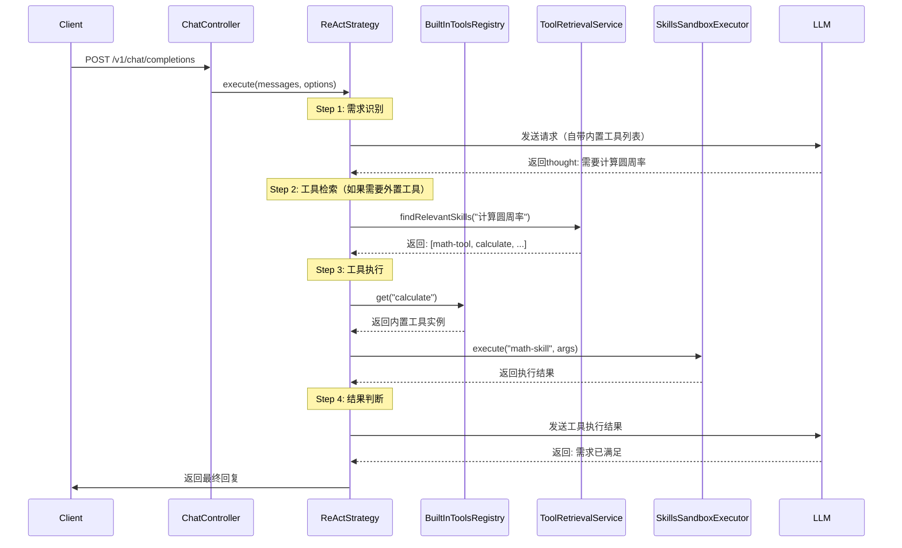

# Change: 重构工具系统 - 内置工具与Skills外置工具融合架构

## Why

当前ApexBridge的工具系统存在以下核心问题（src/strategies/ReActStrategy.ts:292-311）：
- `registerDefaultTools()` 为空，无内置工具实现
- `executeCustomTool()` 仅有示例代码，无真实执行能力
- 未明确区分内置工具和外置工具（Claude Code Skills）的设计边界
- 工具发现机制缺失，前端需显式传入所有工具定义
- 工具向量化检索能力未实现，无法基于语义相似度动态加载Skills
- 无Skills生命周期管理（安装、卸载、修改、列表）
- 外置工具无沙箱隔离，存在安全隐患

### 直接引用方案核心思想

根据《工具系统重构方案.md》设计理念：
1. **工具类型分层**：内置工具（直接方法调用） vs 外置工具（Skills能力包）
2. **渐进式披露**：系统启动预加载高频内置工具，运行时按需检索外置Skills
3. **向量化对象**：对Skills（名称+描述）进行向量化，而非单个工具函数
4. **生命周期管理**：提供完整的Skills安装、卸载、修改、列表API
5. **沙箱隔离**：外置Skills在独立Node子进程中执行，资源受限

## What Changes

### 核心架构重构

新增**三层工具系统架构**（符合《工具系统重构方案.md》）：

```
┌──────────────────────────────────────────────────┐
│              工具调用层（Strategy）               │
│         ┌─────────────────────────┐              │
│         │  ReActStrategy          │              │
│         │  - 内置工具直接调用      │              │
│         │  - 外置Skills检索加载    │              │
│         └──────────┬──────────────┘              │
└────────────────────┼──────────────────────────────┘
                     │
                     ▼
┌──────────────────────────────────────────────────┐
│              工具管理层（Service）                │
│  ┌──────────────┐  ┌──────────────┐  ┌─────────┐│
│  │BuiltInTools  │  │ToolRetrieval │  │Skill    ││
│  │Registry      │  │Service       │  │Manager  ││
│  │- calculate   │  │- 向量检索     │  │- 安装   ││
│  │- datetime    │  │- 语义匹配     │  │- 卸载   ││
│  └──────────────┘  └──────────────┘  └─────────┘│
└──────────────────────────────────────────────────┘
                     │
                     ▼
┌──────────────────────────────────────────────────┐
│              工具执行层（Executor）               │
│  ┌─────────────────────────────────────────────┐ │
│  │ BuiltInExecutor  │  SkillsSandboxExecutor   │ │
│  │ - 直接方法调用   │  - Node子进程隔离         │ │
│  │ - 内存内执行     │  - 60秒超时限制           │ │
│  │ - 无额外开销     │  - 10MB输出限制           │ │
│  └─────────────────────────────────────────────┘ │
└──────────────────────────────────────────────────┘
```

### 新增核心模块

1. **BuiltInToolsRegistry**（内置工具注册表）
   - 直接方法调用（无进程开销）
   - FileRead, FileWrite, VectorSearch, PlatformDetector等高频工具
   - 系统启动时预加载，常驻内存

2. **ToolRetrievalService**（工具检索服务）
   - 向量数据库：对已安装的Skills（名称+描述）进行向量化
   - 渐进式披露：运行时根据用户意图动态检索相关Skills
   - 语义匹配：基于用户查询向量相似度，返回Top-N相关Skills

3. **SkillManager**（Skills生命周期管理）
   - 安装：解压ZIP → 验证结构 → 向量化 → 注册到检索服务
   - 卸载：删除目录 → 从向量库移除 → 清理元数据
   - 修改：仅允许修改SKILL.md描述 → 重新向量化
   - 列表：提供已安装Skills的元数据列表API

4. **SkillsSandboxExecutor**（Skills沙箱执行器）
   - Node.js子进程隔离（child_process.spawn）
   - 资源限制：60秒执行超时，10MB输出限制
   - 安全沙箱：清理环境变量，限制文件系统访问

### 修改关键文件

**新增**（~1200行）：
- `src/services/BuiltInToolsRegistry.ts` - 内置工具注册表
- `src/services/ToolRetrievalService.ts` - Skills向量检索
- `src/services/SkillManager.ts` - Skills生命周期管理
- `src/services/SkillsSandboxExecutor.ts` - 沙箱执行器
- `src/core/tools/builtin/` - 内置工具实现（FileRead, FileWrite等）
- `src/api/controllers/SkillController.ts` - Skills管理API

**修改**（~150行）：
- `src/strategies/ReActStrategy.ts` - 集成内置工具调用和Skills检索加载
- `src/core/stream-orchestrator/ReActEngine.ts` - 扩展支持Skills执行

### 向后兼容性与BREAKING CHANGES

⚠️ **BREAKING CHANGE**: Skills存储路径变更
- **旧路径**: 无统一规范
- **新路径**: `data/skills/{skill-name}/`
- **迁移影响**: 现有Skills需重新安装到标准路径

✅ **API兼容性**: 聊天API接口保持不变
✅ **行为兼容性**: 新增能力为增强，不影响现有功能

## Architecture

### 工具调用完整流程



### Skills生命完整周期

```mermaid
graph TD
    A[用户上传skill.zip] --> B{SkillManager.installSkill()}
    B --> C[验证ZIP结构]
    C --> D{结构是否有效?}
    D -- 否 --> E[返回错误: 无效结构]
    D -- 是 --> F[解压到 data/skills/{name}/]
    F --> G[读取SKILL.md元数据]
    G --> H[ToolRetrievalService.indexSkill()]
    H --> I[生成向量嵌入]
    I --> J[存储到LanceDB]
    J --> K[注册到可用列表]
    K --> L[返回: 安装成功]

    M[用户调用卸载API] --> N{SkillManager.uninstallSkill()}
    N --> O[删除 data/skills/{name}/]
    O --> P[ToolRetrievalService.removeSkill()]
    P --> Q[从LanceDB删除向量]
    Q --> R[返回: 卸载成功]
```

## Impact

### 核心能力提升

| 能力维度 | 现状 | 重构后 | 提升 |
|---------|------|--------|------|
| 工具类型 | 无明确区分 | 内置+外置双层架构 | ✅ 架构清晰 |
| 工具发现 | 前端传入完整列表 | 渐进式检索 | ✅ 智能高效 |
| 工具执行 | 单步骤执行 | 内置直接调用+外置沙箱隔离 | ✅ 安全可控 |
| 生命周期 | 无管理 | 完整的CRUD | ✅ 可维护 |
| 语义检索 | 无 | Skills向量化检索 | ✅ 智能匹配 |

### 技术影响

**新增依赖**（生产环境）：
- `vectordb` - LanceDB向量数据库（嵌入式）
- `@xenova/transformers` - 本地嵌入模型

**存储影响**:
- Skills文件：`data/skills/`（约10-50MB/100个Skills）
- 向量数据：`.data/skills.lance/`（约5MB/100个Skills）
- 已向量化标识：各Skill目录下`.vectorized`文件

**性能影响**:
- 内置工具调用：+0ms（直接方法调用）
- Skills检索：+5-20ms（向量搜索，有缓存）
- Skills执行：+50-200ms（子进程启动+执行）
- 内存占用：+50MB（嵌入模型+缓存）

### 开发影响

**新增文件**（~15个）：
- 服务层：注册表、检索服务、管理器、执行器（4个）
- 内置工具：FileRead, FileWrite, VectorSearch, PlatformDetector（4个）
- API控制器：Skills管理（1个）
- 类型定义：工具类型、Skills类型、执行结果类型（3个）
- 测试文件：单元测试+集成测试（3个）

**修改文件**（~3个）：
- ReActStrategy: ~100行（集成检索和双执行器）
- ReActEngine: ~30行（增强执行日志）
- app.ts: ~20行（注册新路由）

### 业务价值

1. **开发效率**：内置高频工具开箱即用，无需重复实现FileRead/FileWrite等基础能力
2. **生态扩展**：支持Claude Code Skills格式，可复用社区能力包
3. **智能检索**：基于语义的Skills发现，降低前端开发负担
4. **安全可靠**：外置Skills沙箱隔离，保护主进程安全
5. **可维护性**：完整的Skills生命周期管理，便于运维

### 风险与缓解

**风险1: Skills执行性能问题**
- 概率: 中
- 影响: 高
- 缓解: 60秒超时 + 输出限制 + 缓存优化

**风险2: 向量检索准确性**
- 概率: 中
- 影响: 中
- 缓解: 支持手动指定Skills + 检索结果置信度显示

**风险3: 兼容性问题**
- 概率: 低
- 影响: 高
- 缓解: 提供迁移工具 + 详细的升级文档
