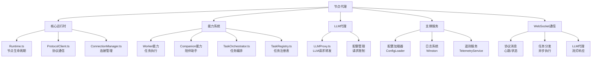

<!-- OPENSPEC:START -->
# OpenSpec Instructions

These instructions are for AI assistants working in this project.

Always open `@/openspec/AGENTS.md` when the request:
- Mentions planning or proposals (words like proposal, spec, change, plan)
- Introduces new capabilities, breaking changes, architecture shifts, or big performance/security work
- Sounds ambiguous and you need the authoritative spec before coding

Use `@/openspec/AGENTS.md` to learn:
- How to create and apply change proposals
- Spec format and conventions
- Project structure and guidelines

Keep this managed block so 'openspec update' can refresh the instructions.

<!-- OPENSPEC:END -->

# ApexBridge 节点代理

> **模块职责**: 分布式节点运行时，支持Worker节点（任务执行）和Companion节点（陪伴助手），提供与主系统的WebSocket通信、任务调度、LLM代理等功能

## 🏗️ 架构概览



## 📁 项目结构

```
packages/node-agent/
├── src/
│   ├── capabilities/       # 能力实现
│   │   ├── index.ts      # 能力导出
│   │   ├── worker.ts     # Worker节点能力
│   │   └── companion.ts  # Companion节点能力
│   ├── config/           # 配置管理
│   │   ├── loader.ts     # 配置加载器
│   │   └── types.ts      # 配置类型定义
│   ├── connection/       # 连接管理
│   │   └── ConnectionManager.ts # WebSocket连接管理
│   ├── llm/              # LLM代理
│   │   └── LLMProxy.ts   # LLM请求代理
│   ├── protocol/         # 协议实现
│   │   ├── ProtocolClient.ts # 协议客户端
│   │   └── types.ts      # 协议类型定义
│   ├── tasks/            # 任务系统
│   │   ├── TaskOrchestrator.ts # 任务编排器
│   │   ├── TaskRegistry.ts # 任务注册表
│   │   └── types.ts      # 任务类型定义
│   ├── telemetry/        # 遥测服务
│   │   └── TelemetryService.ts # 遥测数据收集
│   ├── utils/            # 工具函数
│   │   ├── object.ts     # 对象操作工具
│   │   ├── taskStorage.ts # 任务存储工具
│   │   └── time.ts       # 时间处理工具
│   ├── logger.ts         # 日志系统
│   ├── runtime.ts        # 运行时核心
│   └── index.ts          # 应用入口
├── runtime-data/         # 运行时数据
│   ├── Worker_Todo_Assistant/ # Worker示例数据
│   └── Example_Companion/ # Companion示例数据
├── tests/                # 测试文件
│   ├── integration/      # 集成测试
│   ├── unit/             # 单元测试
│   ├── helpers.ts        # 测试辅助函数
│   └── setup.ts          # 测试环境设置
├── config.example.json   # 配置示例
├── config.worker.todo.json # Worker配置示例
├── config.companion.json # Companion配置示例
├── package.json          # 包配置
├── tsconfig.json         # TypeScript配置
├── tsconfig.tests.json   # 测试TypeScript配置
└── jest.config.ts        # Jest测试配置
```

## 🚀 技术栈

### 核心依赖
- **TypeScript**: 类型安全的JavaScript超集
- **WebSocket**: 实时双向通信
- **Winston**: 日志记录
- **Commander**: 命令行参数解析
- **Zod**: 运行时类型验证
- **EventEmitter3**: 事件处理

### 开发工具
- **Jest**: 测试框架
- **ts-node**: TypeScript执行环境
- **ESLint**: 代码质量检查

## 🔧 节点类型

### Worker节点
- **职责**: 执行后台任务和计算密集型工作
- **特点**:
  - 支持任务队列和并发执行
  - 可以绑定多个任务类型
  - 支持任务结果缓存
  - 具备错误重试机制

### Companion节点
- **职责**: 提供陪伴式交互和轻量级服务
- **特点**:
  - 支持对话式交互
  - 可以绑定特定人格
  - 支持主动性消息推送
  - 轻量级任务处理

## 🌐 通信协议

### WebSocket连接
```typescript
// 连接配置
interface ConnectionConfig {
  url: string;           // WebSocket服务器地址
  protocols?: string[];  // 子协议
  reconnect?: boolean;   // 自动重连
  heartbeat?: boolean;   // 心跳检测
}

// 消息类型
interface ProtocolMessage {
  type: string;          // 消息类型
  payload: any;          // 消息载荷
  timestamp: number;     // 时间戳
  nodeId?: string;       // 节点ID
}
```

### 协议消息类型
- **心跳**: `heartbeat` - 维持连接活跃
- **状态更新**: `status_update` - 报告节点状态
- **任务分配**: `task_assign` - 分配任务给节点
- **任务完成**: `task_complete` - 任务执行完成
- **LLM请求**: `llm_request` - 转发LLM请求
- **LLM响应**: `llm_response` - LLM响应结果

## 🛠️ 核心功能

### 1. 运行时管理
```typescript
// Runtime.ts - 节点生命周期管理
class Runtime {
  async start(): Promise<void>;    // 启动节点
  async stop(): Promise<void>;     // 停止节点
  getStatus(): NodeStatus;           // 获取节点状态
  registerCapability(capability): void; // 注册能力
}
```

### 2. 连接管理
```typescript
// ConnectionManager.ts - WebSocket连接管理
class ConnectionManager {
  async connect(config: ConnectionConfig): Promise<void>;
  disconnect(): void;
  sendMessage(message: ProtocolMessage): void;
  onMessage(callback: (message) => void): void;
  onDisconnect(callback: () => void): void;
}
```

### 3. 任务系统
```typescript
// TaskOrchestrator.ts - 任务编排
class TaskOrchestrator {
  registerTask(task: TaskDefinition): void;
  executeTask(taskId: string, parameters: any): Promise<TaskResult>;
  getTaskStatus(taskId: string): TaskStatus;
  cancelTask(taskId: string): void;
}

// TaskRegistry.ts - 任务注册表
class TaskRegistry {
  addTask(task: TaskDefinition): void;
  removeTask(taskId: string): void;
  getTask(taskId: string): TaskDefinition;
  listTasks(): TaskDefinition[];
}
```

### 4. LLM代理
```typescript
// LLMProxy.ts - LLM请求代理
class LLMProxy {
  async forwardRequest(request: LLMRequest): Promise<LLMResponse>;
  streamRequest(request: LLMRequest): AsyncIterableIterator<string>;
  checkQuota(nodeId: string): boolean;
  updateQuota(nodeId: string, usage: number): void;
}
```

### 5. 配置管理
```typescript
// ConfigLoader.ts - 配置加载器
class ConfigLoader {
  loadConfig(path: string): Promise<NodeConfig>;
  validateConfig(config: NodeConfig): boolean;
  mergeWithDefaults(config: Partial<NodeConfig>): NodeConfig;
}
```

## 🔍 遥测与监控

### 遥测数据收集
```typescript
// TelemetryService.ts - 遥测服务
interface TelemetryData {
  nodeId: string;
  timestamp: number;
  cpuUsage: number;
  memoryUsage: number;
  taskCount: number;
  errorCount: number;
  uptime: number;
}

class TelemetryService {
  collect(): TelemetryData;
  send(data: TelemetryData): Promise<void>;
  startCollection(interval: number): void;
  stopCollection(): void;
}
```

### 日志系统
```typescript
// logger.ts - 日志配置
const logger = winston.createLogger({
  level: process.env.LOG_LEVEL || 'info',
  format: winston.format.combine(
    winston.format.timestamp(),
    winston.format.errors({ stack: true }),
    winston.format.json()
  ),
  transports: [
    new winston.transports.Console(),
    new winston.transports.File({ filename: 'node-agent.log' })
  ]
});
```

## 🚀 开发指南

### 开发环境
```bash
# 进入节点代理目录
cd packages/node-agent

# 安装依赖
npm install

# 开发模式（带热重载）
npm run dev

# 构建项目
npm run build

# 运行测试
npm test

# 类型检查
npm run typecheck

# 代码检查
npm run lint
```

### 创建新的能力
```typescript
// 1. 创建能力文件
// src/capabilities/newCapability.ts
import { Capability } from './types';

export const newCapability: Capability = {
  name: 'new-capability',
  type: 'worker', // 或 'companion'

  async initialize(runtime) {
    // 初始化逻辑
  },

  async execute(task, parameters) {
    // 任务执行逻辑
    return {
      success: true,
      data: { result: 'task completed' }
    };
  },

  async cleanup() {
    // 清理逻辑
  }
};

// 2. 注册能力
// src/capabilities/index.ts
export { newCapability } from './newCapability';

// 3. 在配置文件中使用
{
  "nodeType": "worker",
  "capabilities": ["new-capability"]
}
```

### 配置示例

#### Worker节点配置
```json
{
  "nodeId": "worker-001",
  "nodeType": "worker",
  "displayName": "任务工作节点",
  "description": "执行后台任务的工作节点",
  "server": {
    "url": "ws://localhost:8088/abp-distributed-server",
    "reconnect": true,
    "heartbeat": true
  },
  "capabilities": {
    "worker": {
      "maxConcurrentTasks": 5,
      "taskTimeout": 300000,
      "supportedTaskTypes": ["data-processing", "file-conversion"]
    }
  },
  "llm": {
    "proxyEnabled": true,
    "quota": {
      "dailyLimit": 1000,
      "requestTimeout": 60000
    }
  },
  "logging": {
    "level": "info",
    "file": "worker-001.log"
  }
}
```

#### Companion节点配置
```json
{
  "nodeId": "companion-001",
  "nodeType": "companion",
  "displayName": "智能陪伴助手",
  "description": "提供陪伴式交互的助手节点",
  "server": {
    "url": "ws://localhost:8088/abp-distributed-server",
    "reconnect": true,
    "heartbeat": true
  },
  "capabilities": {
    "companion": {
      "personalityId": "warm-partner",
      "proactiveMessaging": true,
      "conversationContext": true
    }
  },
  "llm": {
    "proxyEnabled": true,
    "quota": {
      "dailyLimit": 500,
      "requestTimeout": 30000
    }
  },
  "logging": {
    "level": "info",
    "file": "companion-001.log"
  }
}
```

## 🧪 测试策略

### 单元测试
```typescript
// tests/unit/TaskOrchestrator.test.ts
describe('TaskOrchestrator', () => {
  let orchestrator: TaskOrchestrator;

  beforeEach(() => {
    orchestrator = new TaskOrchestrator();
  });

  test('should register and execute task', async () => {
    const mockTask = {
      id: 'test-task',
      execute: jest.fn().mockResolvedValue({ success: true })
    };

    orchestrator.registerTask(mockTask);
    const result = await orchestrator.executeTask('test-task', {});

    expect(mockTask.execute).toHaveBeenCalled();
    expect(result.success).toBe(true);
  });
});
```

### 集成测试
```typescript
// tests/integration/hub-worker.integration.test.ts
describe('Hub-Worker Integration', () => {
  let hubRuntime: Runtime;
  let workerRuntime: Runtime;

  beforeAll(async () => {
    // 启动Hub和Worker节点
    hubRuntime = new Runtime(hubConfig);
    workerRuntime = new Runtime(workerConfig);

    await hubRuntime.start();
    await workerRuntime.start();
  });

  afterAll(async () => {
    await hubRuntime.stop();
    await workerRuntime.stop();
  });

  test('should assign and complete task', async () => {
    const task = {
      id: 'integration-test-task',
      type: 'test',
      parameters: { data: 'test' }
    };

    // Hub分配任务
    await hubRuntime.assignTask(task);

    // 等待Worker完成
    await waitFor(() => {
      const result = hubRuntime.getTaskResult(task.id);
      expect(result.status).toBe('completed');
    });
  });
});
```

## 🔒 安全考虑

### 认证与授权
- **节点认证**: 使用节点Key进行身份验证
- **权限控制**: 基于节点类型的权限控制
- **API安全**: LLM代理请求的配额限制

### 数据安全
- **配置加密**: 敏感配置信息加密存储
- **传输安全**: WebSocket连接支持WSS协议
- **日志脱敏**: 日志中不包含敏感信息

### 运行时安全
- **任务隔离**: 任务执行环境隔离
- **资源限制**: CPU、内存使用限制
- **超时控制**: 任务执行超时保护

## 📊 性能优化

### 连接优化
- **连接池**: WebSocket连接复用
- **心跳机制**: 保持连接活跃
- **重连策略**: 指数退避重连

### 任务优化
- **并发控制**: 限制并发任务数量
- **结果缓存**: 任务结果缓存机制
- **错误重试**: 失败任务自动重试

### 资源优化
- **内存管理**: 及时清理无用对象
- **CPU使用**: 合理的轮询间隔
- **网络带宽**: 消息压缩和批处理

## 📊 变更记录 (Changelog)

### 2025-11-16 - 节点代理模块分析
- ✅ 完成节点代理架构分析
- ✅ 识别节点类型：Worker和Companion
- ✅ 分析核心功能：运行时管理、连接管理、任务系统、LLM代理
- ✅ 建立模块文档结构和开发指南
- ✅ 识别技术栈和通信协议

### 扫描覆盖率
- **总文件数**: 约25个文件
- **已扫描**: 12个核心文件
- **主要功能**: 6个核心功能模块
- **下一步**: 详细分析运行时和任务系统实现

## 🎯 下一步建议

### 高优先级任务
1. **运行时深度分析** - 详细分析Runtime.ts的实现细节
2. **任务系统分析** - 研究TaskOrchestrator和TaskRegistry实现
3. **LLM代理分析** - 分析LLMProxy的转发机制和配额管理

### 中等优先级任务
4. **连接管理分析** - 研究ConnectionManager的WebSocket管理
5. **能力系统分析** - 分析Worker和Companion能力的实现差异
6. **遥测服务分析** - 研究TelemetryService的数据收集机制

### 建议扫描重点
- `packages/node-agent/src/runtime.ts` - 运行时核心
- `packages/node-agent/src/tasks/TaskOrchestrator.ts` - 任务编排
- `packages/node-agent/src/llm/LLMProxy.ts` - LLM代理
- `packages/node-agent/src/connection/ConnectionManager.ts` - 连接管理
- `packages/node-agent/src/capabilities/` - 能力实现
- `packages/node-agent/src/telemetry/TelemetryService.ts` - 遥测服务

**预计深度分析时间**: 2-3个工作日
**推荐续扫目录**:
- `apex-bridge/packages/node-agent/src/` - 核心实现
- `apex-bridge/packages/node-agent/src/capabilities/` - 能力系统
- `apex-bridge/packages/node-agent/src/protocol/` - 协议实现
- `apex-bridge/packages/node-agent/src/tasks/` - 任务系统
- `apex-bridge/packages/node-agent/tests/` - 测试实现