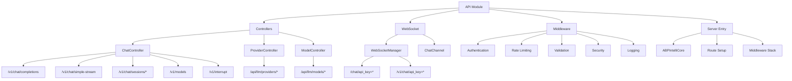

[根目录](../../CLAUDE.md) > [src](../) > **api**

# API 模块 - 接口与控制器层

## 🎯 模块职责

API模块是ApexBridge的接口层，负责处理HTTP RESTful API、WebSocket实时通信、中间件管理和安全控制。提供OpenAI兼容的聊天API、LLM配置管理和实时双向通信功能。

## 🏗️ 架构设计



## 📋 核心组件

### ChatController (`controllers/ChatController.ts`)

- **职责**: OpenAI兼容的聊天API控制器
- **关键端点**:
  - `POST /v1/chat/completions` - 标准聊天完成
  - `POST /v1/chat/simple-stream` - 简化流式聊天
  - `GET /v1/chat/sessions/active` - 活动会话列表
  - `GET /v1/chat/sessions/{id}` - 获取会话详情
  - `GET /v1/chat/sessions/{id}/history` - 会话历史
  - `GET /v1/chat/sessions/{id}/messages` - 对话消息
  - `DELETE /v1/chat/sessions/{id}` - 删除会话
  - `GET /v1/models` - 模型列表
  - `POST /v1/interrupt` - 中断请求
- **特性**: 支持selfThinking配置、会话管理、流式输出

### ProviderController (`controllers/ProviderController.ts`)

- **职责**: LLM提供商管理
- **关键端点**:
  - `GET /api/llm/providers` - 列出提供商
  - `GET /api/llm/providers/{id}` - 获取提供商详情
  - `POST /api/llm/providers` - 创建提供商
  - `PUT /api/llm/providers/{id}` - 更新提供商
  - `DELETE /api/llm/providers/{id}` - 删除提供商

### ModelController (`controllers/ModelController.ts`)

- **职责**: LLM模型管理
- **关键端点**:
  - `GET /api/llm/providers/{providerId}/models` - 提供商的模型列表
  - `GET /api/llm/providers/{providerId}/models/{modelId}` - 模型详情
  - `POST /api/llm/providers/{providerId}/models` - 创建模型
  - `PUT /api/llm/providers/{providerId}/models/{modelId}` - 更新模型
  - `DELETE /api/llm/providers/{providerId}/models/{modelId}` - 删除模型
  - `GET /api/llm/models` - 跨提供商模型查询
  - `GET /api/llm/models/default` - 获取默认模型

### WebSocketManager (`websocket/WebSocketManager.ts`)

- **职责**: WebSocket连接管理和消息路由
- **关键功能**:
  - 连接认证和授权
  - 心跳检测和连接保活
  - 频道管理和消息路由
  - 安全日志和监控
- **端点格式**: `/chat/api_key={apiKey}` 或 `/v1/chat/api_key={apiKey}`

### ChatChannel (`websocket/channels/ChatChannel.ts`)

- **职责**: 聊天频道的具体实现
- **关键功能**:
  - 聊天消息处理
  - 流式响应推送
  - 错误处理和通知
  - 连接状态管理

## 🛡️ 中间件体系

### 认证中间件 (`middleware/authMiddleware.ts`)

- **职责**: API Key认证
- **功能**: 提取和验证API Key，用户身份识别

### 限流中间件 (`middleware/rateLimitMiddleware.ts`)

- **职责**: 请求速率限制
- **功能**: IP和API Key双重限流策略，支持内存和Redis后端

### 验证中间件 (`middleware/validationMiddleware.ts`)

- **职责**: 请求参数验证
- **功能**: JSON Schema验证，自定义验证器支持

### 清理中间件 (`middleware/sanitizationMiddleware.ts`)

- **职责**: 输入数据清理
- **功能**: 危险字符过滤，防止XSS和注入攻击

### 安全中间件 (`middleware/securityHeadersMiddleware.ts`)

- **职责**: 安全头部设置
- **功能**: Helmet.js集成，CSP、HSTS等安全头部

### 安全日志中间件 (`middleware/securityLoggerMiddleware.ts`)

- **职责**: 安全事件记录
- **功能**: 安全相关事件的日志记录和监控

### 审计日志中间件 (`middleware/auditLoggerMiddleware.ts`)

- **职责**: 关键操作审计
- **功能**: 用户操作、配置变更等审计记录

### 错误处理中间件 (`middleware/errorHandler.ts`)

- **职责**: 全局错误处理
- **功能**: 错误统一处理、日志记录、客户端响应

## 🚀 服务器初始化

### ABPIntelliCore (`server.ts`)

- **职责**: 主服务器类
- **初始化流程**:
  1. 基础服务初始化（PathService、ConfigService）
  2. 数据库初始化（LLMConfigService）
  3. 核心引擎初始化（ProtocolEngine、LLMManager）
  4. 业务服务初始化（ChatService）
  5. WebSocket初始化（WebSocketManager、ChatChannel）
  6. 中间件栈设置
  7. 路由配置
  8. HTTP服务器启动
  9. 优雅关闭处理

### 中间件栈顺序

```
1. 安全头部 (Helmet)
2. CORS配置
3. Body解析 (JSON/urlencoded)
4. 限流保护
5. 输入清理
6. 安全日志
7. 审计日志
8. 认证检查
9. 路由处理
10. 错误处理
```

## 🔧 关键依赖

### 外部依赖

- `express`: Web框架
- `ws`: WebSocket库
- `helmet`: 安全头部中间件
- `cors`: CORS处理
- `ajv`: JSON Schema验证

### 内部依赖

- `../services/`: 业务服务层
- `../core/`: 核心引擎
- `../types/`: 类型定义
- `../utils/`: 工具函数

## 🧪 测试要点

### API测试重点

- OpenAI兼容端点的正确性
- 会话管理API的完整性
- 流式输出的稳定性
- 中断功能的可靠性

### WebSocket测试重点

- 连接建立和认证
- 消息传输的实时性
- 心跳检测和重连
- 错误处理和通知

### 中间件测试重点

- 认证和授权逻辑
- 限流策略的准确性
- 输入验证的完整性
- 安全日志的记录

## 📊 安全考虑

### 认证安全

- API Key的安全传输和存储
- 连接认证的状态管理
- 敏感信息的脱敏日志

### 数据安全

- 输入数据的清理和验证
- SQL注入防护
- XSS攻击防护

### 访问控制

- 基于API Key的权限控制
- 限流和DDoS防护
- CORS配置的安全性

## 🔗 相关文件

### 控制器文件

- `/src/api/controllers/ChatController.ts` - 聊天控制器
- `/src/api/controllers/ProviderController.ts` - 提供商控制器
- `/src/api/controllers/ModelController.ts` - 模型控制器

### WebSocket文件

- `/src/api/websocket/WebSocketManager.ts` - WebSocket管理器
- `/src/api/websocket/channels/ChatChannel.ts` - 聊天频道

### 中间件文件

- `/src/api/middleware/authMiddleware.ts` - 认证中间件
- `/src/api/middleware/rateLimitMiddleware.ts` - 限流中间件
- `/src/api/middleware/validationMiddleware.ts` - 验证中间件
- `/src/api/middleware/sanitizationMiddleware.ts` - 清理中间件
- `/src/api/middleware/securityHeadersMiddleware.ts` - 安全头部
- `/src/api/middleware/securityLoggerMiddleware.ts` - 安全日志
- `/src/api/middleware/auditLoggerMiddleware.ts` - 审计日志
- `/src/api/middleware/errorHandler.ts` - 错误处理

### 服务器入口

- `/src/server.ts` - 主服务器类

### 验证和配置

- `/src/api/middleware/validationSchemas.ts` - 验证模式
- `/src/api/middleware/customValidators.ts` - 自定义验证器
- `/src/api/middleware/rateLimit/` - 限流实现

## 📈 最近更新

### 2025-11-30

- ✅ **会话管理增强**: 新增活动会话列表和历史记录API
- ✅ **简化流式接口**: 专为前端优化的`/v1/chat/simple-stream`
- ✅ **中断功能**: 完善请求中断API

### 2025-11-19

- ✅ **中间件优化**: 简化验证和安全中间件，减少代码量
- ✅ **错误处理**: 统一错误处理和响应格式
- ✅ **性能优化**: 优化WebSocket连接管理

### 2025-11-16

- ✅ **基础架构**: 建立完整的API层架构
- ✅ **OpenAI兼容**: 实现标准聊天完成API
- ✅ **WebSocket支持**: 添加实时通信能力

## 🎯 API使用示例

### 标准聊天完成

```bash
POST /v1/chat/completions
Content-Type: application/json
Authorization: Bearer your-api-key

{
  "model": "gpt-3.5-turbo",
  "messages": [
    {"role": "user", "content": "Hello!"}
  ],
  "stream": false
}
```

### 启用ReAct模式

```bash
POST /v1/chat/completions
Content-Type: application/json

{
  "messages": [{"role": "user", "content": "Search for information"}],
  "selfThinking": {
    "enabled": true,
    // maxIterations未设置，使用默认值（50次）
    "tools": [{"name": "search", "description": "Search knowledge base"}]
  }
}
```

### WebSocket连接

```javascript
const ws = new WebSocket("ws://localhost:8088/chat/api_key=your-api-key");

ws.onmessage = (event) => {
  const data = JSON.parse(event.data);
  console.log("Received:", data);
};

ws.send(
  JSON.stringify({
    type: "chat",
    messages: [{ role: "user", content: "Hello" }],
  })
);
```

## 🎯 下一步计划

1. **API扩展**: 支持更多OpenAI兼容端点
2. **GraphQL支持**: 考虑添加GraphQL API
3. **API文档**: 生成OpenAPI/Swagger文档
4. **性能监控**: 添加API性能指标
5. **安全增强**: 实现更完善的认证机制

---

**模块路径**: `/src/api/`
**更新时间**: 2025-11-30 18:21:54
**状态**: 功能完整，支持RESTful API和WebSocket

**核心成就**:

- ✅ OpenAI兼容的聊天API
- ✅ 完整的LLM配置管理API
- ✅ 实时WebSocket通信
- ✅ 15+安全中间件
- ✅ 会话管理和历史记录
- ✅ 请求中断功能
- ✅ 流式输出支持

**架构特点**:

- RESTful设计原则
- 多层安全中间件
- WebSocket实时通信
- 完整的错误处理
- 优雅的服务启动和关闭
- 全面的日志和监控
