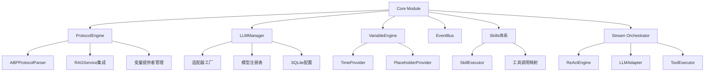

[根目录](../../CLAUDE.md) > [src](../) > **core**

# Core 模块 - 核心引擎

## 🎯 模块职责

Core模块是ApexBridge的核心引擎层，负责处理ABP协议、LLM管理、变量解析和Skills体系。采用独立实现，不依赖外部SDK，专注于轻量级、高性能的聊天核心功能。

## 🏗️ 架构设计

## 📋 核心组件

### ProtocolEngine (`ProtocolEngine.ts`)

- **职责**: ABP协议解析、变量引擎管理、RAG服务集成
- **关键功能**:
  - 统一的ABP协议解析（不依赖外部SDK）
  - 变量引擎初始化和管理
  - RAG向量检索服务集成
  - 插件计数和管理
- **配置**: 支持ABP协议配置、RAG配置、调试模式

### LLMManager (`LLMManager.ts`)

- **职责**: 多LLM提供商统一管理
- **关键功能**:
  - 适配器模式支持多提供商（OpenAI、DeepSeek、智谱、Ollama、Claude）
  - SQLite数据库加载配置，支持运行时热更新
  - 智能重试机制和错误处理
  - 流式聊天支持
- **架构**: 两级配置结构（提供商 + 模型）

### VariableEngine (`variable/VariableEngine.ts`)

- **职责**: 动态变量解析
- **关键功能**:
  - 时间变量解析（TimeProvider）
  - 占位符变量解析（PlaceholderProvider）
  - 支持缓存机制（可配置TTL）
  - 可扩展的提供者架构

### EventBus (`EventBus.ts`)

- **职责**: 事件总线管理
- **关键功能**:
  - 单例模式实现
  - 支持事件订阅和发布
  - 服务间解耦通信

### Skills体系 (`skills/SkillExecutor.ts`)

- **职责**: 轻量级技能执行
- **关键功能**:
  - Direct/Internal双模式执行
  - 技能注册和查找
  - 统一的执行接口
  - 错误处理和结果封装

### Stream Orchestrator (`stream-orchestrator/`)

- **职责**: 流式处理编排
- **关键组件**:
  - **ReActEngine**: 多轮思考和工具调用引擎
  - **LLMAdapter**: LLM适配器接口
  - **ToolExecutor**: 工具并发执行管理

## 🚀 入口点与初始化

### 主要入口文件

- `ProtocolEngine.ts`: 核心引擎入口
- `LLMManager.ts`: LLM管理器入口
- `variable/index.ts`: 变量引擎入口
- `skills/SkillExecutor.ts`: 技能执行器入口

### 初始化流程

1. **ProtocolEngine初始化**:
   - 创建ABPProtocolParser实例
   - 初始化VariableEngine
   - 可选初始化RAG服务
   - 注册变量提供者

2. **LLMManager初始化**:
   - 从SQLite加载提供商配置
   - 创建适配器实例
   - 注册到内部映射表

## 🔧 关键依赖

### 外部依赖

- `abp-rag-sdk`: RAG向量检索服务
- `better-sqlite3`: SQLite数据库支持
- `p-limit`: 并发控制
- `winston`: 日志记录

### 内部依赖

- `types/`: 类型定义
- `utils/`: 工具函数（logger、errors等）
- `config/`: 配置管理

## 🧪 测试要点

### 单元测试重点

- ABP协议解析的正确性
- 变量解析的准确性
- LLM适配器的兼容性
- Skills执行的错误处理
- ReActEngine的迭代逻辑

### 集成测试重点

- 多LLM提供商切换
- RAG服务集成流程
- 变量引擎缓存机制
- Skills与ProtocolEngine集成

## 📊 性能考虑

### 内存管理

- ProtocolEngine支持优雅关闭和资源清理
- VariableEngine支持缓存重置
- RAG服务内存使用监控

### 并发处理

- LLMManager支持并发请求管理
- ToolExecutor支持并发工具执行
- EventBus支持异步事件处理

## 🔗 相关文件

### 核心文件

- `/src/core/ProtocolEngine.ts` - 协议引擎主实现
- `/src/core/LLMManager.ts` - LLM管理器
- `/src/core/variable/VariableEngine.ts` - 变量引擎
- `/src/core/EventBus.ts` - 事件总线
- `/src/core/skills/SkillExecutor.ts` - 技能执行器

### 配置文件

- `/src/types/abp.ts` - ABP协议类型定义
- `/src/types/llm-models.ts` - LLM模型类型定义
- `/src/types/variable.ts` - 变量相关类型定义
- `/src/config/endpoint-mappings.ts` - 端点映射配置

### 适配器实现

- `/src/core/llm/adapters/` - 各LLM提供商适配器
- `/src/core/stream-orchestrator/` - 流式处理组件

## 📈 最近更新

### 2025-11-30

- ✅ 完成ReActEngine流式处理优化
- ✅ 新增LLMManagerAdapter适配器
- ✅ 优化SkillExecutor错误处理

### 2025-11-19

- ✅ 架构简化，移除过度设计组件
- ✅ 优化ProtocolEngine初始化流程
- ✅ 增强RAG服务错误处理

## 🎯 下一步计划

1. **性能优化**: 进一步优化ReActEngine的内存使用
2. **测试覆盖**: 增加核心引擎的单元测试
3. **文档完善**: 补充各组件的详细使用文档
4. **Skills扩展**: 实现更多内置技能

---

**模块路径**: `/src/core/`
**更新时间**: 2025-11-30 18:21:54
**状态**: 活跃开发中
