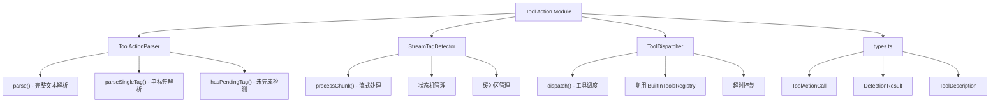

[根目录](../../../CLAUDE.md) > [src](../../) > [core](../) > **tool-action**

# Tool Action 模块 - 工具调用标签解析

## 🎯 模块职责

Tool Action 模块负责解析 LLM 输出中的 `<tool_action>` 标签格式工具调用，支持流式检测和工具调度。这是对现有 OpenAI 风格 `tool_calls` 的补充方案，让任何能输出结构化文本的 LLM 都能具备工具调用能力。

## 🏗️ 架构设计



## 📋 标签格式

### 工具调用标签
```xml
<tool_action name="工具名称">
  <参数名1 value="参数值1" />
  <参数名2 value="参数值2" />
</tool_action>
```

### 格式说明
| 元素 | 说明 | 必需 |
|------|------|------|
| `tool_action` | 工具调用标签 | 是 |
| `name` 属性 | 工具名称标识符 | 是 |
| 子标签 | 参数名作为标签名，`value` 属性为参数值 | 否 |

### 示例
```xml
<!-- 向量搜索 -->
<tool_action name="vector-search">
  <query value="读取文件" />
  <limit value="5" />
  <threshold value="0.6" />
</tool_action>

<!-- 读取文件 -->
<tool_action name="file-read">
  <path value="path/xxx.txt" />
  <startLine value="1" />
  <endLine value="100" />
</tool_action>
```

## 📦 核心组件

### ToolActionParser (`ToolActionParser.ts`)
- **职责**: 解析完整文本中的 tool_action 标签
- **关键方法**:
  - `parse(text)`: 解析文本，返回工具调用列表和文本段
  - `parseSingleTag(tagText)`: 解析单个标签
  - `hasPendingTag(text)`: 检测未完成的标签
- **特点**: 正则匹配，支持自闭合和标准闭合两种参数格式

### StreamTagDetector (`StreamTagDetector.ts`)
- **职责**: 流式输出中实时检测 tool_action 标签
- **状态机**: NORMAL → TAG_OPENING → TAG_CONTENT → TAG_CLOSING
- **关键方法**:
  - `processChunk(chunk)`: 处理流式输入块
  - `reset()`: 重置检测器状态
  - `flush()`: 强制刷新缓冲区
- **特点**: 支持跨 chunk 的标签检测，零阻塞

### ToolDispatcher (`ToolDispatcher.ts`)
- **职责**: 统一路由 tool_action 调用到正确的执行器
- **关键方法**:
  - `dispatch(toolCall)`: 执行工具调用
  - `hasTool(name)`: 检查工具是否存在
  - `getAvailableTools()`: 获取可用工具列表
- **特点**: 复用 BuiltInToolsRegistry，支持超时控制

### generateToolPrompt (`ToolDispatcher.ts`)
- **职责**: 生成工具描述文本供系统提示词使用
- **功能**: 包含工具列表、参数说明、使用示例

## 🚀 使用方式

### 在 ReActEngine 中使用

```typescript
import { ReActEngine } from '../stream-orchestrator/ReActEngine';

const engine = new ReActEngine({
  enableToolActionParsing: true,  // 启用标签解析（默认true）
  toolActionTimeout: 30000,       // 工具超时时间（默认30秒）
  maxIterations: 5
});
```

### 在 ReActStrategy 中配置

```typescript
const options = {
  selfThinking: {
    enabled: true,
    enableToolActionParsing: true,   // 启用 tool_action 标签解析
    toolActionTimeout: 30000         // 工具执行超时时间
  }
};
```

### 直接使用解析器

```typescript
import { ToolActionParser, StreamTagDetector } from '../core/tool-action';

// 完整文本解析
const parser = new ToolActionParser();
const result = parser.parse(text);

// 流式检测
const detector = new StreamTagDetector();
for (const chunk of streamChunks) {
  const detection = detector.processChunk(chunk);
  if (detection.complete) {
    // 处理工具调用
    console.log(detection.toolAction);
  }
  // 输出安全文本
  console.log(detection.textToEmit);
}
```

## 🔄 与现有系统集成

### 与原生 tool_calls 的关系
- **并行支持**: tool_action 标签和原生 tool_calls 同时支持
- **优先级**: 原生 tool_calls 优先，避免冲突
- **互斥处理**: 检测到原生 tool_calls 时，跳过标签解析

### 数据流
```
LLM Output
    ↓
StreamTagDetector.processChunk()
    ↓
┌─────────────────────────┐
│ 无标签 → 直接输出        │
│ 标签开始 → 缓冲          │
│ 标签完整 → 解析执行      │
└─────────────────────────┘
    ↓
ToolDispatcher.dispatch()
    ↓
BuiltInToolsRegistry.execute()
    ↓
工具结果注入对话历史
    ↓
继续 ReAct 循环
```

## 🧪 测试

### 运行测试
```bash
npm test -- --testPathPattern="tool-action"
```

### 测试覆盖
- ToolActionParser: 标签解析、参数提取、未完成检测
- StreamTagDetector: 流式检测、跨 chunk 处理、状态管理
- ToolDispatcher: 工具调度、错误处理、提示词生成

## 📊 配置选项

| 选项 | 类型 | 默认值 | 说明 |
|------|------|--------|------|
| `enableToolActionParsing` | boolean | true | 是否启用标签解析 |
| `toolActionTimeout` | number | 30000 | 工具执行超时(ms) |
| `maxConcurrency` | number | 3 | 最大并发执行数 |

## 🔗 相关文件

### 模块文件
- `/src/core/tool-action/types.ts` - 类型定义
- `/src/core/tool-action/ToolActionParser.ts` - 标签解析器
- `/src/core/tool-action/StreamTagDetector.ts` - 流式检测器
- `/src/core/tool-action/ToolDispatcher.ts` - 工具调度器
- `/src/core/tool-action/index.ts` - 模块导出

### 集成文件
- `/src/core/stream-orchestrator/ReActEngine.ts` - ReAct 引擎
- `/src/strategies/ReActStrategy.ts` - ReAct 策略
- `/src/types/index.ts` - ChatOptions 类型

### 测试文件
- `/tests/unit/tool-action/ToolActionParser.test.ts`
- `/tests/unit/tool-action/StreamTagDetector.test.ts`
- `/tests/unit/tool-action/ToolDispatcher.test.ts`

## 📈 更新记录

### 2025-12-07 - 初始实现
- ✅ 实现 ToolActionParser 标签解析器
- ✅ 实现 StreamTagDetector 流式检测器
- ✅ 实现 ToolDispatcher 工具调度器
- ✅ 集成到 ReActEngine 和 ReActStrategy
- ✅ 添加配置选项到 ChatOptions
- ✅ 编写完整单元测试

---

**模块路径**: `/src/core/tool-action/`
**创建时间**: 2025-12-07
**状态**: 实现完成
