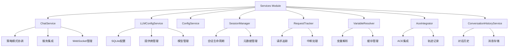

[根目录](../../CLAUDE.md) > [src](../) > **services**

# Services 模块 - 业务服务层

## 🎯 模块职责

Services模块是ApexBridge的业务逻辑层，负责处理聊天服务、配置管理、LLM配置、会话管理等核心业务功能。采用策略模式重构后，ChatService被拆分为6个高内聚的独立服务。

## 🏗️ 架构设计



## 📋 核心服务

### ChatService (`ChatService.ts`)

- **职责**: 聊天服务主协调器，应用策略模式
- **关键功能**:
  - 策略选择和执行（ReAct/SingleRound）
  - 会话管理和请求追踪集成
  - WebSocket管理器集成
  - 变量解析和ACE集成协调
- **重构亮点**: 从1406行上帝类拆分为协调器，职责清晰

### LLMConfigService (`LLMConfigService.ts`)

- **职责**: LLM配置管理（提供商+模型两级结构）
- **关键功能**:
  - SQLite数据库存储配置
  - 提供商生命周期管理
  - 模型配置和默认设置
  - 运行时热更新支持
- **架构**: 单例模式，支持WAL模式提升性能

### ConfigService (`ConfigService.ts`)

- **职责**: 系统配置管理
- **关键功能**:
  - 配置文件读取和验证
  - 环境变量处理
  - 配置缓存和更新
  - 设置完成状态检测

### SessionManager (`SessionManager.ts`)

- **职责**: 会话生命周期管理
- **关键功能**:
  - 会话创建和查找
  - 元数据更新和维护
  - 会话活动追踪
  - 与ACE服务集成

### RequestTracker (`RequestTracker.ts`)

- **职责**: 活动请求追踪和中断处理
- **关键功能**:
  - 请求注册和管理
  - 中断信号处理
  - 超时管理（默认5分钟）
  - WebSocket集成支持

### VariableResolver (`VariableResolver.ts`)

- **职责**: 动态变量解析服务
- **关键功能**:
  - 消息变量替换
  - 缓存管理（30秒TTL）
  - ProtocolEngine集成
  - 性能优化

### AceIntegrator (`AceIntegrator.ts`)

- **职责**: ACE引擎集成服务
- **关键功能**:
  - 轨迹记录和保存
  - 会话活动更新
  - ACE服务状态检测
  - 错误处理和降级

### ConversationHistoryService (`ConversationHistoryService.ts`)

- **职责**: 对话历史管理
- **关键功能**:
  - 消息历史存储
  - 对话记录查询
  - 历史数据清理
  - 与聊天服务集成

## 🚀 服务初始化流程

### 初始化顺序

1. **PathService**: 确保目录结构
2. **ConfigService**: 加载系统配置
3. **LLMConfigService**: 初始化SQLite数据库
4. **AceService**: 初始化ACE引擎
5. **ConversationHistoryService**: 初始化历史服务
6. **ChatService**: 协调各服务，初始化策略

### 依赖关系

```
ChatService
├── ProtocolEngine (外部)
├── LLMManager (外部)
├── SessionManager
│   ├── AceService
│   └── ConversationHistoryService
├── RequestTracker
├── VariableResolver
│   └── ProtocolEngine
└── AceIntegrator
    └── AceService
```

## 🔧 关键依赖

### 外部依赖

- `better-sqlite3`: SQLite数据库支持
- `winston`: 日志记录
- `abp-rag-sdk`: RAG服务集成

### 内部依赖

- `core/`: 核心引擎
- `types/`: 类型定义
- `utils/`: 工具函数
- `api/websocket/`: WebSocket管理

## 🧪 测试要点

### 单元测试重点

- ChatService的策略选择和协调逻辑
- LLMConfigService的数据库操作
- SessionManager的会话生命周期
- RequestTracker的中断处理
- VariableResolver的缓存机制

### 集成测试重点

- 服务间的协调和通信
- 数据库事务和一致性
- WebSocket集成的正确性
- ACE集成的完整性

## 📊 性能考虑

### 数据库优化

- LLMConfigService使用WAL模式
- 适当的索引设计
- 连接池管理

### 缓存策略

- VariableResolver的30秒缓存
- 配置缓存机制
- 会话状态缓存

### 并发处理

- RequestTracker的并发请求管理
- SessionManager的并发会话处理
- 数据库操作的并发安全

## 🔗 相关文件

### 核心服务文件

- `/src/services/ChatService.ts` - 聊天服务主实现
- `/src/services/LLMConfigService.ts` - LLM配置服务
- `/src/services/ConfigService.ts` - 系统配置服务
- `/src/services/SessionManager.ts` - 会话管理器
- `/src/services/RequestTracker.ts` - 请求追踪器
- `/src/services/VariableResolver.ts` - 变量解析器
- `/src/services/AceIntegrator.ts` - ACE集成器
- `/src/services/ConversationHistoryService.ts` - 对话历史服务

### 支持文件

- `/src/services/PathService.ts` - 路径管理
- `/src/services/RedisService.ts` - Redis缓存
- `/src/services/ModelRegistry.ts` - 模型注册表
- `/src/services/AceService.ts` - ACE引擎服务

### 类型定义

- `/src/types/llm-models.ts` - LLM模型类型
- `/src/types/config.ts` - 配置类型
- `/src/types/index.ts` - 通用类型

## 📈 最近更新 - 策略重构（2025-11-30）

### ✅ ChatService策略重构完成

- **上帝类拆分**: 1406行→~200行协调器
- **新增服务**: 5个独立的高内聚服务
- **策略模式**: 支持ReAct和单轮两种策略
- **职责清晰**: 每个服务专注单一职责

### 服务拆分详情

1. **ChatService**: 主协调器（~200行）
2. **SessionManager**: 会话生命周期管理
3. **RequestTracker**: 请求追踪和中断（5分钟超时）
4. **VariableResolver**: 变量解析（30秒缓存）
5. **AceIntegrator**: ACE轨迹集成
6. **ConversationHistoryService**: 对话历史管理

### ✅ 架构优化

- **高内聚低耦合**: 服务间通过接口协作
- **类型安全**: 完整的TypeScript支持
- **测试友好**: 便于单独测试每个服务
- **扩展性强**: 易于添加新服务和策略

## 🎯 下一步计划

1. **测试覆盖**: 为每个新服务编写单元测试
2. **性能监控**: 添加服务性能指标
3. **文档完善**: 补充各服务的详细使用文档
4. **策略扩展**: 支持更多聊天策略

---

**模块路径**: `/src/services/`
**更新时间**: 2025-11-30 18:21:54
**状态**: 策略重构完成，服务职责清晰分离

**变更记录**:

- 2025-11-30: ✅ ChatService策略重构完成，拆分出5个独立服务
- 2025-11-19: ✅ 架构简化，移除过度设计的服务
- 2025-11-16: ✅ 项目初始化，识别核心业务服务
