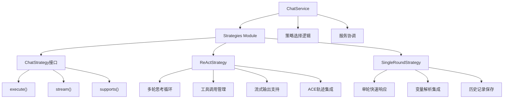

[根目录](../../CLAUDE.md) > [src](../) > **strategies**

# Strategies 模块 - 聊天策略层

## 🎯 模块职责

Strategies模块是ApexBridge的聊天处理策略层，采用策略模式实现不同的聊天处理逻辑。支持ReAct多轮思考和单轮快速响应两种主要策略，可根据用户需求动态选择。

## 🏗️ 架构设计



## 📋 策略接口

### ChatStrategy接口 (`ChatStrategy.ts`)
- **职责**: 定义所有聊天策略的统一契约
- **关键方法**:
  - `execute()`: 执行聊天处理（同步/异步）
  - `stream()`: 流式执行聊天处理
  - `supports()`: 检查策略是否支持给定选项
  - `getName()`: 获取策略名称
- **设计模式**: 策略模式，支持运行时动态选择

## 🧠 ReAct策略 (`ReActStrategy.ts`)

### 核心特性
- **多轮思考**: 支持自我思考循环，最多10轮迭代
- **工具调用**: 集成工具执行框架，支持并发工具调用
- **流式输出**: 支持思考和内容的分段流式输出
- **ACE集成**: 自动记录思考轨迹到ACE引擎

### 执行流程
1. **策略选择**: 检查`options.selfThinking.enabled`是否为true
2. **工具注册**: 注册默认工具和自定义工具
3. **变量解析**: 使用VariableResolver处理消息变量
4. **ReAct循环**: 调用ReActEngine执行多轮思考
5. **轨迹记录**: 保存完整的思考过程到ACE
6. **结果返回**: 返回最终内容和思考过程

### 配置选项
```typescript
selfThinking: {
  enabled: boolean;           // 启用多轮思考
  maxIterations: number;      // 最大迭代次数（默认5）
  includeThoughtsInResponse: boolean; // 是否包含思考过程
  systemPrompt: string;       // 自定义系统提示词
  additionalPrompts: string[]; // 额外提示词
  tools: ToolDefinition[];    // 自定义工具定义
  enableStreamThoughts: boolean; // 是否流式输出思考
}
```

### 流式输出事件
- `reasoning`: 思考过程输出
- `content`: 内容生成输出
- `tool_start`: 工具调用开始
- `tool_end`: 工具调用结束

## ⚡ 单轮策略 (`SingleRoundStrategy.ts`)

### 核心特性
- **快速响应**: 单轮LLM调用，无思考循环
- **简单高效**: 适合简单问答场景
- **变量支持**: 集成变量解析功能
- **历史保存**: 自动保存对话历史

### 执行流程
1. **策略选择**: 默认策略或当ReAct未启用时
2. **变量解析**: 处理消息中的动态变量
3. **LLM调用**: 直接调用LLM生成响应
4. **历史记录**: 保存用户消息和AI响应
5. **结果返回**: 返回生成的内容

### 适用场景
- 简单问答
- 快速响应需求
- 低延迟要求
- 无需工具调用的场景

## 🔧 策略选择逻辑

### ChatService中的选择算法
```typescript
private async selectStrategy(options: ChatOptions): Promise<ChatStrategy> {
  for (const strategy of this.strategies) {
    if (strategy.supports(options)) {
      logger.debug(`[ChatService] Selected strategy: ${strategy.getName()}`);
      return strategy;
    }
  }
  // 默认使用单轮策略
  return this.strategies.find(s => s.getName() === 'SingleRoundStrategy');
}
```

### 选择优先级
1. **ReAct策略**: `selfThinking.enabled === true`
2. **单轮策略**: 默认回退策略

## 🚀 集成与使用

### 在ChatService中的集成
```typescript
// 构造函数中初始化策略
this.strategies = [
  new ReActStrategy(this.llmManager, this.variableResolver, this.aceIntegrator, this.conversationHistoryService),
  new SingleRoundStrategy(this.llmManager, this.variableResolver, this.aceIntegrator, this.conversationHistoryService)
];
```

### 策略执行调用
```typescript
// 选择策略
const strategy = await this.selectStrategy(options);

// 执行策略
if (options.stream) {
  return strategy.stream(messages, options, abortSignal);
} else {
  return strategy.execute(messages, options);
}
```

## 🔧 关键依赖

### 外部依赖
- `../core/LLMManager`: LLM管理器
- `../core/stream-orchestrator/ReActEngine`: ReAct引擎
- `../core/skills/SkillExecutor`: 技能执行器

### 服务依赖
- `../services/VariableResolver`: 变量解析服务
- `../services/AceIntegrator`: ACE集成服务
- `../services/ConversationHistoryService`: 对话历史服务

### 类型依赖
- `../types/`: 聊天选项和消息类型
- `../core/stream-orchestrator/types`: 流式处理类型

## 🧪 测试要点

### 单元测试重点
- 策略选择逻辑的正确性
- ReAct策略的多轮迭代逻辑
- 单轮策略的快速响应路径
- 流式输出的完整性
- 错误处理和降级机制

### 集成测试重点
- 策略与服务的协调
- 流式输出的实时性
- 工具调用的并发处理
- ACE集成的完整性
- 历史记录的一致性

## 📊 性能考虑

### ReAct策略优化
- **并发工具执行**: 支持最多3个并发工具调用
- **迭代限制**: 默认最多5轮迭代，防止无限循环
- **超时控制**: 支持总超时和单轮超时设置
- **内存管理**: 及时清理思考缓冲区和工具状态

### 单轮策略优化
- **缓存利用**: 充分利用变量解析缓存
- **快速路径**: 最小化处理开销
- **错误降级**: 快速失败和错误传播

## 🔗 相关文件

### 策略实现文件
- `/src/strategies/ChatStrategy.ts` - 策略接口定义
- `/src/strategies/ReActStrategy.ts` - ReAct策略实现
- `/src/strategies/SingleRoundStrategy.ts` - 单轮策略实现

### 核心依赖文件
- `/src/core/stream-orchestrator/ReActEngine.ts` - ReAct引擎
- `/src/core/llm/adapters/LLMAdapterFactory.ts` - LLM适配器工厂
- `/src/core/skills/SkillExecutor.ts` - 技能执行器

### 服务依赖文件
- `/src/services/VariableResolver.ts` - 变量解析服务
- `/src/services/AceIntegrator.ts` - ACE集成服务
- `/src/services/ConversationHistoryService.ts` - 对话历史服务

## 📈 最近更新

### 2025-11-30 - 策略模式重构
- ✅ **新增策略层**: 从ChatService中独立出来
- ✅ **ReAct策略**: 完整的多轮思考和工具调用支持
- ✅ **单轮策略**: 快速响应路径优化
- ✅ **接口统一**: 所有策略实现统一接口

### 关键改进
- **职责分离**: 策略逻辑从业务服务中分离
- **可扩展性**: 易于添加新的聊天策略
- **测试友好**: 可以独立测试每个策略
- **类型安全**: 完整的TypeScript接口定义

## 🎯 使用示例

### ReAct策略使用
```typescript
// 启用多轮思考
const options = {
  selfThinking: {
    enabled: true,
    maxIterations: 5,
    includeThoughtsInResponse: true,
    tools: [{
      name: "search",
      description: "搜索知识库",
      parameters: { query: { type: "string" } }
    }]
  }
};

// 执行聊天
const result = await chatService.processMessage(messages, options);
```

### 单轮策略使用
```typescript
// 默认使用单轮策略
const options = {
  // 不需要特殊配置
};

// 执行聊天
const result = await chatService.processMessage(messages, options);
```

## 🎯 下一步计划

1. **策略扩展**: 支持更多聊天策略（如RAG策略、多模态策略）
2. **性能优化**: 优化ReAct策略的内存使用和响应时间
3. **配置增强**: 支持更细粒度的策略配置
4. **监控指标**: 添加策略执行的性能指标

---

**模块路径**: `/src/strategies/`
**更新时间**: 2025-11-30 18:21:54
**状态**: 策略模式重构完成，支持ReAct和单轮两种策略

**核心成就**:
- ✅ 完成策略模式架构设计
- ✅ 实现ReAct多轮思考策略
- ✅ 实现单轮快速响应策略
- ✅ 统一的策略接口和选择逻辑
- ✅ 完整的流式输出支持
- ✅ 与所有服务完美集成